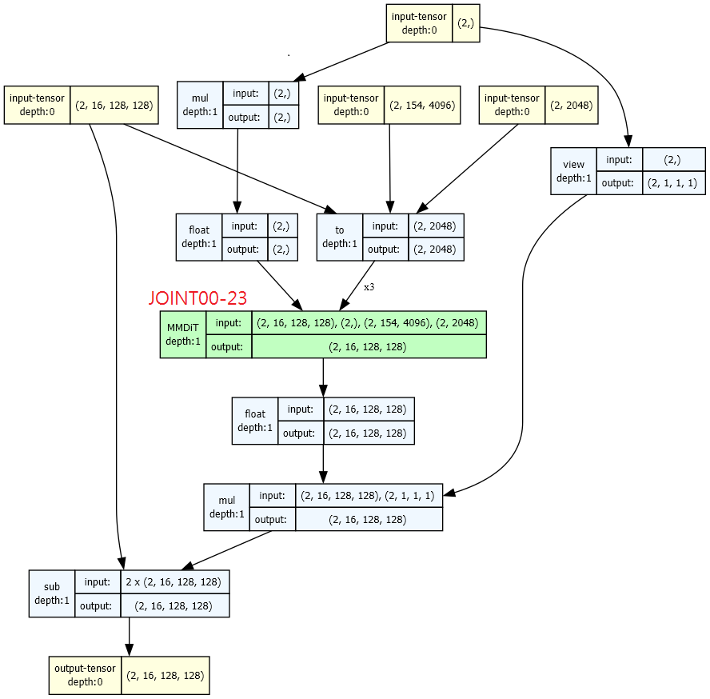
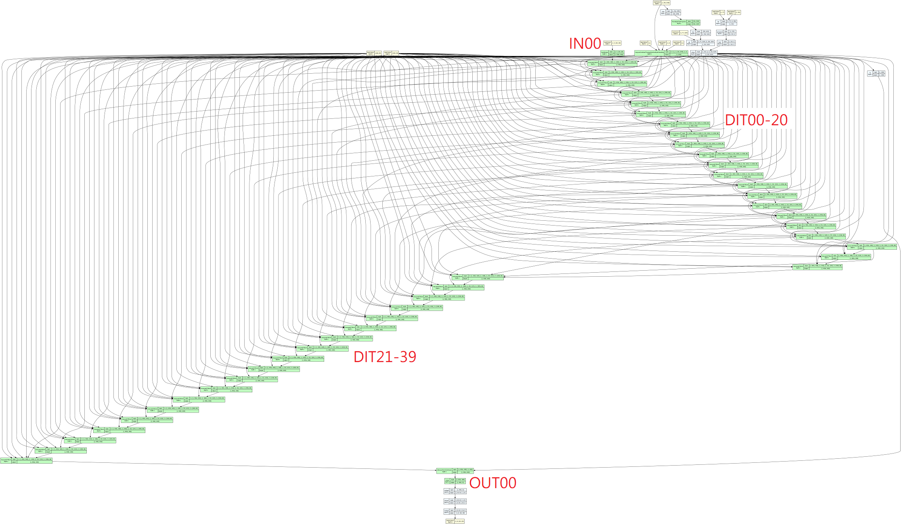
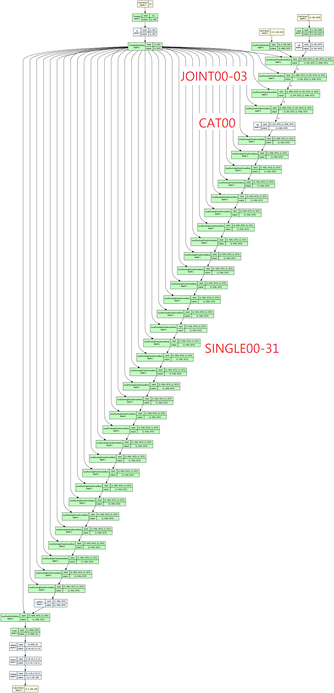
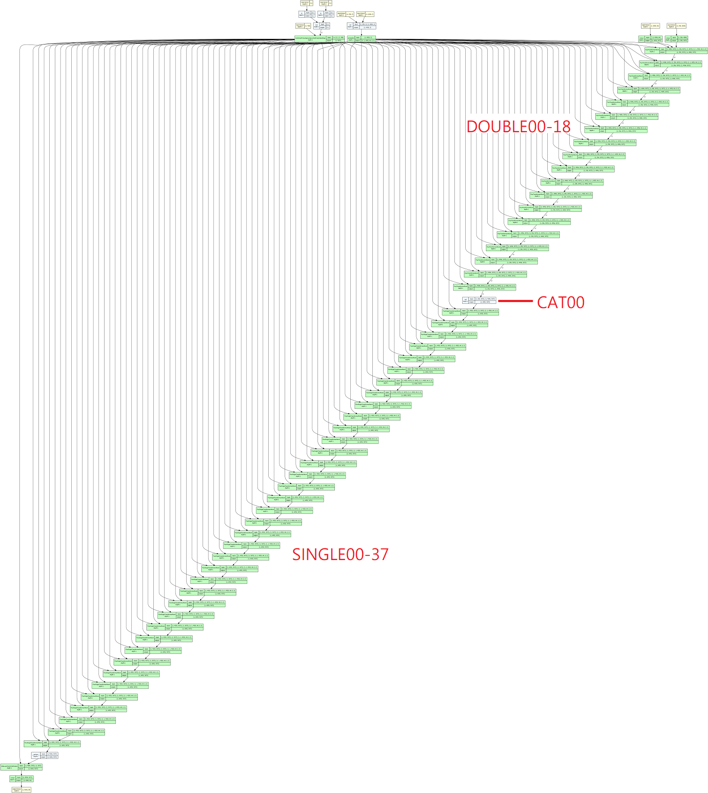

# Chapter 03: Data analysis #

Usually involves model comparasion.

- Comparasion of models **by model architecture**, with findings: [v1/mega_cmp.ipynb](v1/mega_cmp.ipynb)
- Mass scale of model comparasion, making [distance matrix](https://en.wikipedia.org/wiki/Distance_matrix) and try to plot a [weighed graph](https://en.wikipedia.org/wiki/Graph_(discrete_mathematics)) based from the distances: [v2a/mega_cmp_v2.ipynb](v2a/mega_cmp_v2.ipynb)
- Archived reports / diagrams: [v2a/results.7z](v2a/results.7z)

## Extra: Visualizing UNET ##

- Tired of diagrams drawn by hand? How about generated solely by program? [view_unet.ipynb](./view_unet/view_unet.ipynb)

SD1: [stabilityai/stable-diffusion-v1-5](https://huggingface.co/runwayml/stable-diffusion-v1-5/blob/main/unet/config.json)

SD2: [stabilityai/stable-diffusion-2-1](https://huggingface.co/stabilityai/stable-diffusion-2-1/blob/main/unet/config.json)

SDXL: [stabilityai/stable-diffusion-xl-base-1.0](https://huggingface.co/stabilityai/stable-diffusion-xl-base-1.0/blob/main/unet/config.json)

SD3: [stabilityai/stable-diffusion-3-medium-diffusers](https://huggingface.co/stabilityai/stable-diffusion-3-medium-diffusers/blob/main/transformer/config.json)

Hunyuan-DiT: [Tencent-Hunyuan/HunyuanDiT-Diffusers](https://huggingface.co/Tencent-Hunyuan/HunyuanDiT-Diffusers/blob/main/transformer/config.json)

AuraFlow: [fal/AuraFlow-v0.2](https://huggingface.co/fal/AuraFlow-v0.2/blob/main/transformer/config.json)

Flux: [black-forest-labs/FLUX.1-dev](https://huggingface.co/black-forest-labs/FLUX.1-dev/blob/main/transformer/config.json) ~~CPU + 80GB RAM only. 31 minutes~~

- Enjoy the comparasion. Actual VRAM requirement is different, maybe *Total Size (GB) x 0.5 x (image size / 1024) + TEs*. 

- Also there are no implied image sizes, the "height / width" in the model is already counted as latent space.

|Model|MBW Layers|Params (b)|Forward/backward pass size (MB, FP16)|Estimated Total Size (GB, FP16)|
|---|---|---|---|---|
|SD1|25|2.0|1265|2.91|
|SD2|25|2.1|2837|4.46|
|SDXL|19|5.3|8993|13.80|
|SD3|24|2.0|11127|18.79|
|Hunyuan-DiT|40|1.5|17595|20.12|
|AuraFlow|36|6.8|39974|52.38|
|Flux|**57**|**11.91**|**63114**|**108.13**|

## Extra: PCA over CLIP embeddings ##
 
- As mini side request: [view_clip.ipynb](./view_clip/view_clip.ipynb)

- *More like validate my thought instead of discovery.*

