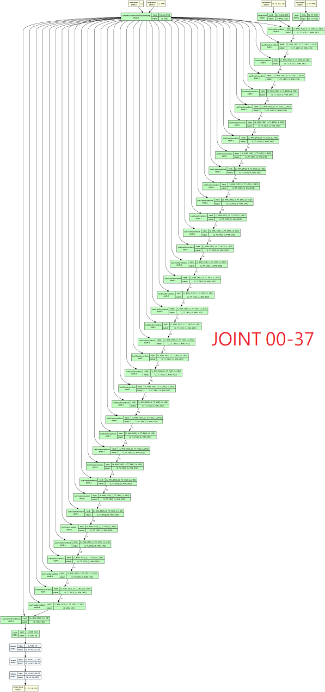

# Chapter 03: Data analysis #

Usually involves model comparasion.

- Comparasion of models **by model architecture**, with findings: [v1/mega_cmp.ipynb](v1/mega_cmp.ipynb)
- Mass scale of model comparasion, making [distance matrix](https://en.wikipedia.org/wiki/Distance_matrix) and try to plot a [weighed graph](https://en.wikipedia.org/wiki/Graph_(discrete_mathematics)) based from the distances: [v2a/mega_cmp_v2.ipynb](v2a/mega_cmp_v2.ipynb)
- V2a but in parallel version (for many CPU cores): [v2a/mega_cmp_parallel.ipynb](v2a/mega_cmp_parallel.ipynb)
- Archived reports / diagrams: [v2a/results.7z](v2a/results.7z)

## Extra: Visualizing UNET ##

- Tired of diagrams drawn by hand? How about generated solely by program? [view_unet.ipynb](./view_unet/view_unet.ipynb)

SD1: [stabilityai/stable-diffusion-v1-5](https://huggingface.co/runwayml/stable-diffusion-v1-5/blob/main/unet/config.json)

SD2: [stabilityai/stable-diffusion-2-1](https://huggingface.co/stabilityai/stable-diffusion-2-1/blob/main/unet/config.json)

SDXL: [stabilityai/stable-diffusion-xl-base-1.0](https://huggingface.co/stabilityai/stable-diffusion-xl-base-1.0/blob/main/unet/config.json)

SD3: [stabilityai/stable-diffusion-3-medium-diffusers](https://huggingface.co/stabilityai/stable-diffusion-3-medium-diffusers/blob/main/transformer/config.json)

SD3.5: [stabilityai/stable-diffusion-3.5-large](https://huggingface.co/stabilityai/stable-diffusion-3.5-large/blob/main/transformer/config.json)

Hunyuan-DiT: [Tencent-Hunyuan/HunyuanDiT-Diffusers](https://huggingface.co/Tencent-Hunyuan/HunyuanDiT-Diffusers/blob/main/transformer/config.json)

AuraFlow: [fal/AuraFlow-v0.2](https://huggingface.co/fal/AuraFlow-v0.2/blob/main/transformer/config.json)

Flux: [black-forest-labs/FLUX.1-dev](https://huggingface.co/black-forest-labs/FLUX.1-dev/blob/main/transformer/config.json) ~~CPU + 80GB RAM only. 31 minutes~~

## Extra: Model comparasion in size and "MBW" layers ##

- Enjoy the comparasion. Actual VRAM requirement is different, maybe *Total Size (GB) x 0.5 x (image size / 1024) + TEs*. 

- Also there are no implied image sizes, the "height / width" in the model is already counted as latent space. It will cause so much confusion therefore I'll try to *intercept the input from the diffuser pipeline to the actual model component, which should match the public docuements from the model authors.*

- "MBW layers" is an *unit* of "funcional layers", according to the concept of ["MBW merge"](https://github.com/hako-mikan/sd-webui-supermerger?tab=readme-ov-file#merge-block-weight) which was the meta of merging SD1.5 models ~~obviously not working since then~~. However it is still useful to have a feeling of how the model works, from UNET to DiT.

### Inconsistent observed parameter counts between running instance and official claim ###

- From the inconsistint result of `["sdxl", "sd1", "sd2"]` **which was overestimated for 2.37x** (others are < 0.1%), I also implemented `diffusers` and `torch` native approach based from [this Stackoverflow post](https://stackoverflow.com/questions/49201236/check-the-total-number-of-parameters-in-a-pytorch-model). Issues [#262](https://github.com/TylerYep/torchinfo/issues/262), [#303](https://github.com/TylerYep/torchinfo/issues/303), [#312](https://github.com/TylerYep/torchinfo/issues/312) were reported in `torchinfo`, which made me a bit panic. *Hopefully it can be justified from future inconsistent results.*
- Refer [diffusers.num_parameters](https://huggingface.co/docs/diffusers/api/models/overview#diffusers.ModelMixin.num_parameters) [and its code](https://github.com/huggingface/diffusers/blob/main/src/diffusers/models/modeling_utils.py#L1040), [nn.Parameter](https://pytorch.org/docs/stable/generated/torch.nn.parameter.Parameter.html), [torch.numel](https://pytorch.org/docs/stable/generated/torch.numel.html) for how it is counted. It is very likely **MISMATCH** for other contents (e.g. `torchvision` and `torchinfo` here, refered as ["model summary"](https://stackoverflow.com/questions/42480111/how-do-i-print-the-model-summary-in-pytorch) )
- The ["2.6b"](https://www.reddit.com/r/StableDiffusion/comments/1d7t0op/sdxl_is_a_26b_parameter_model_not_66b/), ["860M"](https://github.com/CompVis/stable-diffusion/blob/main/README.md#stable-diffusion-v1) and ["865M"](https://github.com/Stability-AI/stablediffusion?tab=readme-ov-file#stable-diffusion-v2) counts are matching the official claim.
- Meanwhile, RTX 3090 is barely capable for flux FP16 for `torchinfo`.

|Model|MBW Layers|Params (b, `torchinfo`)|Params (b, `diffusers`)|Forward/backward pass size (MB, FP16)|Estimated Total Size (GB, FP16)|
|---|---|---|---|---|---|
|SD1|25|*2.0*|0.860|1265|2.91|
|SD2|25|*2.1*|0.865|2837|4.46|
|SDXL|19|*5.3*|2.6|8993|13.80|
|SD3|24|2.0|2.0|11127|18.79|
|SD3.5|38|8.0|8.0|17010|32.35|
|Hunyuan-DiT|40|1.5|1.5|17595|20.12|
|AuraFlow|36|6.8|6.8|**39974**|52.38|
|Flux|**57**|11.91|**11.91**|31557|**54.06**|

- Would vLLM be the next trend such as [Lumia-mGPT](https://github.com/Alpha-VLLM/Lumina-mGPT/tree/main) (30B), [Llava-Visionary-70B](https://github.com/aimagelab/LLaVA-MORE) (70B) and [Qwen2-VL](https://github.com/QwenLM/Qwen2-VL) (72B)?

## Extra: PCA over CLIP embeddings ##
 
- As mini side request: [view_clip.ipynb](./view_clip/view_clip.ipynb)

- *More like validate my thought instead of discovery.*

