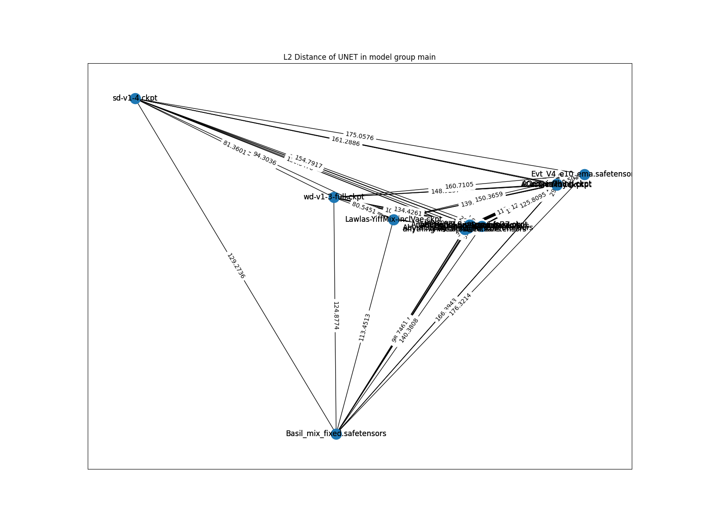

# Data analysis #

Usually involves model comparasion.

- Comparasion of models **by model architecture**, with findings: [mega_cmp.ipynb](mega_cmp.ipynb)
- Mass scale of model comparasion, making [distance matrix](https://en.wikipedia.org/wiki/Distance_matrix) and try to plot a [weighed graph](https://en.wikipedia.org/wiki/Graph_(discrete_mathematics)) based from the distances: [mega_cmp_v2.ipynb](mega_cmp_v2.ipynb)
- Archived reports / diagrams: [results.7z](results.7z)

