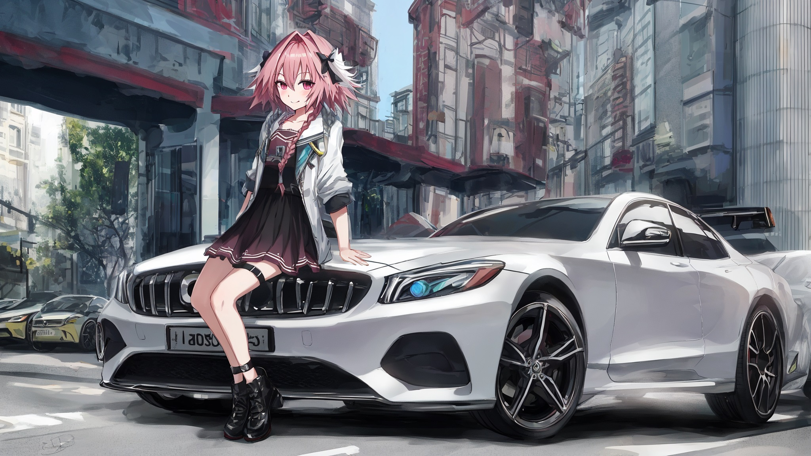
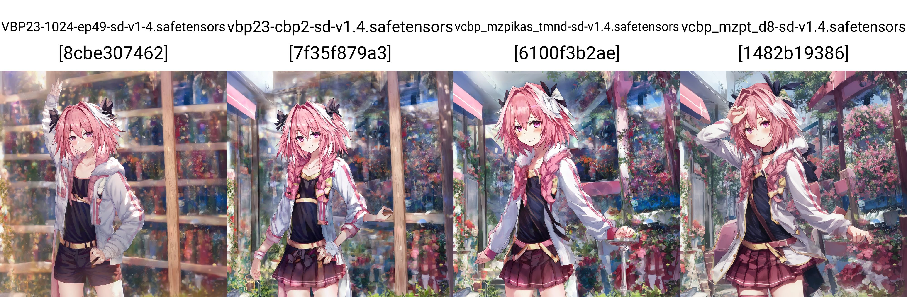

# Chapter 05: Astolfo mix. #

Maybe I write it here first. I don't have idea to seperate the contents into any subheader / article yet.

## Why make a model? ##

- I have found that the potential of *community supported* SD1.X model still not fully explorered. Meanwhile, although SDXL is greatly improved, it is still lack of *THE proper anime finetune* (e.g. "full danbooru"). Therefore, would there be something to be explorered by making a model with my own discoveries (theory)?

## My discoveries ##

### Merge model is feasible for me ###

- [ch01/merge](../ch01/merge.md): Even it is not well theorized, merging models is an relatively effective method to "ensemble" models without prior knowledge, includes dataset, and training procedures. 

- *Finetuning SDXL has been a engineering challenge*, without any publicized models trained with 1M+ images after a month. The largest scale of [pure finetune](https://civitai.com/models/136719/nekorayxl) or [mixed approach](https://civitai.com/models/136389/kohaku-xl) are only 300k images, way less then the [publicized 4M "full danbooru" dataset](https://huggingface.co/datasets/animelover/danbooru2022). For me not investing on expensive GPUs, e.g. [8x A40 for WD](https://gist.github.com/harubaru/f727cedacae336d1f7877c4bbe2196e1#training-process), or even a single RTX4090, finetuning, or even LoRA, sounds impossible for me. Also, given *my hiatus for 2 months because of other hobbies (hint: PC hardware)*, I won't have time to explore the hyperparameters for model finetuning, or even image tagging, and gathering dataset. Therefore brutally merging models sounds feasible for me.

### Imporvement on model structure vs learnt experience ###

- [ch02/model_history](../ch02/model_history.md): Given the rich history since "NAI" and other datasets, SD1.X models after many iterations are still comparable to the new SDXL models with only a few iterations.

- [ch01/hires_fix](../ch01/hires_fix.md), [ch01/cfg_step](../ch01/cfg_step.md), [ch01/arb](../ch01/arb.md): The most noticeable (slight) difference is the lowerbound CFG and the upper bound of resolution. My recent artwork in both [SD1.X based](https://www.pixiv.net/en/artworks/111379481) and [SDXL based](https://www.pixiv.net/en/artworks/111558772) models are sharing similar parameters and image content (although the car shape in this comparasion is a lot wacky). With the claimed "1024 ARB" (and "trained with 2048x2048 images") for SD1.x models, comparing with "1024 ARB" SDXL models, generating images with 768x768 hires 2.0x or 1024x1024 hires 1.5x images still yields similar details. *However  "1024 ARB" SD1.x models are rare, and no one has merge them before.*

- *It is hard to compare, especially I don't have nice metrics to compare.* It will be benchmarked by [ch01/my_procedure](../ch01/my_procedure.md), to keep my justification consistant.

### Merging models from different background ###

|Model Name|Model source|
|---|---|
|[VBP](../ch02/f59359c175.md)|"NAI SFW"|
|[BP](https://huggingface.co/Crosstyan/BPModel)|[ACertainty](ACertainty)|
|[CBP](../ch02/ae2b38ac14.md)|"NAI NSFW"|
|[MzPikas TMND Enhanced](https://huggingface.co/ashen-sensored/mzpikas_tmnd_enhanced)|NAI + [OpenNiji](https://huggingface.co/ShoukanLabs/OpenNiji-V2) *Speculated*|
|[DreamShaperV8](https://civitai.com/models/4384/dreamshaper)|"A>R" Merge, realistic nxxes|

- Given the success of ["2.5D" models](../ch02/4de704d8.md), I expect there will be suprise when I merge them together (however it is hard to preprocess the model, see below).

### Nice merge will introduce "union" effect on prompt interpretation ###

- [ch01/merge](../ch01/merge.md): Although the MBW / LBW theory lacks of scientific proof, [autombw](https://github.com/Xerxemi/sdweb-auto-MBW) / [autombw v2](https://github.com/Xerxemi/auto-MBW-rt) reconstructed the optimization task / [model selection](https://en.wikipedia.org/wiki/Model_selection) into a ML task, treating MBW / LBW as a *framework with simplified parameter*, instead of directly applying domain knowledge.

- There are nice models based from manual MBW, such as [majicMIX](https://civitai.com/models/43331/majicmix-realistic), [GhostMix](https://civitai.com/models/36520?modelVersionId=76907), and autombw models such as [SD-Silicon](https://huggingface.co/Xynon/SD-Silicon) and [MzPikas TMND Enhanced](https://huggingface.co/ashen-sensored/mzpikas_tmnd_enhanced), and an unreleased "CGA" model, *they are showing ability to know more entities without sacrificing too much existing knowledges* (See [this artwork based from majicMIX](https://www.pixiv.net/en/artworks/110065358)). Seems that the variance can be a lot greater, resembling [my guess long time ago](../ch99/925997e9.md). Therefore it would support the "suprise" I have expected.

### The power of the original SD 1.X's Text Encoder ###

- [ch02/animevae_pt](../ch02/animevae_pt.md#extra-text-encoder): Other then VAE, *NAI also used SD's orignal TE*. This is special for SD1.X because the CLIP / ViT used *was trained with uncropped LAION dataset, including the NSFW words*. It is in theory knowing most vocabulary, even the token count is less then SDXL. It shuold be reminded that NSFW SDXL / SD2.X models are *almost inexist*, with a [little exception](https://cafeai.notion.site/WD-1-5-Beta-2-Release-Notes-2852db5a9cdd456ba52fc5730b91acfd). [Rare artwork done by me.](https://www.pixiv.net/en/artworks/105947222). It further supports "nice content may be better then nice structure".

- [ch03](../ch03): Hhowever, most finetuned models used [TTE (train text encoder)](https://github.com/kohya-ss/sd-scripts) to create "triger word" effect, but variance has been greatly sacrificed. Note that it is *highly doubtful* because most models are TTE enabled, and it is hard to proof or even verify.

## My action list ##

- **Docuement first.** If you see any content not covered in this article, it is either an idea just appeared, or I really havn't considered. Most idea in this article is original and relies on my own experience. 

- **Recover, and even replace TE.** [Models have been uploaded to HuggingFace.](https://huggingface.co/6DammK9/bpmodel-sd14-merge) Thanks *@gesen2gee (Discord)* for mentioning [stable-diffusion-webui-model-toolkit](https://github.com/arenasys/stable-diffusion-webui-model-toolkit). After some simple test (make sure it can run, can being merged afterward), **I'll post into HuggingFace for reference.** [Here is the scirpt segment to remove TE.](https://github.com/CCRcmcpe/scal-sdt/blob/963ac6a20151139b90f4d0dc7216c036a57964cd/ckpt_tool.py#L40) Recovering them is unknown. Probably need to program it myself. [Here is a script potentially useful.](https://github.com/kohya-ss/sd-scripts/blob/main/tools/convert_diffusers20_original_sd.py) 

- **Baseline merge: Uniform merge.** [Models have been uploaded to HuggingFace.](https://huggingface.co/6DammK9/AstolfoMix) As easy as the "Checkpoint Merger" does. To make sure all of them are in [uniform distribution](https://en.wikipedia.org/wiki/Discrete_uniform_distribution), merge with weight $1/x$ for $x > 1$. Therefore 50% for the 2nd model, 33% for the 3rd model, and so on. The process should be **parameterless**.

- **Proposed merge: autombw.** Use [autombw v2](https://github.com/Xerxemi/auto-MBW-rt). Technical details are under analysis. It has been known as *memory intensive* instead of *GPU intensive*. I have some ex-mining SSDs which may help the process.

- Model to be merged (in order): VBP, CBP, MzPikas TMND Enhanced, *DreamShaperV8*, CGA, SD Sillicon, BP, any models I think can generate hires images.

### Baseline Merge ###

- *Current resolution limit is 1280x1280 (native T2I), hires 1.4x (2080Ti 11G)*



```
parameters

(aesthetic:0), (quality:0), (car:0), [[mercedes]], (1girl:0), (boy:0), [[braid]], [astolfo]
Negative prompt: (worst:0), (low:0), (bad:0), (exceptional:0), (masterpiece:0), (comic:0), (extra:0), (lowres:0), (breasts:0.5)
Steps: 48, Sampler: Euler, CFG scale: 4.5, Seed: 342433587, Size: 1024x576, Model hash: 6100f3b2ae, Model: vcbp_mzpikas_tmnd-sd-v1.4, VAE hash: 551eac7037, VAE: vae-ft-mse-840000-ema-pruned.ckpt, Denoising strength: 0.7, Clip skip: 2, Hires upscale: 2, Hires upscaler: Latent, Dynamic thresholding enabled: True, Mimic scale: 1, Separate Feature Channels: False, Scaling Startpoint: MEAN, Variability Measure: AD, Interpolate Phi: 0.3, Threshold percentile: 100, Version: v1.6.0
```

- *Seems that merging Hi-Res models is a training method one step beyond*


