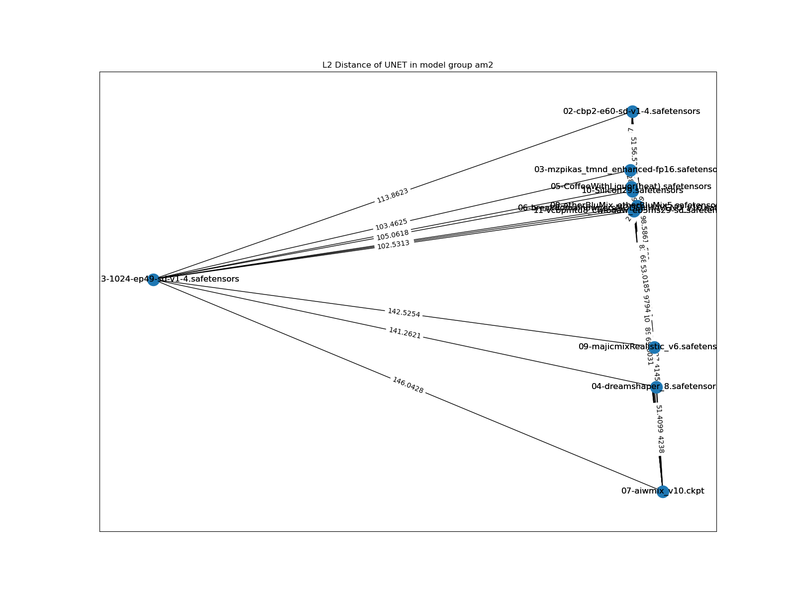
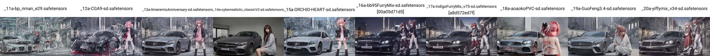
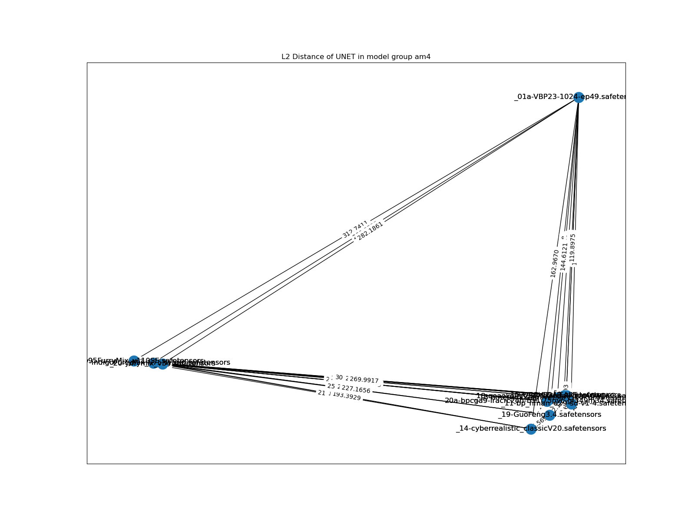
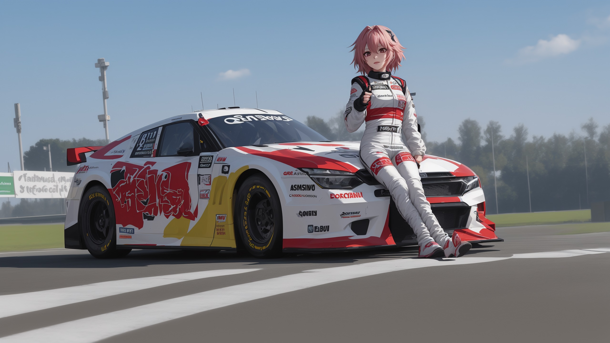
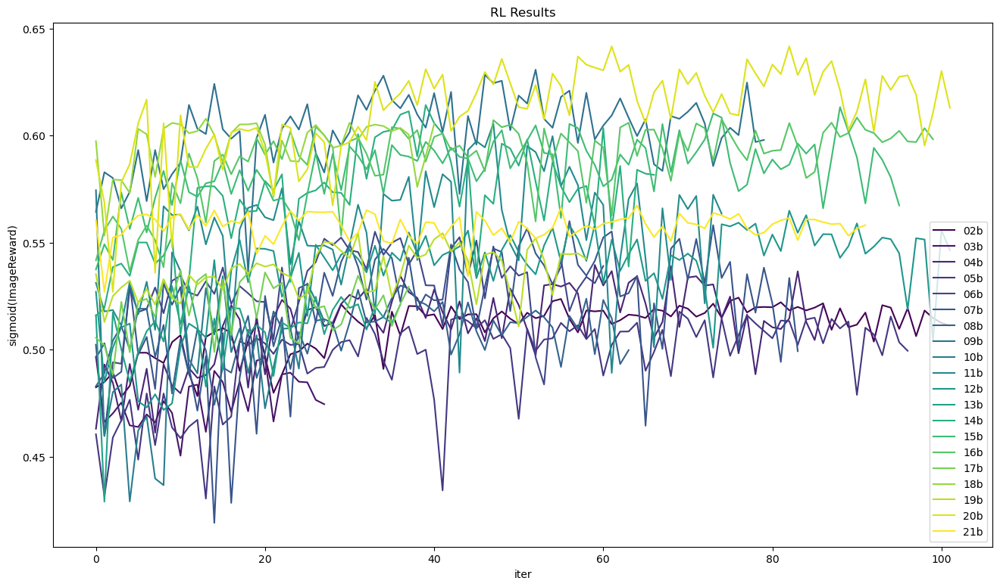

# Chapter 05: AstolfoMix. #

- [CivitAI model page.](https://civitai.com/models/155604) The style there is a bit different.

- [HuggingFace model page.](https://huggingface.co/6DammK9/AstolfoMix) The style is also different.

- [CivitAI article page.](https://civitai.com/articles/3409) Summary of here.

- [BEST REVIEW EVER.](https://boards.4chan.org/g/thread/98213245#p98214678) *Thanks anon. Never thought it reached 4chan.*


## What is the mix? ##

- Currently, it is an ~~Ensemble averaging of 10 neural networks~~ ~~Uniform~~ AutoMBW [(Bayesian Merge)](https://github.com/s1dlx/sd-webui-bayesian-merger) of ~~10~~ 20+1 SD1.5 models.

- Although I'm going to repeat the "mix" for [SD2](./README_SD2.MD) and SDXL (maybe SDXL Turbo?) models, I will seperate the *exclusive findings* there. If you find unexplained stuffs there, read this article instead.

## Generated Images ##

- ["AstolfoMix" in Pixiv.](https://www.pixiv.net/en/tags/AstolfoMix/artworks)

## Why make such a model? ##

- I have found that the potential of *community supported* SD1.X model still not fully explorered. Meanwhile, although SDXL is greatly improved, it is still lack of *THE proper anime finetune* (e.g. "full danbooru"). Therefore, would there be something to be explorered by making a model with my own discoveries (theory)?

## My discoveries ##

### Merge model is feasible for me ###

- [ch01/merge](../ch01/merge.md): Even it is not well theorized, merging models is an relatively effective method to "ensemble" models without prior knowledge, includes dataset, and training procedures. 

- *Finetuning SDXL has been a engineering challenge*, without any publicized models trained with 1M+ images after a month. The largest scale of [pure finetune](https://civitai.com/models/136719/nekorayxl) or [mixed approach](https://civitai.com/models/136389/kohaku-xl) are only 300k images, way less then the [publicized 4M "full danbooru" dataset](https://huggingface.co/datasets/animelover/danbooru2022). For me not investing on expensive GPUs, e.g. [8x A40 for WD](https://gist.github.com/harubaru/f727cedacae336d1f7877c4bbe2196e1#training-process), or even a single RTX4090, finetuning, or even LoRA, sounds impossible for me. Also, given *my hiatus for 2 months because of other hobbies (hint: PC hardware)*, I won't have time to explore the hyperparameters for model finetuning, or even image tagging, and gathering dataset. Therefore brutally merging models sounds feasible for me. Moreover, [even I have two 3090s now,](https://www.instagram.com/p/CyoHFQGSMv6) I can choose to spend all the efforts on making lots of images instead of training models.

### Imporvement on model structure vs learnt experience ###

- [ch02/model_history](../ch02/model_history.md): Given the rich history since "NAI" and other datasets, SD1.X models after many iterations are still comparable to the new SDXL models with only a few iterations.

- [ch01/hires_fix](../ch01/hires_fix.md), [ch01/cfg_step](../ch01/cfg_step.md), [ch01/arb](../ch01/arb.md): The most noticeable (slight) difference is the lowerbound CFG and the upper bound of resolution. My recent artwork in both [SD1.X based](https://www.pixiv.net/en/artworks/111379481) and [SDXL based](https://www.pixiv.net/en/artworks/111558772) models are sharing similar parameters and image content (although the car shape in this comparasion is a lot wacky). With the claimed "1024 ARB" (and "trained with 2048x2048 images") for SD1.x models, comparing with "1024 ARB" SDXL models, generating images with 768x768 hires 2.0x or 1024x1024 hires 1.5x images still yields similar details. *However  "1024 ARB" SD1.x models are rare, and no one has merge them before.*

- *It is hard to compare, especially I don't have nice metrics to compare.* It will be benchmarked by [ch01/my_procedure](../ch01/my_procedure.md), to keep my justification consistant.

### Merging models from different background ###

- Here is a list of merged, or "may be merged" of models:

|Index|Model Name|Model source|Merged yet? (Baseline / Extended / In review)|
|---|---|---|---|
|`01`|[VBP](../ch02/f59359c175.md)|"NAI SFW"|Baseline|
|`_02`|[CBP](../ch02/ae2b38ac14.md)|"NAI NSFW"|Baseline|
|`_03`|[MzPikas TMND Enhanced](https://huggingface.co/ashen-sensored/mzpikas_tmnd_enhanced)|AutoMBW~~NAI + [OpenNiji](https://huggingface.co/ShoukanLabs/OpenNiji-V2) *Speculated*~~ [AutoMBW](https://github.com/ashen-sensored/sd-webui-runtime-block-merge)|Baseline|
|`_04`|[DreamShaperV8](https://civitai.com/models/4384/dreamshaper)|"A>R" Merge, realistic nxxes|Baseline|
|`_05`|[CoffeeWithLiquor](https://huggingface.co/StereoBartender/CoffeeWithLiquor)|NAI (Lots of LoRAs)|Baseline|
|`_06`|[BreakDomain](https://civitai.com/models/117192/breakdomainowners-model-i-have-no-rights-if-he-want-it-will-be-taken-down)|NAI|Baseline|
|`_07`|[AIWMix](https://civitai.com/models/74165?modelVersionId=78888)|["SD"](../ch97/0299d.md), |Baseline|
|`_08`|[Ether Blu Mix](https://civitai.com/models/17427/ether-blu-mix)|Merges of famous A|Baseline|
|`_09`|[majicMIX realistic](https://civitai.com/models/43331?modelVersionId=94640)|Merges of MJ + "2.5" + [NWSJ](https://civitai.com/models/53601/nwsjrealistic)|Baseline|
|`_10`|[Silicon29](https://huggingface.co/Xynon/SD-Silicon)|[AutoMBW](https://github.com/Xerxemi/auto-MBW-rt) of "2.5"|Baseline|
|`_11`|[BP](https://huggingface.co/Crosstyan/BPModel)|[ACertainty](ACertainty)|Extended|
|`_12`|[CGA9](https://t.me/StableDiffusion_CN/1170018)|AutoMBW|Extended|
|`_13`|[LimeREmix](https://civitai.com/models/153081?modelVersionId=23379)|Human evaluated merge|Extended|
|`_14`|[CyberRealistic Classic](https://civitai.com/models/71185/cyberrealistic-classic)|Pure Realistic Merge|Extended
|`_15`|[ORCHIDHEART](https://huggingface.co/reroti/ORCHIDHEART)|Similar to CGA|Extended|
|`_16`|[BB95 Furry Mix](https://civitai.com/models/17649/bb95-furry-mix)|[E621](https://knowyourmeme.com/memes/sites/e621)|Extended|
|`_17`|[Indigo Furry mix](https://civitai.com/models/34469?modelVersionId=167882)|[E621](https://knowyourmeme.com/memes/sites/e621)|Extended|
|`_18`|[AOAOKO [PVC Style Model]](https://civitai.com/models/15509/aoaoko-pvc-style-model)|[PVC](https://huggingface.co/datasets/p1atdev/pvc)|Extended|
|`_19`|[GuoFeng3](https://civitai.com/models/10415/3-guofeng3)|[Chinese fantasy](https://en.wikipedia.org/wiki/Xianxia)|Extended|
|`_20`|[YiffyMix](https://civitai.com/models/3671?modelVersionId=189192)|[E621](https://knowyourmeme.com/memes/sites/e621)|Extended|
|xx|[ALunarDream](https://discord.com/channels/930499730843250783/1087111248447017172)|NAI (Style Blending)|*In review*|
|xx|[Dreamlike Anime](https://huggingface.co/dreamlike-art/dreamlike-anime-1.0)|Non NAI based Anime|*Rejected (legal issue)*|
|xx|[Marbel V182](https://discord.com/channels/1027129024054575174/1155074634274844693)|Human evaluated merge|*In review*|
|xx|[AIDv2.10](https://civitai.com/models/16828/aidv210-anime-illust-diffusion)|NAI (Style Blending)|*In review*|

- Note that all models are [abruptly replaced with SD1.4's Text Encoder.](https://huggingface.co/6DammK9/bpmodel-sd14-merge) Original desired contents (e.g. specific anime contents) will be disabled.

|Merge Batch|Description|
|---|---|
|Baseline|This model is **capable to output images well with 1024x1024 native, with great varity contents.** *Identifying Astolfo is a plus* (LAION has a few images of him).|
|Extended|This model is **either** capable to do any one of them above. It means that the model has experienced radical finetuning, and the output diversity is damaged. ~~(Or it is just too late to be spotted, such as 13)~~ |
|In review|This model **sounds** that it has been finetuned in a menaingful way. It is mostly not effective with great tradeoff, and it need to be carefully merged **under sequence** (i.e. very last). **Now they are put on hold because I have 20 models already.**|

- Given the success of ["2.99D" models](../ch02/4de704d8.md) and ["2.5D" models](https://huggingface.co/WarriorMama777/OrangeMixs), I expect there will be suprise when I merge them together (however it is hard to preprocess the model, see below).

- Note that some of them are also merges of other models, I expect that I can be benefied from the inherited contents also, for example, *style embeddings* and more keywords.

- (Not proven) The *inheritance* is not straightforward, it may requires replacing the Text Encoder with the child's instead of the master SD1.x's. See below for how I discover the phenomenon.

### Nice merge will introduce "union" effect on prompt interpretation ###

- [ch01/merge](../ch01/merge.md): Although the MBW / LBW theory lacks of scientific proof, [autombw](https://github.com/Xerxemi/sdweb-auto-MBW) / [autombw v2](https://github.com/Xerxemi/auto-MBW-rt) reconstructed the optimization task / [model selection](https://en.wikipedia.org/wiki/Model_selection) into a ML task, treating MBW / LBW as a *framework with simplified parameter*, instead of directly applying domain knowledge.

- There are nice models based from manual MBW, such as [majicMIX](https://civitai.com/models/43331/majicmix-realistic), [GhostMix](https://civitai.com/models/36520?modelVersionId=76907), and autombw models such as [SD-Silicon](https://huggingface.co/Xynon/SD-Silicon) and [MzPikas TMND Enhanced](https://huggingface.co/ashen-sensored/mzpikas_tmnd_enhanced), and an unreleased "CGA" model, *they are showing ability to know more entities without sacrificing too much existing knowledges* (See [this artwork based from majicMIX](https://www.pixiv.net/en/artworks/110065358)). Seems that the variance can be a lot greater, resembling [my guess long time ago](../ch99/925997e9.md). Therefore it would support the "suprise" I have expected.

### The power of the original SD 1.X's Text Encoder ###

- [ch02/animevae_pt](../ch02/animevae_pt.md#extra-text-encoder): Other then VAE, *NAI also used SD's orignal TE*. This is special for SD1.X because the CLIP / ViT used *was trained with uncropped LAION dataset, including the NSFW words*. It is in theory knowing most vocabulary, even the token count is less then SDXL. It shuold be reminded that NSFW SDXL / SD2.X models are *almost inexist*, with a [little exception](https://cafeai.notion.site/WD-1-5-Beta-2-Release-Notes-2852db5a9cdd456ba52fc5730b91acfd). [Rare artwork done by me.](https://www.pixiv.net/en/artworks/105947222). It further supports "nice content may be better then nice structure".

- [ch03](../ch03): However, most finetuned models used [TTE (train text encoder)](https://github.com/kohya-ss/sd-scripts) to create "triger word" effect, but variance has been greatly sacrificed. Note that it is *highly doubtful* because most models are TTE enabled, and it is hard to proof or even verify.

### Verifying the merge is precise ###

- I experienced [floating point error](https://www.geeksforgeeks.org/floating-point-error-in-python/) while merging. *It is not merger error. This is natural for most programming languages.* The merged model must be verified with [toolkit](https://github.com/arenasys/stable-diffusion-webui-model-toolkit) to make sure **the offset counter must be (XXXX/0000/0000).** 

- I further verify [with the scripts extracting metadata in model](../ch97/extract_merge_info.js) [by batch](../ch97/batch_extract.cmd) to make sure I am merging the right model (however the "merge chain" is wiped when I reset the Text Encoder):

```json
{
    "__metadata__": {
        "sd_merge_recipe": {
            "type": "webui",
            "primary_model_hash": null,
            "secondary_model_hash": "aba1307666acb7f5190f8639e1bc28b2d4a1d23b92934ab9fc35abf703e8783d",
            "tertiary_model_hash": null,
            "interp_method": "Weighted sum",
            "multiplier": 0.125,
            "save_as_half": true,
            "custom_name": "08-vcbpmt_d8cwlbd_aweb5-sd",
            "config_source": 0,
            "bake_in_vae": "None",
            "discard_weights": "",
            "is_inpainting": false,
            "is_instruct_pix2pix": false
        },
        "format": "pt",
        "sd_merge_models": {
            "fe38511e88a8b7110a61658af6a0ff6a6b707852ff2893a38bc8fa0f92b3ace4": {
                "name": "07-vcbp_mtd8cwl_bdaw-sd.safetensors",
                "legacy_hash": "72982c20",
                "sd_merge_recipe": null
            },
            "aba1307666acb7f5190f8639e1bc28b2d4a1d23b92934ab9fc35abf703e8783d": {
                "name": "etherBluMix5-sd-v1-4.safetensors",
                "legacy_hash": "25d4f007",
                "sd_merge_recipe": null
            }
        }
    }
}
```

- For full recipe, see [recipe-10a.json](./recipes/recipe-10a.json).Replace with SD original CLIP / VAE to obtain "10", *however the equivalence may not in file hash precision because of floating point error.*

- Personally I prefer using [vae-ft-mse-840000-ema-pruned](https://huggingface.co/stabilityai/sd-vae-ft-mse-original/blob/main/vae-ft-mse-840000-ema-pruned.ckpt) for VAE, but I'll keep it neutral while merging.

- For the merge ratio, I *round to 3 d.p.* which is engough for the first 20 merges.

## My action list ##

- **Docuement first.** If you see any content not covered in this article, it is either an idea just appeared, or I really havn't considered. Most idea in this article is original and relies on my own experience. 

- **Recover, and even replace TE.** [Models have been uploaded to HuggingFace.](https://huggingface.co/6DammK9/bpmodel-sd14-merge) Thanks *@gesen2gee (Discord)* for mentioning [stable-diffusion-webui-model-toolkit](https://github.com/arenasys/stable-diffusion-webui-model-toolkit). After some simple test (make sure it can run, can being merged afterward), **I'll post into HuggingFace for reference.** [Here is the scirpt segment to remove TE.](https://github.com/CCRcmcpe/scal-sdt/blob/963ac6a20151139b90f4d0dc7216c036a57964cd/ckpt_tool.py#L40) Recovering them is unknown. Probably need to program it myself. [Here is a script potentially useful.](https://github.com/kohya-ss/sd-scripts/blob/main/tools/convert_diffusers20_original_sd.py) 

- **Baseline merge: Uniform merge a.k.a ~~bagging~~ averaging.** [Models have been uploaded to HuggingFace.](https://huggingface.co/6DammK9/AstolfoMix) As easy as the "Checkpoint Merger" does. To make sure all of them are in [uniform distribution](https://en.wikipedia.org/wiki/Discrete_uniform_distribution), merge with weight $1/x$ for $x > 1$. Therefore 50% for the 2nd model, 33% for the 3rd model, and so on. The process should be **parameterless**. 

- **Proposed merge: autombw a.k.a ~~boosting~~ RL.** Use [my own fork](https://github.com/6DammK9/auto-MBW-rt) of [autombw v2](https://github.com/Xerxemi/auto-MBW-rt). ~~Technical details are under analysis. It has been known as *memory intensive* instead of *GPU intensive*. I have some ex-mining SSDs which may help the process. **This will not happen soon.** I didn't expect for merging 10+ models. [Boosting](https://chih-sheng-huang821.medium.com/%E6%A9%9F%E5%99%A8%E5%AD%B8%E7%BF%92-ensemble-learning%E4%B9%8Bbagging-boosting%E5%92%8Cadaboost-af031229ebc3) in such scale requires a new software from ground up. *I am still using pure GUI with minimum coding.*~~ It is not memory intensive. It is just time consuming. See [my findings on autombw](../ch01/autombw.md). Also it is more like [RL](https://en.wikipedia.org/wiki/Reinforcement_learning) instead of boosting.

- [Get a capable GPU to output such kind of images.](../ch04/readme.md#chapter-04b-extra-making-use-of-m40-24gb-for-generating-large-images) I'm suprised that *it pulls 19GB of VRAM already*.

## Finding on "Baseline Merge" ##

### Boosted Resolution ###

- *Current resolution limit is 1280x1280 (native T2I), hires 1.4x (2080Ti 11G), or 2.0x (Tesla M40)*.


```
parameters
(aesthetic:0), (quality:0), (solo:0), (boy:0), (ushanka:0.98), [[braid]], [astolfo], [[moscow, russia]] 
Negative prompt: (worst:0), (low:0), (bad:0), (exceptional:0), (masterpiece:0), (comic:0), (extra:0), (lowres:0), (breasts:0.5) 
Steps: 256, Sampler: Euler, CFG scale: 4.5, Seed: 132385090, Size: 1344x768, Model hash: 6ffdb39acd, Model: 10-vcbpmtd8_cwlbdaw_eb5ms29-sd, VAE hash: 551eac7037, VAE: vae-ft-mse-840000-ema-pruned.ckpt, Denoising strength: 0.7, Clip skip: 2, FreeU Stages: "[{\"backbone_factor\": 1.2, \"skip_factor\": 0.9}, {\"backbone_factor\": 1.4, \"skip_factor\": 0.2}]", FreeU Schedule: "0.0, 1.0, 0.0", Hires upscale: 2, Hires steps: 64, Hires upscaler: Latent, Dynamic thresholding enabled: True, Mimic scale: 1, Separate Feature Channels: False, Scaling Startpoint: MEAN, Variability Measure: AD, Interpolate Phi: 0.7, Threshold percentile: 100, Version: v1.6.0
```

### Associative property ###

- [Associative property](https://en.wikipedia.org/wiki/Associative_property) has been observed. First, these are comparasion between 10 models without pre processing:


- And then mixing them together, you will find the [intelligence agent](https://en.wikipedia.org/wiki/Intelligent_agent) *successfully choose to "draw" the most confident one*:


- This time all models are replaced with original SD's CLIP / Text Encoder:


- Finally mixing them together again, now it is capable to "draw" in 1344x768x2.0, which SD was supposed to be trained with 512px images:


```
(aesthetic:0), (quality:0), (car:0), [[mercedes]], (1girl:0), (boy:0), [astolfo] Negative prompt: (worst:0), (low:0), (bad:0), (exceptional:0), (masterpiece:0), (comic:0), (extra:0), (lowres:0), (breasts:0.5) Steps: 48, Sampler: Euler, CFG scale: 4.5, Seed: 3972813705, Size: 1024x576, Model hash: 8cbe307462, Model: VBP23-1024-ep49-sd-v1-4, VAE hash: 551eac7037, VAE: vae-ft-mse-840000-ema-pruned.ckpt, Denoising strength: 0.7, Clip skip: 2, FreeU Stages: "[{\"backbone_factor\": 1.2, \"skip_factor\": 0.9}, {\"backbone_factor\": 1.4, \"skip_factor\": 0.2}]", FreeU Schedule: "0.0, 1.0, 0.0", Hires upscale: 2.5, Hires upscaler: Latent, Dynamic thresholding enabled: True, Mimic scale: 1, Separate Feature Channels: False, Scaling Startpoint: MEAN, Variability Measure: AD, Interpolate Phi: 0.7, Threshold percentile: 100, Script: X/Y/Z plot, X Type: Checkpoint name, X Values: "VBP23-1024-ep49-sd-v1-4.safetensors [8cbe307462],02-vbp23-cbp2-sd.safetensors [6075160ea7],03-vcbp-mzpikas_tmnd-sd.safetensors [4f4da1e956],04-vcbp_mzpt_d8-sd.safetensors [4b36d29be3],05-vcbp_mtd8_cwl-sd.safetensors [84c1865c1e],06-vcbp_mtd8cwl_bd-sd.safetensors [dd1d0b7fc4],07-vcbp_mtd8cwl_bdaw-sd.safetensors [fe38511e88],08-vcbpmt_d8cwlbd_aweb5-sd.safetensors [b21ea2b267],09-vcbpmt_d8cwlbd_aweb5m-sd.safetensors [f32f9b8e99],10-vcbpmtd8_cwlbdaw_eb5ms29-sd.safetensors [6ffdb39acd]", Version: v1.6.0
```

- (*Diagram coming soon*) The "merge pipeline" is drawn below. With "uniform merge", merge order is arbitrary, you will get the same mixture eventually. *You can verify if you "bag of SD" is performing as expected.*

$$merge(merge(model_1,model_2,\tfrac{1}{2}),model_3,\tfrac{1}{3}) \equiv merge(merge(model_2,model_3,\tfrac{1}{2}),model_1,\tfrac{1}{3}) \equiv merge_3(model_1,model_2,model_3,\tfrac{1}{3}) $$

- Also, merging 10 "CLIP / TE reseted" models is same as merg 10 models and then "reset CLIP / TE". *In practice, you may suffer [floating point error](https://www.geeksforgeeks.org/floating-point-error-in-python/), making the "hash" is different in [toolkit](https://github.com/arenasys/stable-diffusion-webui-model-toolkit)*:

$$ResetCLIP(merge(model_1,model_2,\tfrac{1}{2})) \equiv merge(ResetCLIP(model_1),ResetCLIP(model_2),\tfrac{1}{2})$$

### Swapping CLIP / TE with other models ###

- You can switch Text Encoder to what you're familiar with. The model still remember how it looks. However it tends to be effective for an entity instead of abstract art style (including nsfw).


```
parameters
(aesthetic:0), (quality:0), (solo:0), (1girl:0), (gawr_gura:0.98)
Negative prompt: (worst:0), (low:0), (bad:0), (exceptional:0), (masterpiece:0), (comic:0), (extra:0), (lowres:0)
Steps: 48, Sampler: Euler, CFG scale: 4.5, Seed: 978318572, Size: 768x768, Model hash: d94d7363a0, Model: 08-vcbpmt_d8cwlbd_aweb5-cwl, VAE hash: 551eac7037, VAE: vae-ft-mse-840000-ema-pruned.ckpt, Clip skip: 2, Version: v1.6.0
```

### "Uniform merge" as a variant of ~~bagging~~ ensemble averaging ### 

- [Referenced papers.](../ch01/merge.md#blue-pill-but-in-thesis-paper)

- [This is random gold medal Kaggle notebook using an ensemble of 10 models with average weight first, then further optimize with Regressor OVER the weights.](https://www.kaggle.com/code/ipythonx/tf-keras-hybrid-efficientnet-swin-transformer-tpu). 

- ["Ensemble" is a well known method on ML field, and it is possible to have ensemble over neural networks.](https://towardsdatascience.com/ensembles-the-almost-free-lunch-in-machine-learning-91af7ebe5090#2871) ["Ensemble averaging" without soft voting is the most simple approach, it shows improvement on ML tasks by resolving bias-variance dilemma in the fundamental way.](https://towardsdatascience.com/ensemble-averaging-improve-machine-learning-performance-by-voting-246106c753ee) [Hinted by "evolutionary computing",](https://en.wikipedia.org/wiki/Ensemble_averaging_(machine_learning)) ["polyak averaging" (average out models in different aspect, including time) makes the model easier to converge while transversing in high dimensional latent space, i.e. generating sementic fragements from noise.](https://machinelearningmastery.com/polyak-neural-network-model-weight-ensemble/) [Althoguh it is a technique in RL field,](https://arxiv.org/abs/2112.14582) *it is applicable on open-end, real-world problem which communities keep envolving / iterlating the same SD model in their "artistic way" across this year (2022 Aug - 2023 Sept).* [Such artistic problem has been discused, and attempted to be formulated ("latent space") before SD or even LDA model, as soon as StyleGAN in 2019, I believe that such complex problem can be related in interdisciplinary manner, like computer vision / computer graphic in BIM / GIS / CFD, and even acoustic.)](../ch01/aesthetic.md) 

### Phenomenon: Convergent to a equilibrium in an arbitary space ###

- **Note that it is not validated or verified, even if it is possible to do so in CS + Art manner.** This should depends on [model selection](https://en.wikipedia.org/wiki/Model_selection), but the [dimensionless]( dimensionless) [MSE](https://en.wikipedia.org/wiki/Mean_squared_error) somehow show [correlation](https://en.wikipedia.org/wiki/Correlation) to the image difference in the xy plots (Astolfo with Mercedes) above. *If the correlation is legit*, the equilibrium will let the intelligence agent try to draw most objects with lowest variance disregarding any art style it have learnt (almost no impact on bias). 




- The proof of correlation should be an extended work in [ch03](../ch03/readme.md) but I have no time to write the script. Image difference can be calculated with MSE with [SIFT](https://en.wikipedia.org/wiki/Scale-invariant_feature_transform) or encoded by [Swin Transformer](https://huggingface.co/docs/transformers/model_doc/swin). [So the proof is left as an exercise](https://matheducators.stackexchange.com/questions/1896/are-the-words-easy-basic-clearly-obviously-etc-ever-helpful).

## Finding on "Baseline Merge Extended" ##

### "Robustness" ###

- Model doesn't break even I've merged some radical models.
- Recommended CFG has been reduced from 4.5 to 4.

```

parameters
(aesthetic:0), (quality:0), (1girl:0), (boy:0), [[shirt]], [[midriff]], [[braid]], [astolfo], [[[[sydney opera house]]]]
Negative prompt: (worst:0), (low:0), (bad:0), (exceptional:0), (masterpiece:0), (comic:0), (extra:0), (lowres:0), (breasts:0.5)
Steps: 256, Sampler: Euler, CFG scale: 4, Seed: 341693176, Size: 1344x768, Model hash: 41429fdee1, Model: 20-bpcga9-lracrc2oh-b11i75pvc-gf34ym34-sd, VAE hash: 551eac7037, VAE: vae-ft-mse-840000-ema-pruned.ckpt, Denoising strength: 0.7, Clip skip: 2, FreeU Stages: "[{\"backbone_factor\": 1.2, \"skip_factor\": 0.9}, {\"backbone_factor\": 1.4, \"skip_factor\": 0.2}]", FreeU Schedule: "0.0, 1.0, 0.0", Hires upscale: 2, Hires steps: 64, Hires upscaler: Latent, Dynamic thresholding enabled: True, Mimic scale: 1, Separate Feature Channels: False, Scaling Startpoint: MEAN, Variability Measure: AD, Interpolate Phi: 0.7, Threshold percentile: 100, Version: v1.6.0
```

- With DynamicCFG and FreeU enabled, CFG1 can produce reasonable images, however pure negative prompt is harder to be effective.

### Compatibility on embedding / LoRAs ###

- For Embedding, as what we've seen in CivitAI, [VBP's embeddings](../ch02/f59359c175.md) works, LoRA also works. *Hint: [Do you know "momoko", the unfourtunate person styled as AnythingV3 and mmk-e?](https://twitter.com/momoco_haru)*

```
parameters
(aesthetic:0), (quality:0), (solo:0), (boy:0), (momoko=momopoco_ms100:0.98), (astolfo:0.98)
Negative prompt: (worst:0), (low:0), (bad:0), (exceptional:0), (masterpiece:0), (comic:0), (extra:0), (lowres:0), (breasts:0.5)
Steps: 48, Sampler: Euler, CFG scale: 4, Seed: 1920996841, Size: 1024x1024, Model hash: 8cbe307462, Model: 01-VBP23-1024-ep49-sd-v1-4, VAE hash: 551eac7037, VAE: vae-ft-mse-840000-ema-pruned.ckpt, Denoising strength: 0.7, Clip skip: 2, FreeU Stages: "[{\"backbone_factor\": 1.2, \"skip_factor\": 0.9}, {\"backbone_factor\": 1.4, \"skip_factor\": 0.2}]", FreeU Schedule: "0.0, 1.0, 0.0", Hires upscale: 1.5, Hires upscaler: Latent, Dynamic thresholding enabled: True, Mimic scale: 1, Separate Feature Channels: False, Scaling Startpoint: MEAN, Variability Measure: AD, Interpolate Phi: 0.7, Threshold percentile: 100, TI hashes: "momoko=momopoco_ms100: 8fe99091c82b, momoko=momopoco_ms100: 8fe99091c82b", Script: X/Y/Z plot, X Type: Checkpoint name, X Values: "01-VBP23-1024-ep49-sd-v1-4.safetensors [8cbe307462],17-bpcga9-lracrc2-ohb11i75-sd.safetensors [d80def2643],aoaokoPVC-sd.safetensors [20c0e77565],anythingV5-sd.safetensors [3d8e2d96c4],_11-bp_nman_e29-sd-v1-4.safetensors [4a15b47ed1]", Version: v1.6.0
```

- However we should make sure the EMB / LoRA should be trained on NAI or SD for best expectancy. **Ideal match will not affect any other parameters, and it serves as another prompt keyword.** See [this LoRA's info](https://civitai.com/models/168404/igawa-asagi-suit-or-taimanin) for example (first session, [artwork](https://www.pixiv.net/en/artworks/112744854)):
```json
{
    "ss_sd_model_name": "Animefull-final-pruned.ckpt",
    "ss_clip_skip": "2",
    "ss_num_train_images": "92",
    "ss_tag_frequency": {
        "train_data": {
            "asagisuit": 46,
            "1girl": 46,
            "solo": 41
        }
    }
}
```

- If the EMB / LoRA is trained on other "popular models" (e.g. AnyLora / AOM3 / Pastel), [such as this LoRA](https://civitai.com/models/156120/arcaea-saya?modelVersionId=175198) ([artwork](https://www.pixiv.net/en/artworks/112661463)), the compability should remains unchanged. Usually the "maximum resolution" will be dropped to be the original training resolution. For this merge, it drops from 1344x768 x2.0 to 1344x768 x1.0, which there is no hires scaling.

### Comparasion with Baseline (Associative property) ###

- And then here is the xy plots as in Baseline:




- For full recipe, see [recipe-20a.json](./recipes/recipe-20a.json).

- Now the L2 distance graph (*both X-Y axis are arbitary picked, in order to visually seperate the points*):


- For the ["a posteriori style"](https://en.wikipedia.org/wiki/A_priori_and_a_posteriori), it is "western anime (2.5D) close to photorealism (2.99D) but proportion is more realistic, more like [impressionism oil painting](https://en.wikipedia.org/wiki/Impressionism) with modern content". It can be related to the "relational coorinate of stylish models":



- Comparing to baseline, since the art style varies, it shows less convergent. It actually drifts outward.


- In artistic sense, we can see that *the human face has been slightly changed, and the background is more clean and consistant.* [Could it be correlated to other statistical tools?](https://github.com/deepghs/imgutils) [Once again the proof is left as an exercise](https://matheducators.stackexchange.com/questions/1896/are-the-words-easy-basic-clearly-obviously-etc-ever-helpful).

## Finding on "autombw a.k.a ~~boosting~~ RL." ##

- *Currently in rabbit hole.* Forked [auto-MBW-rt](https://github.com/6DammK9/auto-MBW-rt) and [sd-webui-runtime-block-merge](https://github.com/6DammK9/sd-webui-runtime-block-merge). Yes I write codes again.



### Studying for recommended parameters ###

- For [Bayesian Optimization](https://jonathan-hui.medium.com/bayesian-linear-regression-gaussian-process-with-normal-distribution-e686f7846ad1), the library used [Hyperactive](https://github.com/SimonBlanke/Hyperactive/tree/master) for implementation, Check out [this guide (very bottom) for description.](https://nbviewer.org/github/SimonBlanke/hyperactive-tutorial/blob/main/notebooks/hyperactive_tutorial.ipynb) From [this code](https://github.com/SimonBlanke/Hyperactive/blob/master/examples/optimization_techniques/bayesian_optimization.py), it points to [this code](https://github.com/SimonBlanke/Gradient-Free-Optimizers/blob/master/gradient_free_optimizers/optimizers/smb_opt/bayesian_optimization.py), which make use of [GaussianProcessRegressor](https://scikit-learn.org/stable/modules/generated/sklearn.gaussian_process.GaussianProcessRegressor.html). The `xi` is the only hyperparameter, which makes "warm start" `warm_start_smbo` sounds irrelevant.

- I think [ImageReward](https://github.com/THUDM/ImageReward) is the SOTA of the general evaluation metric, which is advanced from the [original AVA](https://paperswithcode.com/dataset/aesthetic-visual-analysis) used by SD, or [Cafe's Aesthetic score](https://huggingface.co/cafeai/cafe_aesthetic) in anime community, [and the hybird approach](https://cafeai.notion.site/WD-1-5-Beta-2-Release-Notes-2852db5a9cdd456ba52fc5730b91acfd)

- For the payloads, my Astolfo is already a great [testing dataset](https://en.wikipedia.org/wiki/Training,_validation,_and_test_data_sets). All 20 models has almost none data related to him, or any actual location, or vehicles. The problem is I'm not sure how the BLIP inside ImageReward treat the prompts. By NLP sense, [BPE](https://en.wikipedia.org/wiki/Byte_pair_encoding) should handle the syntax and punctuations well, especially the training progress in ImageReward involves tag-styled prompts. Also, "batch count" (`n_iter`) is important, which I can make use of averaged score:

```py
    if tally_type == "Arithmetic Mean":
        testscore = statistics.mean(imagescores)
```

- For choosing [Arithmetic Mean](https://en.wikipedia.org/wiki/Arithmetic_mean), [Bayesian ~~statistics~~](https://en.wikipedia.org/wiki/Bayesian_statistics) Optimization relies on [MAP](https://en.wikipedia.org/wiki/Maximum_a_posteriori_estimation) and [MLE](https://en.wikipedia.org/wiki/Maximum_likelihood), which are purely arithmetic.

- For comparasion with other optimizers and related parameters, check out [this discussion](https://stats.stackexchange.com/questions/193306/optimization-when-cost-function-slow-to-evaluate). Usually it is compared with LIPO, or randomized search. Hillclimb (Gradient descent) is also legit, but evalulation time and hyperparameter count is way too high. As stated in the original notebook, [and this paper](https://arxiv.org/abs/2009.08166), if the problem is complicated ~~art is pure abstract~~ and it is costly to try ~~60x of payload~~, *I should invest on the most statistic advanced algorithm.*

- Now I am worried on the "training time" (optimization time on AuboMBW). "RLHF" (the optimization) went wild. With the "payload" of 12 recent artworks (directly from *Baseline*), it takes almost 30 minutes to complete. Since all 12 artworks has different prompts and seeds (even they are highly similar), setting "early stopping" as 25 best iterlations is too large, I will reduce after analyzing the first successful merge. The time limit (2880 minutes, 48 hours) will be followed, although I have a more "flexible range" up to 10000 minutes (close to a week).

- *For other parameters I have not mentioned, they are against consistancy and overcomplicated. Even I need to read actual codes to understand what they means, because they are original ideas from origianl author, which are not explained.*

### Index of each merge ###

- This time I'm doubt that if *associative property* still remains in ~~boosting~~ RL. The mean (just naively take average of 26 parameters) of the merged weight is ranged from 0.33-0.45, with minimal as 0.1 (0.05 will throw runtime error), which yields to uneven merge. Instead of merging in sequence, this time I will use [parallel merge](https://en.wikipedia.org/wiki/Merge_algorithm), which tends to save the "good bias" in progress, while I still need to survive the tedious merges. Since it is not a perfect binary tree, the "better 4" model merges will be preserved for a round.

- Special case: `01` = `_01a`. 
- (After days) `14b` has the best score among `12b` to `16b`.
- Cannot parallel since `17b` to `20b`
- `20b` is yet to be decided (AutoMBW with `20a`?)

|Model Index|Description|
|---|---|
|`10`|The 10th uniform merge model with TE reset.|
|`10a`|The 10th uniform merge model without TE reset.|
|`_10`|The 10th raw model without TE reset.|
|`_10a`|The 10th raw model with TE reset.|
|`10b`|The 10th autoMBW model with TE reset, parallel merge, started from `_01a` with `_02a`.|
|`10c`|The 10th autoMBW model with TE reset, sequential merge, started from `20` with `_01a`.|

|Model O|Model A|Model B|
|---|---|---|
|`02b`|`_01a`|`_02a`|
|`03b`|`_03a`|`_04a`|
|`04b`|`_05a`|`_06a`|
|`05b`|`_07a`|`_08a`|
|`06b`|`_09a`|`_10a`|
|`07b`|`_11a`|`_12a`|
|`08b`|`_13a`|`_14a`|
|`09b`|`_15a`|`_16a`|
|`10b`|`_17a`|`_18a`|
|`11b`|`_19a`|`_20a`|
|`12b`|`02b`|`03b`|
|`13b`|`04b`|`05b`|
|`14b`|`06b`|`07b`|
|`15b`|`08b`|`09b`|
|`16b`|`10b`|`11b`|
|`17b`|`12b`|`13b`|
|`18b`|`15b`|`16b`|
|`19b`|`14b`|`17b`|
|`20b`|`18b`|`19b`|

- With `20a`, `20b`, `20c` presents, I may make `21` by uniform merge `20` + `20b`, and `21b` by one more autombw with `20` + `20b`. See the chapter below for ~~explainantion~~ expression.

- For payloads and recipes, see [folder autombw](./autombw). [Plot has been added](./autombw/plot_rl.ipynb). Since I've found the later models (`15b` , `16b`) failed to early exit within time limit, I slightly increase to 4320 minutes (3 days)



### Comparasion between merges ###

- The "feature" may be preserved across the merge iterlations, make sure you follow the merge pattern. Since `09b` has the highest score (excluding `20b`) while merging, it is expected that most contents come from there. ~~Obviously Astolfo won't appear anthro because other models will contribute.~~

- *RL does introduce bias*, therefore the background is not rich, comparing to both `09b` or `20`.

- The "count of merged iterlations" should exceed 6 to successfully output the legit image, which matches with the session above.


- ~~L2 graph coming soon.~~ L2 graph is generated. Since it requires O(N^2) space therefore I may omit the lowest layer, or shows only a segment of the ["tree"]https://en.wikipedia.org/wiki/Tree_(data_structure) only. **Convergence still appears, and it seems drifts towards where "20" stay.** However it is debunked in the next session, where merge "20" and "20b" once more.+


### "AutoMBW" as a variant of ~~Boosting~~ RL ###

- Academically this process resembles [RL](https://en.wikipedia.org/wiki/Reinforcement_learning) or [Boosting](https://en.wikipedia.org/wiki/Boosting_(machine_learning)). It is not RLHF in strict sence, because the "human feedback" is not directly involved.  

- Philosophicaly, *by belief*, the [MBW (Merge Block Weight)](https://rentry.org/RentrySD/#11112-extensions-for-model-merging) here serves a [framework](https://en.wikipedia.org/wiki/Conceptual_framework) which a whole "SD" is simplified (affirmed) as "12 layers of UNet with a whole CLIP". Checkout [my findings / opionions](https://github.com/6DammK9/nai-anime-pure-negative-prompt/blob/main/ch01/merge.md) if interested.

- Therefore "Auto" "MBW" is a kind of cheap way to "train" a SD model [from an ensemble of SD models](https://en.wikipedia.org/wiki/Ensemble_learning), without millions of images ["6M"](https://huggingface.co/datasets/animelover/danbooru2022) ["10e"](https://www.reddit.com/r/NovelAi/comments/xydjc6/announcement_proprietary_software_source_code/) [for "the anime model"](https://twitter.com/novelaiofficial/status/1573844864390791169), disregarding [the original LAION5B for SD](https://laion.ai/blog/laion-5b/), which is "5B".

## Findings on "AstolfoMix 21(b)" ##


```
parameters
(aesthetic:0), (quality:0), (solo:0.98), (boy:0), (ushanka:0.98), [[braid]], [astolfo], [[moscow, russia]]
Negative prompt: (worst:0), (low:0), (bad:0), (exceptional:0), (masterpiece:0), (comic:0), (extra:0), (lowres:0), (breasts:0.5)
Steps: 256, Sampler: Euler, CFG scale: 4, Seed: 873435189, Size: 1792x768, Model hash: 28adb7ba78, Model: 21b-AstolfoMix-2020b, VAE hash: 551eac7037, VAE: vae-ft-mse-840000-ema-pruned.ckpt, Denoising strength: 0.7, Clip skip: 2, FreeU Stages: "[{\"backbone_factor\": 1.2, \"skip_factor\": 0.9}, {\"backbone_factor\": 1.4, \"skip_factor\": 0.2}]", FreeU Schedule: "0.0, 1.0, 0.0", FreeU Version: 2, Hires upscale: 2, Hires steps: 64, Hires upscaler: Latent, Dynamic thresholding enabled: True, Mimic scale: 1, Separate Feature Channels: False, Scaling Startpoint: MEAN, Variability Measure: AD, Interpolate Phi: 0.5, Threshold percentile: 100, Version: v1.6.1
```

- `21` and `21b` is a pair of model. `21` try to "understand more from it other self", and `21b` enrich itself with the missing ["add difference"](https://github.com/AUTOMATIC1111/stable-diffusion-webui/discussions/5218) with $b-c=a+1$, and the "1" is expressed as "difference between 20 and 20b, in unit of art" (no meaning, just arbitary).

- ~~Deleted some hyped paragraphs. Not hyped anymore.~~ 

- Since I have included model info in [auto-MBW-rt](https://github.com/6DammK9/auto-MBW-rt), I need to "wipe model info" by replacing a dummy CIP with [toolkit](https://github.com/arenasys/stable-diffusion-webui-model-toolkit) (but identical), otherwise you will get `TypeError: argument 'metadata': 'dict' object cannot be converted to 'PyString'`.

- Although `20b` has the highest score on ImageReward, it tends to blur background. Merge with the original `20` gained back the nice background generation, with autombw again to "select the best balance" again.


### Optimal prior ###

- And then here is a forgotten [prior test](../ch01/prior.md), with model "20", "20b" and "21b" (top to bottom)


- With pure random content, we can see the *bias and variance* of the model. "20" tends to generate noisy fragement (even it is very robust already, images from general models are hard to identify), meanwhile "20b" generate identifiable but blurry images. "21b" has a *good balance* to keep everything in place, although it does not have a high score of ImageReward. *Correlation matters here, like most psychological studies instead of computer science.*

### "Adjustment" towards a better direction ###

- This VG chart is not expected. **The triangle is legit,** with the L2 distance matches with low difference.


- Could this be explained in academic / technical sense? [I don't know.](https://arstechnica.com/ai/2023/12/the-real-research-behind-the-wild-rumors-about-openais-q-project/) [I really don't know.](https://openai.com/blog/introducing-superalignment) *This may be an original idea which makes its own tier and have nothing to compare.* How on earth there is a SD model "trained" with the most general objective which cannot be described, and just try to "replace the inital original SD model", and start the new fintuning cycle? The idea of "use no images" is already weird enough. *Maybe this is art.*

## Future plan ##

- Repeat in SD2.1: [In progress.](./README_SD2.MD)

- Repeat in SDXL, ~~but I need to rewrite the extension~~ [AutoMBW is rewritten](https://github.com/6DammK9/sd-webui-runtime-block-merge?tab=readme-ov-file#notes-on-merging-sdxl-models). Will start after SD2. May switch to [WhiteWipe/sd-webui-bayesian-merger](https://github.com/WhiteWipe/sd-webui-bayesian-merger/tree/main) because of active development.

- Keep testing the models with new technology (LCM, SDXL Turbo etc.). CUrrently I know my model **has maximum capability** on CS level to observe and discover new or ignored technologies, as what I do in [ch01](../ch01/).
