# Chapter 05-AC: AstolfoCarmix #

**Warning**: The following sections are more towards art performance, instead of pure inference between AI / ML theories. Because of the **asymmetry** of training / inferencing in this generation task (i.e. text-to-image), the theories are drifting away from academic world, my "insight" / "intiution" about how the poor model works may be inaccurate, or scientific to relate to obvious general knowledge. The findings below are heavily relies on the concepts on [flow matching and vector field](https://arxiv.org/abs/2210.02747), even the "SDXL VPred" is **opposite** from there (score matching and markov chain with modified objective function "vpred").

## "AstolfoCarmix": vpred merge ##

- [Got it running in A1111](../ch01/vpred.md#extra-sdxl-vpred-in-a1111) in 2508, downloaded a new model pool, and the findings doesn't align to the eps side (i.e. current work). Need to figure out what is the "survive condition" again.

- *Hopefully not tunnelvision (especially I made quite a lot of drama / feud with others)*, it should points to some fundamental properties and conditions, instead of brute force / fancy algorithm. I should have enough information already to figure out how the merge works.

- Currently blending all vpred models together is working as intended (my eps model treated as outlier successfully).

- For "vpred vs eps" debate, I think vpred is overexaggerated. Colors are mostly from latent offset (model bias), meanwhile users are not aware / desire for rich contents.

## Merging burnt VPred Lycoris with AK: Inspiration ##

- *Discovered in 2508, but went hiatus for 2 months.*

- The hypothesis is something like "EPS to VPRED conversion" is a "relatively easy task (ML task)" which only touchs little model weights. [It was verified in 250902](https://discord.com/channels/1077423770106597386/1093732075355525331/1412429017868537887). However to protect the author (yet the LoRA itself is unuseable other than this niche task), the "LoRA weight" remains private (closest approximation is [this IL2.0 based LoRA](https://civitai.com/models/536954?modelVersionId=2173556)). Instead, [merge log](./xl_docs/vpred_merge_25110301.log) and the [merged model](https://civitai.com/models/1898715/astolfocarmix-vpredxl) can be released.

## Cracking the way how vpred works ##

- External reading: [Trainning log. Still need to merge.](../ch06/sd-scripts-runtime/logs/readme.md#2511-cracking-the-way-how-vpred-works).

- Although VPred from EPS is an easy task, it is not "obvious". Given a broken image instead of numbers, I still need to guess how and why it breaks. *More like educated guess and informed decision?*

- Blindly run vpred mode over eps model will yield to "blur image" with no content. It looks like this xy plot, however I have trained 6k 10EP over it. *There must be something wrong.*

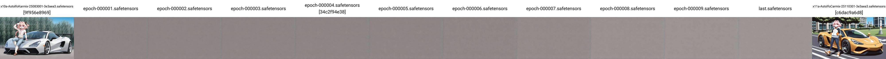

- First to confirm (and it is the hardest one) is *the trainer code works as intended*. Although I have restrucutred the trainer code (see CH06), eps-eps and vpred-vpred training works as intended.

- However, when I trained on the "working merged eps-vpred model by accident a.k.a AC-NIL-0.1", it just shows colored fragments, implies that it works after merge.

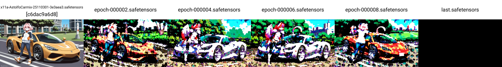

- For the merge, when I merge "AC-NoobAI base" with "AK-NIL-1.2", it only works for 90:10, which implies that I may just underfit in the conversion.

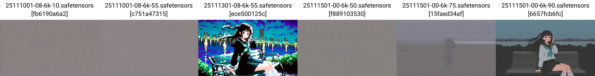

- After my friend [hinablue](https://civitai.com/user/hinablue/models) decided to take my codes ~~and an A100x1 instance~~ to have a few EPs with his "1girl 1k 10x repeat" dataset, I confirm that it will be good to perform the mega 1EP finetune with a [grid search](https://scikit-learn.org/stable/modules/generated/sklearn.model_selection.GridSearchCV.html) on merge ratio.

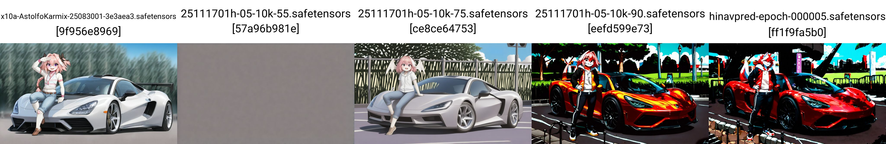

- After 11k / 778k of "production run", I can still barely see the progress, however it may not working at all.

- Yep, *it just doesn't work*. Currently the working condition is unclear. Looks like the dataset must be aligned to the base model, which is not exist for a merged model like this.

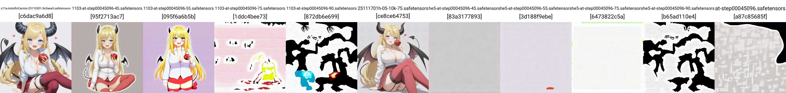

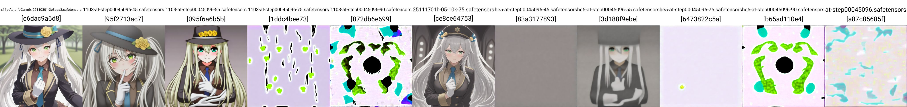

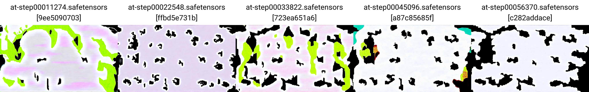

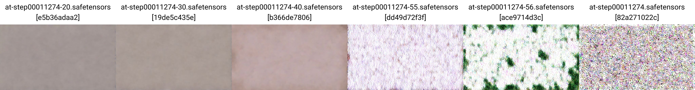

- Swapping to the "merged-trained-merged" model doesn't work either. I even hit `nan` in loss curve.

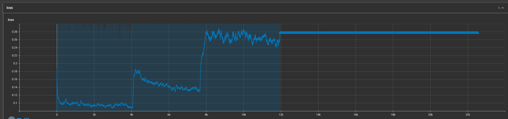

- *Currently returning to [EPS trainning](../ch06/gallery_2511.md).* I have watched some generation preview (available in A1111) and find that the denoise process just snapped in early steps, which implies that it probably really can't handle my raw dataset. Same issue appears in the "working vpred merge" which the model may need a strong bias to generate with vpred process instead of the low bias in eps (eps blur but vpred just go straight into noise).

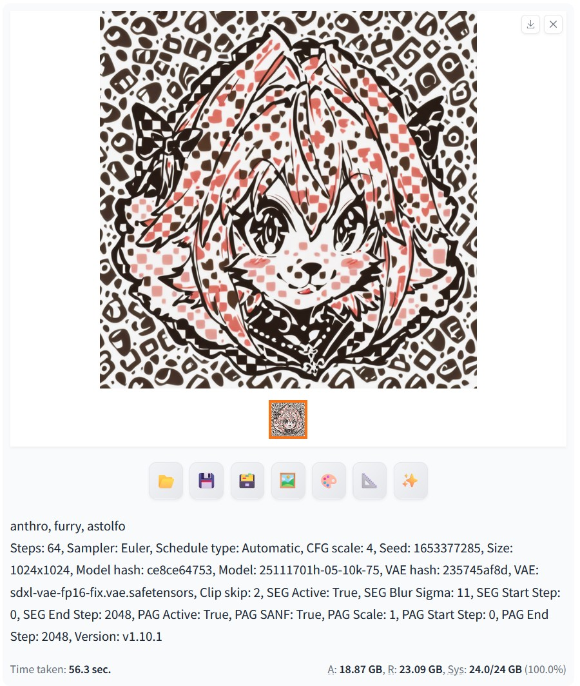

## Retry with the AK-Evo 2EP ##

- Vpred from 2EP is basically no luck.

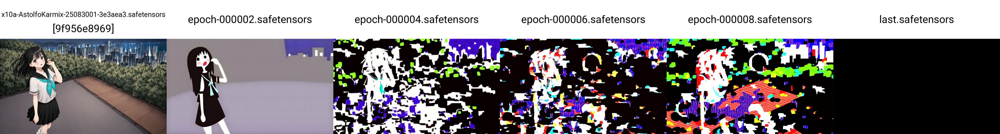

- However, vpred from the merged AK-Evo 2EP, since it has already have the original dataset burnt in, the "6k Astolfo" **subset** works quite well.

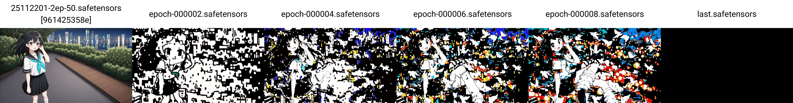

- After some grid search on ratio, it fits with 0.85, which is between 0.75 and 0.9. *It looks like underfit, by comparing with the work in 2511.*

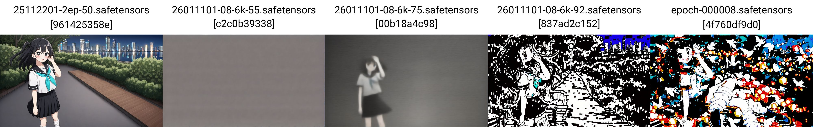

- Switching prompts are having similar result. It is just uncertain for the optimal ratio.

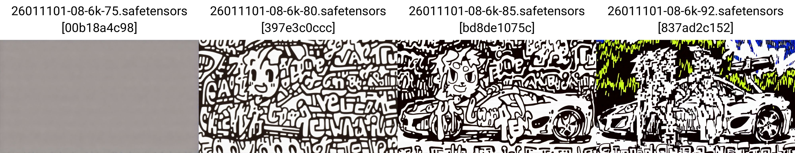

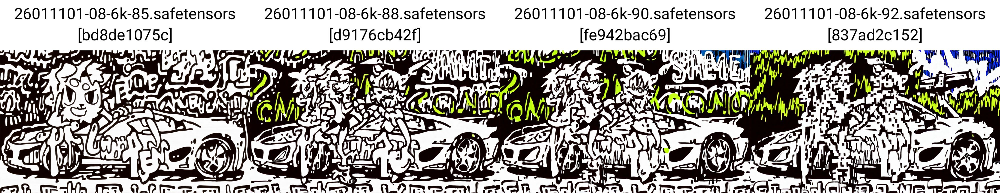

- By comparing with more prompts, the optimal ratio is more certain.

