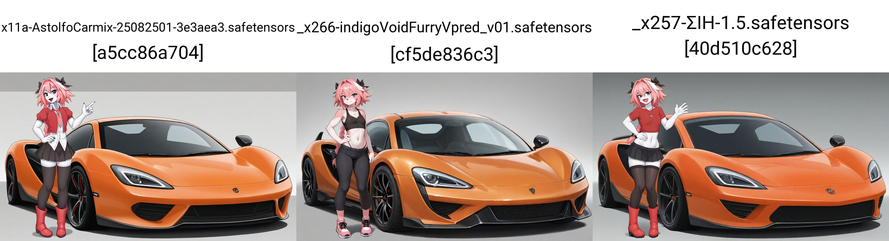
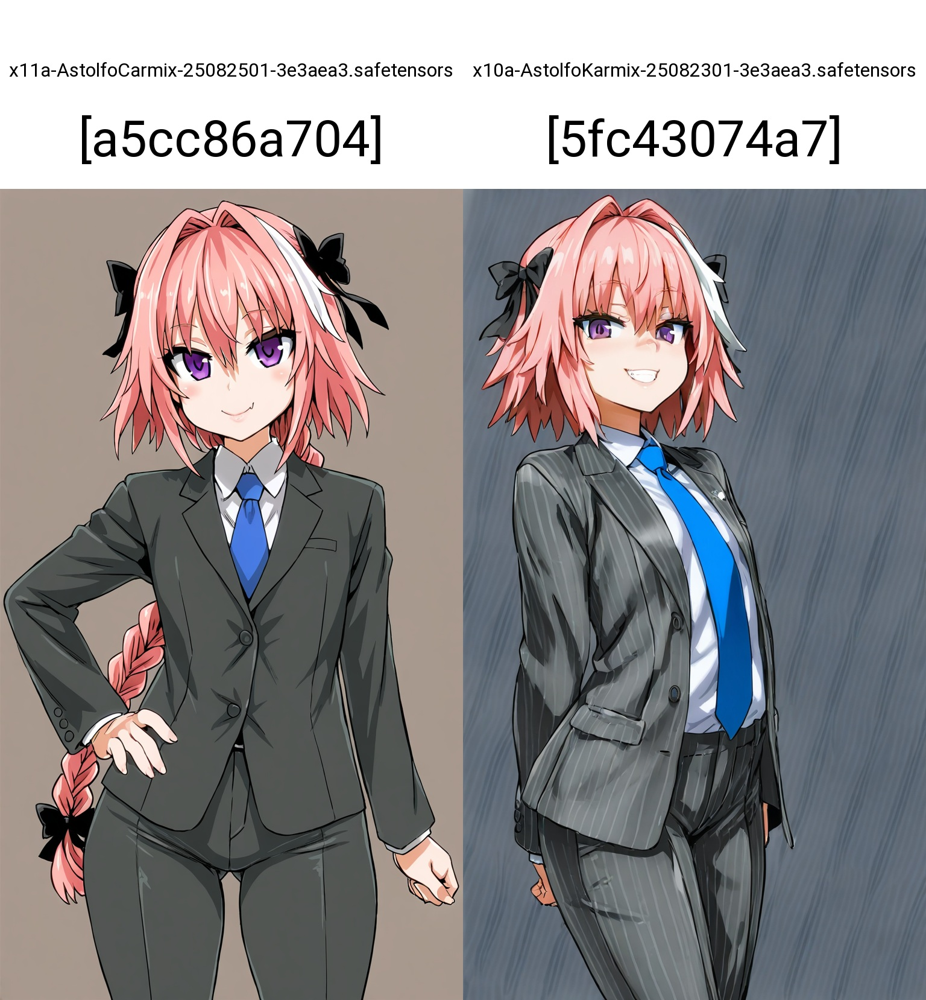
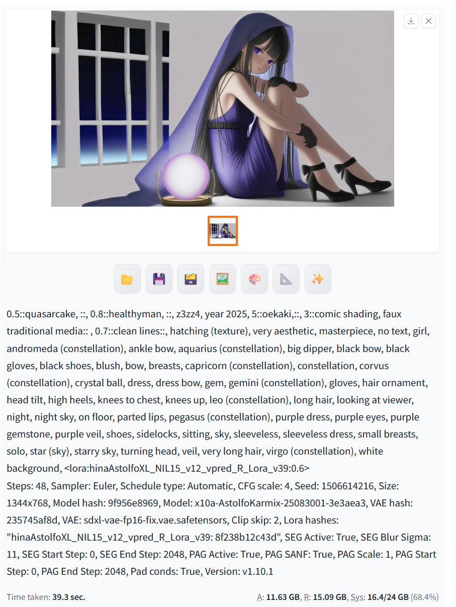
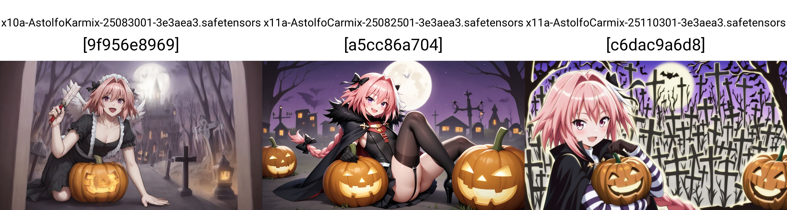
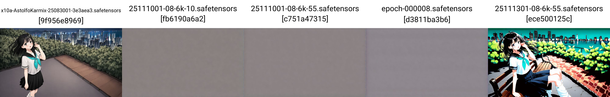

# Chapter 05-AC: AstolfoCarmix #

**Warning**: The following sections are more towards art performance, instead of pure inference between AI / ML theories. Because of the **asymmetry** of training / inferencing in this generation task (i.e. text-to-image), the theories are drifting away from academic world, my "insight" / "intiution" about how the poor model works may be inaccurate, or scientific to relate to obvious general knowledge. The findings below are heavily relies on the concepts on [flow matching and vector field](https://arxiv.org/abs/2210.02747), even the "SDXL VPred" is **opposite** from there (score matching and markov chain with modified objective function "vpred").

## "AstolfoCarmix": vpred merge ##

- [Got it running in A1111](../ch01/vpred.md#extra-sdxl-vpred-in-a1111) in 2508, downloaded a new model pool, and the findings doesn't align to the eps side (i.e. current work). Need to figure out what is the "survive condition" again.

- *Hopefully not tunnelvision (especially I made quite a lot of drama / feud with others)*, it should points to some fundamental properties and conditions, instead of brute force / fancy algorithm. I should have enough information already to figure out how the merge works.

- Currently blending all vpred models together is working as intended (my eps model treated as outlier successfully).

- For "vpred vs eps" debate, I think vpred is overexaggerated. Colors are mostly from latent offset (model bias), meanwhile users are not aware / desire for rich contents.

## Merging burnt VPred Lycoris with AK: Inspiration ##

- *Discovered in 2508, but went hiatus for 2 months.*

- The hypothesis is something like "EPS to VPRED conversion" is a "relatively easy task (ML task)" which only touchs little model weights. [It was verified in 250902](https://discord.com/channels/1077423770106597386/1093732075355525331/1412429017868537887). However to protect the author (yet the LoRA itself is unuseable other than this niche task), the "LoRA weight" remains private (closest approximation is [this IL2.0 based LoRA](https://civitai.com/models/536954?modelVersionId=2173556)). Instead, [merge log](./xl_docs/vpred_merge_25110301.log) and the [merged model](https://civitai.com/models/1898715/astolfocarmix-vpredxl) can be released.

## Cracking the way how vpred works ##

- External reading: [Trainning log. Still need to merge.](../ch06/sd-scripts-runtime/logs/readme.md#2511-cracking-the-way-how-vpred-works).

- Although VPred from EPS is an easy task, it is not "obvious". Given a broken image instead of numbers, I still need to guess how and why it breaks. *More like educated guess and informed decision?*

- Blindly run vpred mode over eps model will yield to "blur image" with no content. It looks like this xy plot, however I have trained 6k 10EP over it. *There must be something wrong.*

- First to confirm (and it is the hardest one) is *the trainer code works as intended*. Although I have restrucutred the trainer code (see CH06), eps-eps and vpred-vpred training works as intended.

- However, when I trained on the "working merged eps-vpred model by accident a.k.a AC-NIL-0.1", it just shows colored fragments, implies that it works after merge.

- For the merge, when I merge "AC-NoobAI base" with "AK-NIL-1.2", it only works for 90:10, which implies that I may just underfit in the conversion.

- *Under progress.*
