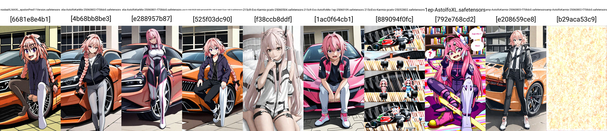

# Chapter 05-AK: AstolfoKarmix #

- [CivitAI model page.](https://civitai.com/models/1671685) *It does what you have expected*.

- [HuggingFace model page.](https://huggingface.co/6DammK9/AstolfoMix-XL) The style is also different.

- [CivitAI article page.](https://civitai.com/articles/3409) Summary of here (as additional content with SD1).

## Merge Log for "215c Evo" ##

- I do not put in the [README_XL](./README_XL.MD) because it needs to be explored, meanwhile it starts to be not 100% original idea. This time I rely on [Karmix](../ch02/karmix.md) and [9527R](https://civitai.com/models/176449/9527-detail-realistic-xl) (the realistic finetune over 215c), or [JANKU v4](https://civitai.com/models/1277670/janku-v4-nsfw-trained-noobai-eps-rouwei-illustrious-xl).

- *From the experience in ch05, all WeightedSum (default $\alpha=0.5$) are enhanced with "BasinSum". Math proof... [Rebasin](../ch01/readme.md) has expected value in $\alpha$ obviously*

${BasinSum}(A,B,\alpha) \leftarrow ( \alpha (\alpha A + (1-\alpha) B) + (1-\alpha) Rebasin(A,B,\alpha) )$

- It has been used since 215c and 255c. Note: 215a = "DGMLA-216", "amp" is the [amplify_diff](./amplify_diff.ipynb), and the "base" is the base model "SDXL1.0". 1EP is the result in [finetuned model](../ch06/) from 255c with 1EP.

${215c} \leftarrow {BasinSum}(215a,amp(215a,base,2.0),0.5)$

- Since BasinSum takes around an hour, but the native 0.5 is just 10 seconds, I can decide if it works the "phase shift".

- My accept criteria is still "man with car" which represents knowledge preservation from the base model. Realife location is optional (that is not a single concept from background). Mainstream "character / artist style recognition" will be ignored because I think [NoobAI-XL](https://civitai.com/models/833294/noobai-xl-nai-xl) has made a great job here ~~especially it really requires dozens of EPs.~~

## Merge Log for AK ##

- "215cEvo-AstolfoMix-1ep-25052801": BasinSum(215c, 1EP, 0.5). Generally tends towards 215c but with enhanced varity of content. However still poor in character / artist style recognition.

- [215cEvo-Karmix-pcatv-25052802](https://huggingface.co/6DammK9/AstolfoMix-XL/blob/main/215cEvo-Karmix-pcatv-25052802.safetensors): 0.7 "Karmix pca-tv-mtd" + 0.3 "215cEvo-AstolfoMix-1ep-25052801". Works fine, with some images broken.

- "215cEvo-Karmix-pcatv-25060103": BasinSum("215cEvo-AstolfoMix-1ep-25052801", "Karmix pca-tv-mtd", 0.5). *Completely broken.*

- "215cR-AstolfoMix-9527-25060107": BasinSum(215c, 9527R, 0.5). [Uncanny valley](https://en.wikipedia.org/wiki/Uncanny_valley) occurs, maybe 9527R alone is fine.

- "215cR-Evo-AstolfoMix-1ep-25060109": BasinSum(215cR, 1EP, 0.5). Generally tends towards 215cEvo but with enhanced character anatomy. Probably anthro only and not feral.

- "215cR-Evo-Janku-25060501": 0.5(215cR + Janku). Suffers like "215cEvo-Karmix-pcatv-25052802".

- "215cR-Evo-Janku-25060503": 0.75 * 215cR + 0.25 * Janku. *Broken.*

- "215cR-Evo-Karmix-pcatv-25060502": "215cEvo-Karmix-pcatv-25052802" UNET + "215cR-Evo-AstolfoMix-1ep-25060109" CLIP. *Completely broken.*

- "215cR-Evo-Karmix-pcatv-25060504": 0.75 * 215cR + 0.25 * Karmix. *Completely broken.*

- ["x6c-AstolfoKarMix-25060802-f758dc0"](https://huggingface.co/6DammK9/AstolfoMix-XL/blob/main/x6c-AstolfoKarMix-25060802-f758dc0.safetensors): DGMLA merge with 7 models, with base model assigned as `noobaiXLNAIXL_epsilonPred11Version`. Improvement over Karmix confirmed. Most conflict resolved by either 215cR-Evo or the base model, even it is just around 12.5% of weight.

### Merge Log in the e2e merger ###

This is the merging log for DGMIA. Based from `25022801`.
- DGMLA: `25060701`. 16 models. `apply_isotropic=False`. Code Test. Looks like x255a.
- DGMLA: `25060702`. 5 models. `apply_isotropic=False`. Control Test. Looks like x215cR-Evo.
- DGMIA: `25060703`. 5 models. `apply_isotropic=True`. Complete fail. *Implementation error.*
- DGMLA: `25060801`. 7 models. `apply_isotropic=False`. Looks like x215cR-Evo also.
- DGMLA: `25060802`. 7 models. `apply_isotropic=False`. Looks like karmix. *Improvement confirmed with around 12.5% of 1EP content.*
- DGMIA: `25060901`. 7 models. `apply_isotropic=True, apply_exp=False, apply_high_dim=False`. Looks less like karmix, but feels strange.
- DGMIA: `25060902`. 7 models. `apply_isotropic=True, apply_exp=True, apply_high_dim=True`. Looks less like karmix, but *more strange*.
- DGMIZ: `25071601`. 7 models. `apply_isotropic=True, apply_exp=False, z_cof=0.8, apply_high_dim=True`. Looks like `25060802`, details become more vivid.
- DGMIZ: `25071602`. 7 models. `apply_isotropic=True, apply_exp=False, z_cof=2.0, apply_high_dim=True`. Looks like 215c, but preserved around 80% of AK's knowledge.
- DGMIZ: `25072001`. 11 models. `apply_isotropic=True, apply_exp=False, z_cof=0.8, apply_high_dim=True`. **IL2.0 base doesn't work.**
- DGMIZ: `25072101`. 257 models. `apply_isotropic=True, apply_exp=False, z_cof=0.8, apply_high_dim=True`. **Better than 215c, just redeemed from 255c.**
- DGMIZ: `25072401`. 11 models. `apply_isotropic=True, apply_exp=False, z_cof=0.8, apply_high_dim=True`. 256c base. Looks like 256c, but different content.
- DGMIZ: `25072501`. 11 models. `apply_isotropic=True, apply_exp=False, z_cof=0.8, apply_high_dim=True`. NoobAI base. Looks like v1.1, trade stability with varity.

## Supplementary Contents ##

```log
PS F:\NOVELAI\astolfo_mix\sdxl\raw> dir


    目錄: F:\NOVELAI\astolfo_mix\sdxl\raw


Mode                 LastWriteTime         Length Name
----                 -------------         ------ ----
-a----         10/5/2025     10:08     6938040744 1ep-AstolfoXL.safetensors
-a----          2/6/2025      6:56     6938067922 215cR-Evo-AstolfoMix-1ep-25060109.safetensors
-a----         25/7/2025      1:06     6938044026 256cEvo-AstolfoMix-1ep-25072103.safetensors
-a----        15/11/2024      0:08     6938064842 x215c-AstolfoMix-24101101-6e545a3.safetensors
-a----         24/7/2025     21:49     6938041946 x256c-AstolfoMix-25072101-a4da898.safetensors
-a----          4/6/2025     23:40     6938040674 _x248-JANKUV4NSFWTrainedNoobaiEPS_v40.safetensors
-a----         12/5/2025     23:26     6938039854 _x249-Karmix-XL-v0.safetensors
-a----         14/5/2025     20:45     6938040318 _x253-pca-tv-mtd-illv20-idx0-personalv30-r-te04-oeaiv12ue-r-te0.4.safetensors
-a----         13/7/2025      1:34     7105351742 _x254-pornmasterPro_noobV4VAE.safetensors
-a----         12/7/2025     15:25     6938040424 _x255-rouwei_080_base_fp16.safetensors
```


## Comparasion ##

- AK does stand out from previous merges.



- Comparing to pure finetuned model, it shows better balance.


- Besides the dominant base model knowledge, general knowledge is regained.


- Finally it can recall and output rare images, which is absent from most models, no matter finetuned or merged.

