# Chapter 05-SD2: AstolfoMix-SD2. #

- [CivitAI model page.](https://civitai.com/models/255754) The style there is a bit different.

- [HuggingFace model page.](https://huggingface.co/6DammK9/AstolfoMix-SD2) The style is also different.

- [CivitAI article page.](https://civitai.com/articles/3409) Summary of here (as additional content with SD1).

## What is the mix? ##

- Currently, it is an ~~Ensemble averaging~~ ~~Uniform merge~~ "Exotic merge" of 12 UNETS + 4 CLIPS (from 15 models), selected from 24 discovered SD2.1 models.

- I will include *exclusive findings* here only. Read the ["master" article](./README.MD) for general ideas.

## Generated Images ##

- ["AstolfoMix" in Pixiv.](https://www.pixiv.net/en/tags/AstolfoMix/artworks)

## Why make such a model? ##

- ["All models are wrong but some are useful."](https://en.wikipedia.org/wiki/All_models_are_wrong) ["所有模型都是错的，但其中有些是有用的！"](https://cloud.tencent.com/developer/article/1460573)

- SD2.1 is the best proving ground for an original idea. Whole history of SD2 and its finetunes (especially WD1.5) is a tragedy. If my mix *looks reasonable* out of merging total unuseable models, I will discover a lot more exlucsive findings, and *get closer to the ground truth.* 

## My discoveries ##

### Total disaster ###

- [ch02/model_history](../ch02/model_history.md): *Image there is irrelevant.* Started from WD1.5B2, I believe that it is *trainer problem along with A1111's runtime problem.* Most models at that era cannot generate any reasonable image, except the prompts mentioned in the demo case. As on 231231, I can't reproduce the [same image](https://www.pixiv.net/en/artworks/105946900) on 2303. Except [Replicant-V3.0](https://civitai.com/models/10701?modelVersionId=75540) and its variants, even the [PonyDiffusion](https://civitai.com/models/95367/pony-diffusion-v5), I cannot make any reasonable images out from demo prompts (most users don't aware of this because they are targeted users). *Therefore there must be something to improve.*

- [ch01/merge](../ch01/merge.md): Althouth there was some [tryhard merges](https://civitai.com/models/11420/quattro4mergei?modelVersionId=13518) which shared a similar thought, it is acting strange (later I found some essential prompts to include), and [there are some actual improvement from parent model.](https://civitai.com/models/68163?modelVersionId=78114) *There must be something really bad, was included in the mix, to make the result model being poor on understanding concepts.*

- [ch01/hires_fix](../ch01/hires_fix.md), [ch01/cfg_step](../ch01/cfg_step.md), [ch01/arb](../ch01/arb.md): Most finetuned models used 768x768 for training, therefore there is no "huge improvement" like what SD1.5 did. However my mix will be carried a lot faster. BTW the result CFG will be changed, due to the lower diversity of the implied training dataset.

- Remining stuffs will be [same as what I do in SD1](./README.MD).

### Merging models from different background ###

- Here is a list of merged, or "may be merged" of models. Explainantion of the selection will be listed in below session.

- Y(a) means it is included in the "Baseline Merge" only. Y(b) means it is included in the "RL Merge" only. Explainantion in "RL merge" session.

|Index|Model name (with URL)|UNET used?|CLIP used?|
|---|---|---|---|
|`_201`|[AllWorkForkRowk](https://civitai.com/models/136088?modelVersionId=233682)|||
|`_202`|[Artius V2.1 NSFW](https://civitai.com/models/15975/artius-v21-nsfw?modelVersionId=33119)|Y||
|`_203`|[E621 Rising v2](https://civitai.com/models/32423/e621-rising-v2-a-stable-diffusion-21-furry-model?modelVersionId=38862)|||
|`_204`|[hakoMayD](https://civitai.com/models/72668/hakomayd?modelVersionId=77394)|Y||
|`_205`|[Illuminati Diffusion v1.1](https://civitai.com/models/11193/illuminati-diffusion-v11?modelVersionId=13259)|||
|`_206`|[Mishi Anime](https://civitai.com/models/7742/mishi-anime?modelVersionId=9125)|Y(a)||
|`_207`|[NijiDiffusion](https://civitai.com/models/55495/nijidiffusion?modelVersionId=59885)|||
|`_208`|[Plat Diffusion v1.3.1](https://huggingface.co/p1atdev/plat-diffusion)|||
|`_209`|[PVC v4](https://huggingface.co/p1atdev/pvc-v4/tree/checkpoints)|||
|`_210`|[Quattro4Merge+i](https://civitai.com/models/11420/quattro4mergei?modelVersionId=13518)|Y||
|`_211`|[Replicant-V3.0](https://civitai.com/models/10701?modelVersionId=75540)|Y||
|`_212`|[Pony Diffusion](https://civitai.com/models/95367/pony-diffusion-v5)|||
|`_213`|[Cool Japan Diffusion 2.1.2](https://huggingface.co/aipicasso/cool-japan-diffusion-2-1-2)||Y|
|`_214`|[WD 1.5 Beta 2](https://huggingface.co/waifu-diffusion/wd-1-5-beta2)|||
|`_215`|[WD 1.5 Beta 3](https://huggingface.co/waifu-diffusion/wd-1-5-beta3)||Y|
|`_216`|[YiffAI](https://civitai.com/models/3684/yiffai-2322?modelVersionId=6253)|||
|`_217`|[Stable Diffusion v2-1](https://huggingface.co/stabilityai/stable-diffusion-2-1)||Y|
|`_218`|[RuminationDiffusion](https://huggingface.co/JosephusCheung/RuminationDiffusion)|Y||
|`_219`|[Scream-SemiRealistic](https://civitai.com/models/99040/sd2scream-semirealistic?modelVersionId=140498)|Y||
|`_220`|[Realgar-v2.1](https://civitai.com/models/70713?modelVersionId=111486)|Y|Y|
|`_221`|[RheaSilvia](https://civitai.com/models/68163?modelVersionId=78114)|Y||
|`_222`|[MuaccaMix](https://civitai.com/models/26087/muaccamix?modelVersionId=112322)|Y||
|`_223`|[hakoMayBoy](https://huggingface.co/852wa/hakoMay/blob/main/hakoMayBoy.safetensors)|Y||
|`_224`|[Hurricane](https://civitai.com/models/204162?modelVersionId=240829)|Y(a)||

- Instead of [abruptly replaced with SD1.4's Text Encoder](https://huggingface.co/6DammK9/bpmodel-sd14-merge), this time *I don't trust SD's original TE, and somehow eventually used it.*

- This time may not have "Extended" version unless I found including more models will be useful.

- Remining stuffs will be [same as what I do in SD1](./README.MD).

### Model selection ###

- [Model seleciton](https://en.wikipedia.org/wiki/Model_selection) is a **NP Hard** ( $O(N!)$ ) question. However with [pattern recognition](https://en.wikipedia.org/wiki/Pattern_recognition) by visual inspection (since total number is still 23), it reduced to a core concept of **"Replicant-V3 UNET + WD1.5B3 CLIP"**. With some further matching, **10 UNETs and 4 CLIP / TEs** are picked for this version of AstolfoMix.

- Builtin VAE will be `kl-f8-anime2.ckpt`. But I'm still using `vae-ft-mse-840000-ema-pruned.ckpt` for WebUI. Choose what you want.

- [ch03](../ch03): TTE may help bring some "anime" features to the foreground, *I must adjust my prompt, since most models are tagged with anime / real*, and AI chose to not blending the style like SD1 did.

- The actual steps of finding the model combination will be listed in below session.

### Verifying the merge is precise ###

- Since I use [parallel merge](https://en.wikipedia.org/wiki/Merge_algorithm) directly, it is 0.5 most of the time. I only need to "reset CLIP" for the last model.

## Finding on "SD2 Baseline Merge" ##

- *Stick with 768x768 with maximum 1.5x HiRes fix*. There are no 1024x1024 trained models in the wild.

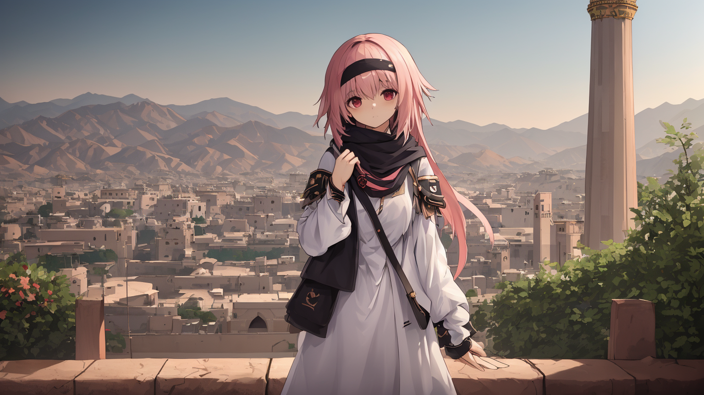

```
parameters
(aesthetic:0), (quality:0), (anime:0), (solo:0), (boy:0), [niqab], [[hijab]], [astolfo], [[afghanistan]]
Negative prompt: (worst:0), (low:0), (bad:0), (exceptional:0), (masterpiece:0), (comic:0), (extra:0), (lowres:0), (photorealisitc:0)
Steps: 256, Sampler: Euler, CFG scale: 6, Seed: 802596511, Size: 1024x576, Model hash: a85153fd84, Model: 209-AstolfoMix-207208-203te, VAE hash: df3c506e51, VAE: vae-ft-mse-840000-ema-pruned.ckpt, Denoising strength: 0.7, Clip skip: 2, FreeU Stages: "[{\"backbone_factor\": 1.1, \"skip_factor\": 0.9}, {\"backbone_factor\": 1.2, \"skip_factor\": 0.2}]", FreeU Schedule: "0.0, 1.0, 0.0", FreeU Version: 2, Hires upscale: 1.5, Hires steps: 64, Hires upscaler: Latent, Dynamic thresholding enabled: True, Mimic scale: 1, Separate Feature Channels: False, Scaling Startpoint: MEAN, Variability Measure: AD, Interpolate Phi: 0.3, Threshold percentile: 100, Version: v1.7.0
```

### Considering CLIP / TE combinations individually ###

- This time [stable-diffusion-webui-model-toolkit](https://github.com/arenasys/stable-diffusion-webui-model-toolkit) will be used frequently, because I need to keep extracting and importing UNETs / CLIPs together. It also saves the model as FP16 safetensors, which is commonly used, reliable and take less disk space. *Now I've generated 80+ models which is huge* ( $O(N)$ for space)

- [Effects on swapping CLIP / TE has been discovered in the SD1 version](./README.MD#swapping-clip--te-with-other-models). This time I used to discover any useful CLIP (somehow SD2.1's CLIP is still competitive for general purpose).

- Looking for images generated by original models are not useful. It only shows indentifible anime face (Astolfo?) or the car (Mercedes?), but not both of them. It shows that TTE made the model weights skewed so hard.

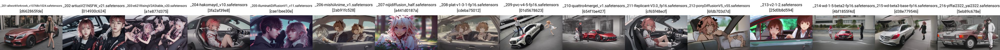

- **Then I blindly merge all models together.** At that point, only 16 models are discovered. Obviously, it is a total mess. 

- For full recipe, see [recipe-215a.json](./recipes/recipe-215a.json).

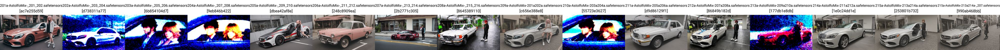

- Then I apply each recipe model's CLIP in to the blindly merged model. Notice that some highly similar images appeared. Also, it shows BOTH a car and a person (although the person is messed up).

- **Now I can identify the useful CLIPs.** Make sure repeat such batch image generation for different topics. Here I show only a single topic.

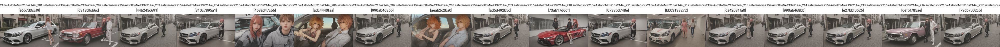

- Finally merge all "useful CLIPs" as whole model, then **join all recipe models with the new merged CLIP**.

- **Now I can identify the useful UNETs.**

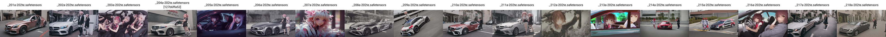

- Finally **repeat the merge with the specified models**. Somehow the "model set" can be simplified to a "model variants merging to another model variants". Let's see the effect.

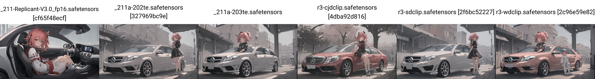

- To expand the "set of models" I've find that I really need more models to "adjust the weight" even it is just an uniform merge. Somehow I've found 6 more models and repeated the whole process. Note that since it is parallel merge, I can "add" the new merge instead of deleting all intermediate models.

- For full recipe, see [recipe-209.json](./recipes/recipe-209.json). Note that [stable-diffusion-webui-model-toolkit](https://github.com/arenasys/stable-diffusion-webui-model-toolkit) doesn't preserve metadata, therefore I only show `209` instead of `209-203te`.

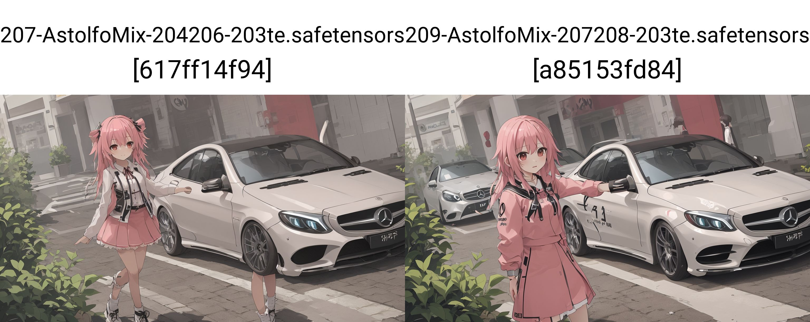

- Since the model is biased to a model variant, I need to adjust the CFG, which is "CFG 4 mimic 1 scale 0.5" to "CFG 6 mimic 1 scale 0.3".

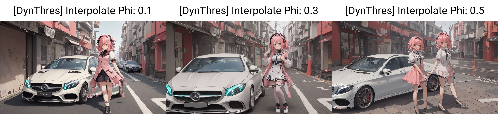

### "Looking good" doesn't mean it is useful ###

- *The merge won't look great, but at least you won't get Miku Hatsune when prompting Suzumiya Haruhi, or having a black hair boy when prompting Link.*

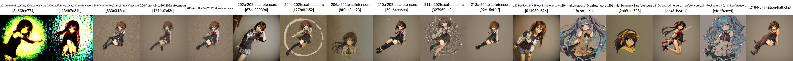

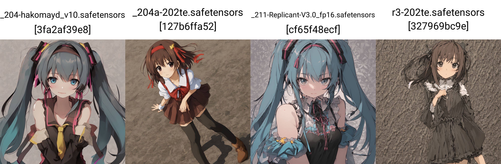

### L2 graph is not working ###

- I may solve the tedious NP-hard question to "visualize" the model weights in a meaningful way. ~~But this time PonyDiffusion (a big finetune) made the chart look skewed.~~ If the weight diverse too much, such a 2D plane is impossible to visualize a *skewed high dimension shape.*

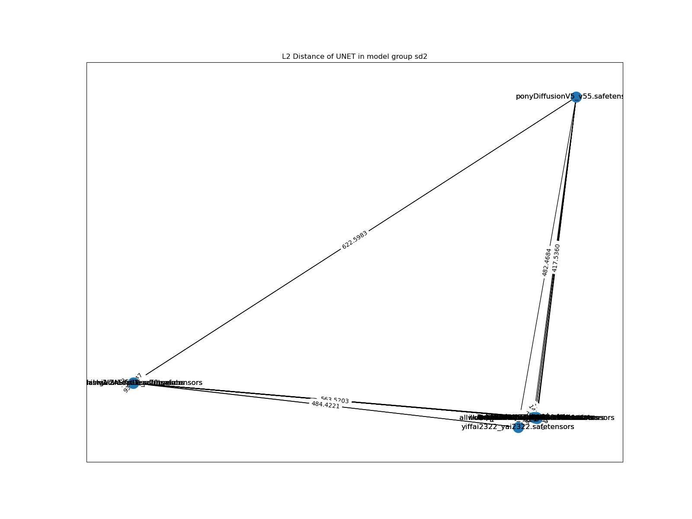

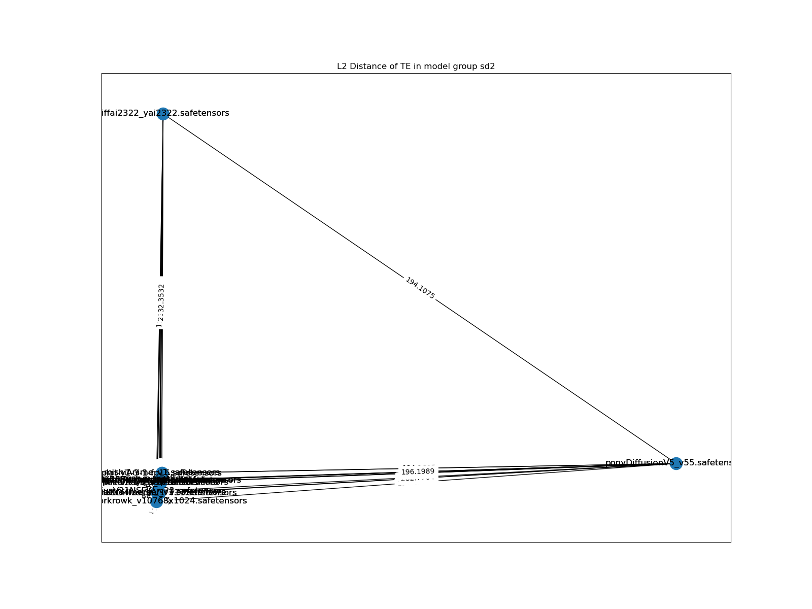

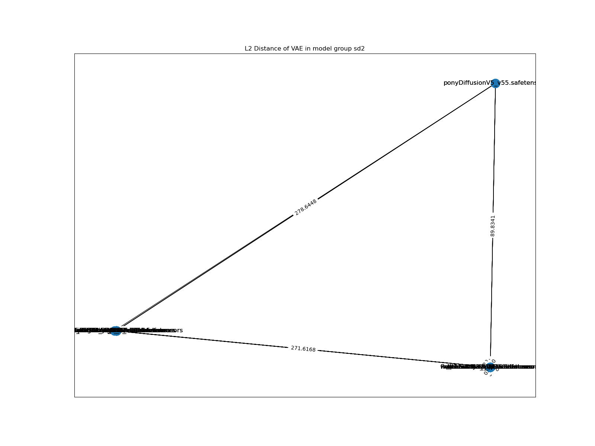

- (Written after the recipe is being chosen) After model selection by solely *editor's choice* (i.e. my choice **without relying on automatic system**), the chart is being more clear with 2 outliers (explained why I dropped `_206` on RL merge):


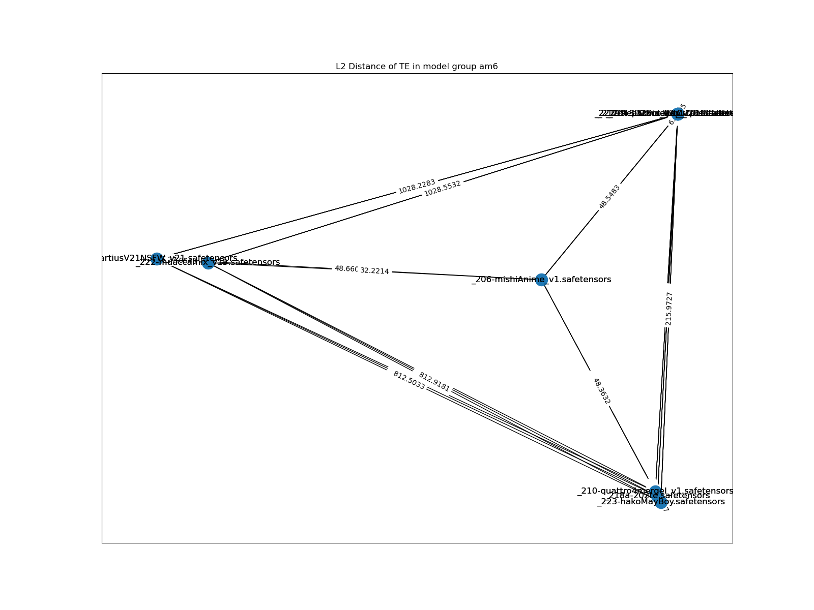

- And then removing the outlier manually:

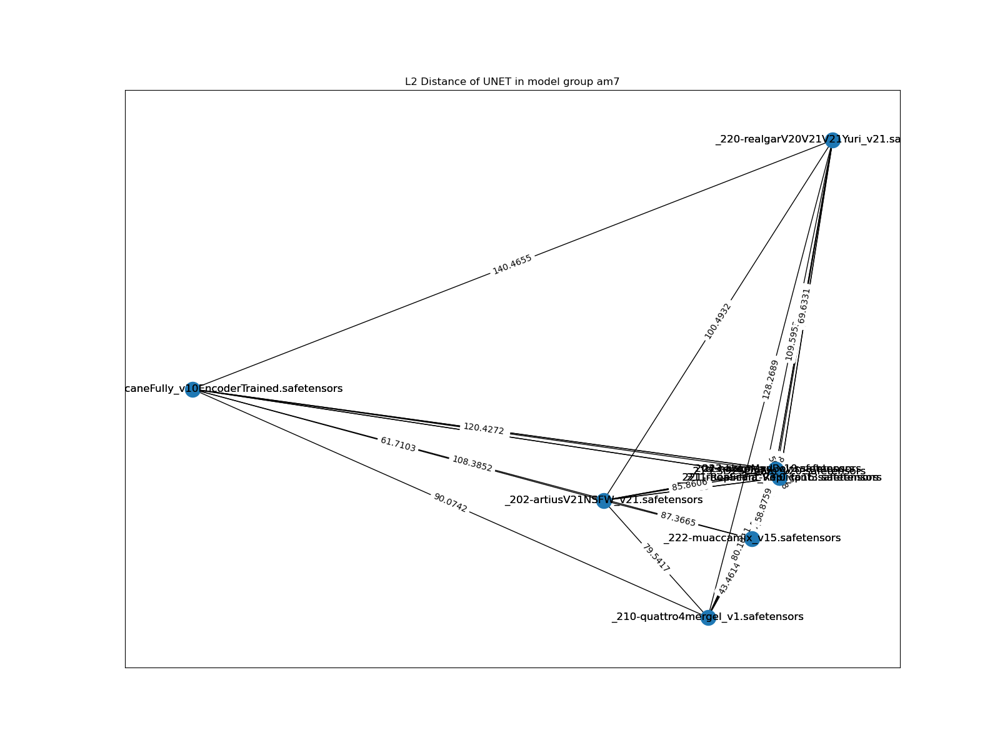

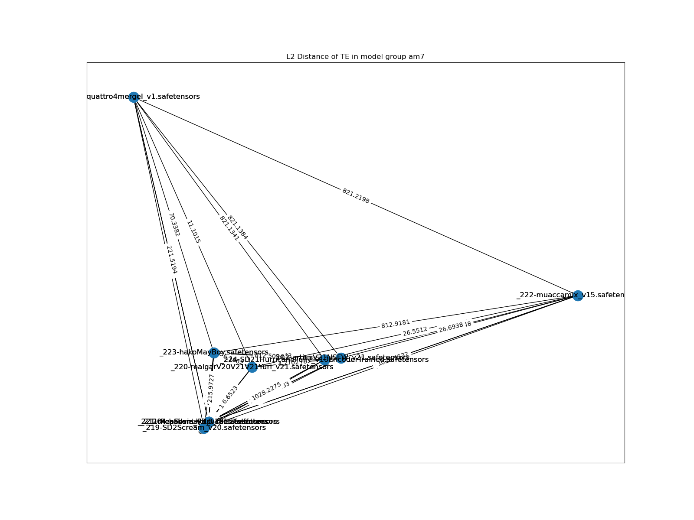

- Now it shows that *most models are quite close together.* The capability did improved (quite a lot), but it is still hard to be consistent in art style, which is a lot worse in SD1 version. *Art style is expensive.*

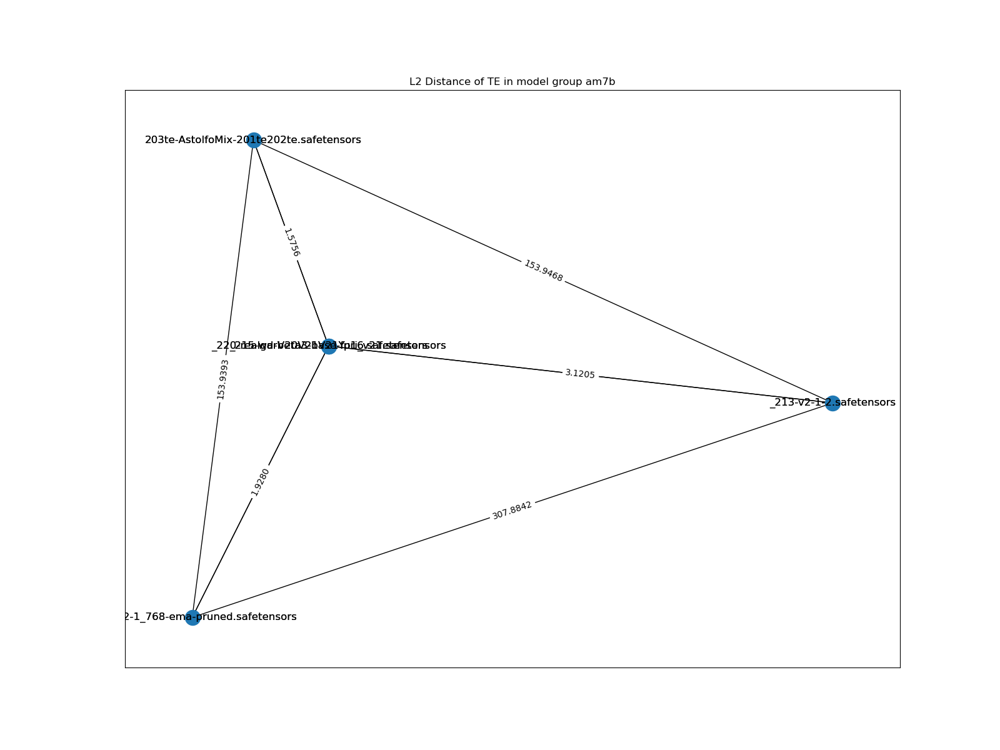

- And then, VG graph of chosen CLIP is close in weight also. WD1.5B3 was described as "undertrained", however I think it's not the case. Small and biased dataset tends to break the balance and make the model "hard to use". As shown in SD1 version also, "easy CLIPs" are still close to SD's original CLIP, which make the CLIP merge optional (and absent in SD1).

- *I should make a script to correlate the image similarity, even it is another dirty L2 instead of SIFT.*

### Boosted Resolution (less then SD1) ###

- *Written after 210b was made.* I was not expecting resolution boost since most models are not trained in 1024x1024. However I'm wrong: It cannot generate large images with cars / bikes, but sceneary is still intact. You can't see the effect within a few images, because the overall (latent) diversity i.e. variance is larger then SD1.

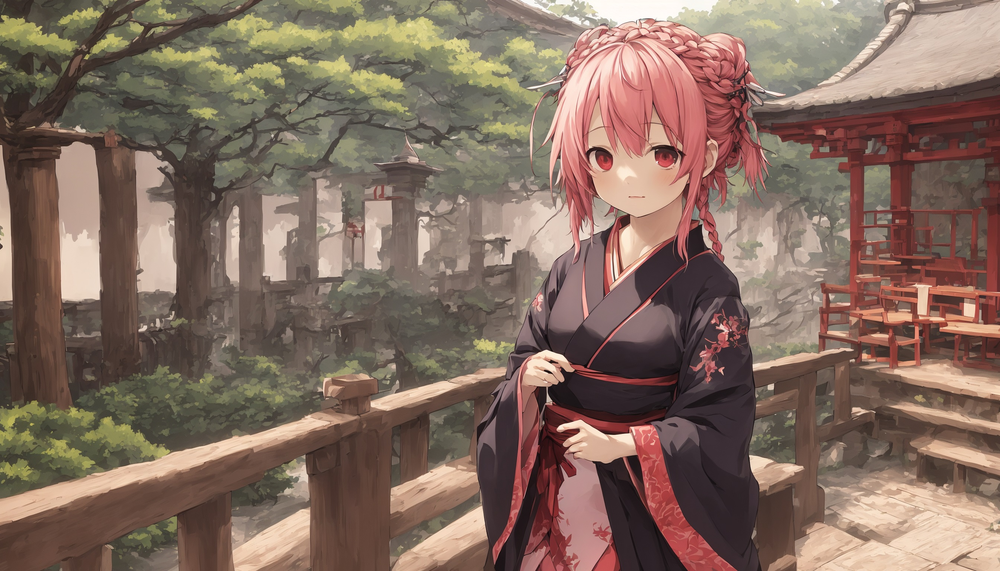

```
parameters
(aesthetic:0), (quality:0), (anime:0), (solo:0), (boy:0), (geisha:0.98), [[braid]], [astolfo], [[kyoto]]
Negative prompt: (worst:0), (low:0), (bad:0), (exceptional:0), (masterpiece:0), (comic:0), (extra:0), (lowres:0), (photorealisitc:0)
Steps: 256, Sampler: Euler, CFG scale: 6, Seed: 3195552242, Size: 1344x768, Model hash: a85153fd84, Model: 209-AstolfoMix-207208-203te, VAE hash: df3c506e51, VAE: vae-ft-mse-840000-ema-pruned.ckpt, Denoising strength: 0.7, Clip skip: 2, FreeU Stages: "[{\"backbone_factor\": 1.1, \"skip_factor\": 0.9}, {\"backbone_factor\": 1.2, \"skip_factor\": 0.2}]", FreeU Schedule: "0.0, 1.0, 0.0", FreeU Version: 2, Hires upscale: 2, Hires steps: 64, Hires upscaler: Latent, Dynamic thresholding enabled: True, Mimic scale: 1, Separate Feature Channels: False, Scaling Startpoint: MEAN, Variability Measure: AD, Interpolate Phi: 0.3, Threshold percentile: 100, Version: v1.7.0
```

### NSFW capability ###

- *Better then original SD2, but worse from the recipe models.* Such capability is sacrificed for content diversity.

## My action list ##

- **Docuement first.** If you see any content not covered in this article, it is either an idea just appeared, or I really havn't considered. Most idea in this article is original and relies on my own experience. 

- Continue what I did in SD1, but in a more efficient way. This time I'm not interested in the intermediate steps.

- *Make it support NSFW by merging the only 1 or 2 discovered NSFW models.*

- *Dropped any "hopeless" models, if the merge breaks a lot (See next chapter)*

## Finding on "SD2 RL Merge" ##


```
parameters
(aesthetic:0), (quality:0), (anime:0), (race queen:0.98), [[braid]], [[bulge]], [astolfo], [[[[nascar, nurburgring]]]]
Negative prompt: (worst:0), (low:0), (bad:0), (exceptional:0), (masterpiece:0), (comic:0), (extra:0), (lowres:0), (photorealisitc:0), (breasts:0.5)
Steps: 256, Sampler: Euler, CFG scale: 6, Seed: 372021954, Size: 1024x576, Model hash: 510ede6f03, Model: 209b-AstolfoMix-207b_208b, VAE hash: df3c506e51, VAE: vae-ft-mse-840000-ema-pruned.ckpt, Denoising strength: 0.7, Clip skip: 2, FreeU Stages: "[{\"backbone_factor\": 1.1, \"skip_factor\": 0.9}, {\"backbone_factor\": 1.2, \"skip_factor\": 0.2}]", FreeU Schedule: "0.0, 1.0, 0.0", FreeU Version: 2, Hires upscale: 1.5, Hires steps: 64, Hires upscaler: Latent, Dynamic thresholding enabled: True, Mimic scale: 1, Separate Feature Channels: False, Scaling Startpoint: MEAN, Variability Measure: AD, Interpolate Phi: 0.3, Threshold percentile: 100, Version: v1.7.0
```

### Crap, I need to drop model! ###

- *Notation and merge sequence follows the SD1 version. I won't repeat them.*

- I've got **runtime errors, exact same score across whole merge, and consistant glitched images** when merging `_206a` against `_210a`. Note that the mentioned 4 layers is actually working, when I reverse the sequence, i.e. merging `_210a` against `_206a`.

```log
RuntimeError: Error(s) in loading state_dict for TimestepEmbedSequential:
        size mismatch for 1.proj_in.weight: copying a param with shape torch.Size([320, 320]) from checkpoint, the shape in current model is torch.Size([320, 320, 1, 1]).
        size mismatch for 1.transformer_blocks.0.attn2.to_k.weight: copying a param with shape torch.Size([320, 1024]) from checkpoint, the shape in current model is torch.Size([320, 768]).
        size mismatch for 1.transformer_blocks.0.attn2.to_v.weight: copying a param with shape torch.Size([320, 1024]) from checkpoint, the shape in current model is torch.Size([320, 768]).
        size mismatch for 1.proj_out.weight: copying a param with shape torch.Size([320, 320]) from checkpoint, the shape in current model is torch.Size([320, 320, 1, 1]).
```

- I have found that it is because `_210a` has ema layers, even after purning, hence the additional layers to crash MBW (1242 vs 1228 layers).

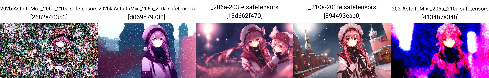

- Then I made a "oridinary merge" between `_206a` and `_210a` with $M=1$, which use the weights from `_210a` entirely. I expected reduced layers will trigger the glitched images, however it doesn't:

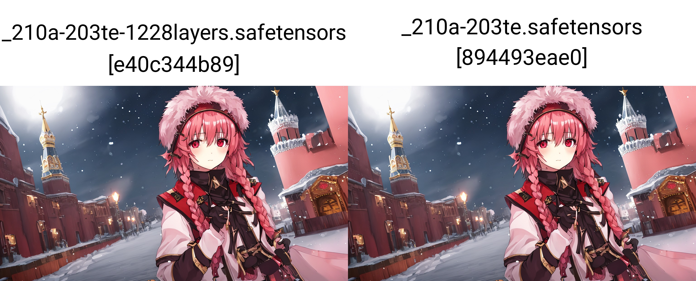

- Seems that `_206a` contains corrupted weight (how? NaN? why?). It forced me to focus on finding alternative models e.g. `_220a`. I can use the entire Hakomay and RheaSilvia series for even more choices, but the damaged diversity will make the ensemble ineffective. 

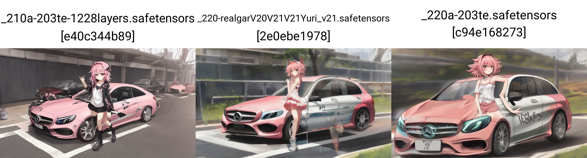

- Then I try to merge `_210a` and `_220a` again, it works. Sorry `_206a`.

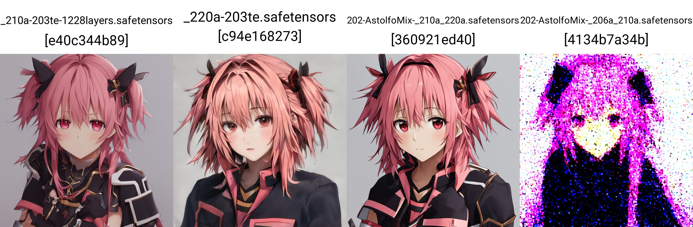

- For the "same score", turns out that it is memory / IO problem. Since I explictly print the score out, restart WebUI, and close the webpage it returns normal.

### Figures ###

- It follows the pattern of SD1. I won't repeat the description. 

- Note that since it is not a perfect $2^n$ models, "pick the best" among `206b` / `207b` will be applied.

|Model O|Model A|Model B|
|---|---|---|
|`201b`|`_202a`|`_204a`|
|`202b`|`_210a`|`_220a`|
|`203b`|`_211a`|`_218a`|
|`204b`|`_221a`|`_222a`|
|`205b`|`_219a`|`_223a`|
|`206b`|`201b`|`202b`|
|`207b`|`203b`|`204b`|
|`208b`|`205b`|`206b` (pick)|
|`209b`|`207b`|`208b`|

- This plot will be updated among progress.

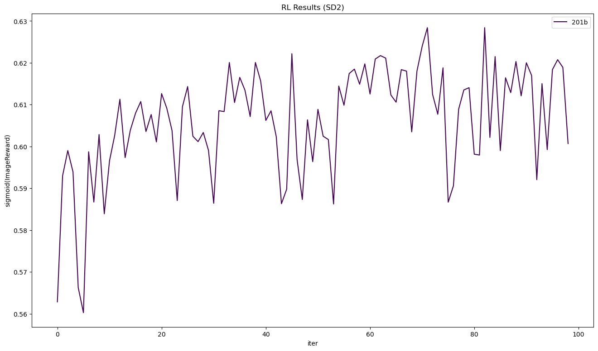

- The L2 graph is more easy to read. Out of my expectation, `_211a`, which is considered as the "root of model variant", tends to be the middle of the graph.

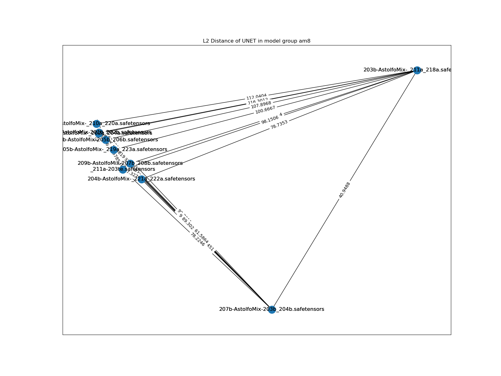

### Boosted contrast ###

- It will be explained in next session "210b", as it is shown in SD1 also [(20b in Comparasion in SD1)](../README.md#findings-on-astolfomix-21b), **produced images tends to be higher contrast and less content in background.** *Although automatic aesthetic scoring model's behaviour are yet to be explained* (I'm not convinced about the cherry-picked result, and tends to desire more psychological test and comparative study), multiple passes of aesthetic scoring model yields to a model more consistant on selected content, as kind of [feature extraction](https://en.wikipedia.org/wiki/Feature_engineering). It can be visible content, or just image effect such as **hue / brightness and contrast**. Obviously it can be done by human also, [here is an examaple about making such effect on fiddling on UNET output.](https://github.com/hako-mikan/sd-webui-supermerger?tab=readme-ov-file#4-contrastdetail) However, I don't think the actual number generated from AutoMBW can relate on the "alpha" attribute there.

### NSFW capability ###

- *NSFW capability is improved*, making me review and discovered some recipe model is actually have basic NSFW content. I guess, *since aesthetic feature is focused on human related content*, it is easy to relate to NSFW.

## Findings on "AstolfoMix-SD2 210b" ##

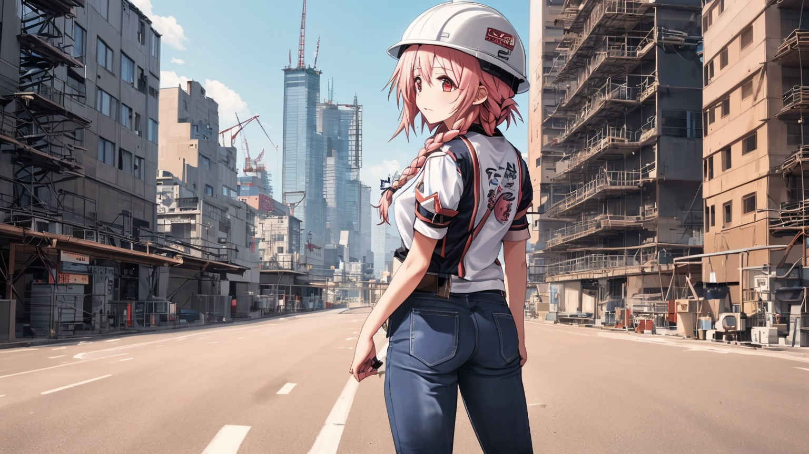

```
parameters
(aesthetic:0), (quality:0), (solo:0), (anime:0), (boy:0), (construction helmet:0.98), [[jeans]], [[braid]], [astolfo], [[new york]]
Negative prompt: (worst:0), (low:0), (bad:0), (exceptional:0), (masterpiece:0), (comic:0), (extra:0), (lowres:0), (photorealisitc:0)
Steps: 192, Sampler: Euler, CFG scale: 6, Seed: 802596570, Size: 1024x576, Model hash: 13696ee702, Model: 210b-AstolfoMix-211209b, VAE hash: df3c506e51, VAE: vae-ft-mse-840000-ema-pruned.ckpt, Denoising strength: 0.7, Clip skip: 2, FreeU Stages: "[{\"backbone_factor\": 1.1, \"skip_factor\": 0.9}, {\"backbone_factor\": 1.2, \"skip_factor\": 0.2}]", FreeU Schedule: "0.0, 1.0, 0.0", FreeU Version: 2, Hires upscale: 1.5, Hires upscaler: Latent, Dynamic thresholding enabled: True, Mimic scale: 1, Separate Feature Channels: False, Scaling Startpoint: MEAN, Variability Measure: AD, Interpolate Phi: 0.3, Threshold percentile: 100, Version: v1.7.0
```

### More model has been added ###

- I have extended 2 more models (`_220`, `_224`) since the weight of `_206` is bad for RL merge. Therefore `210b` is actually come from `211` and `209b`.

- Contrast is greater, making the image can accept lower CFG, or generate better image with intiution.

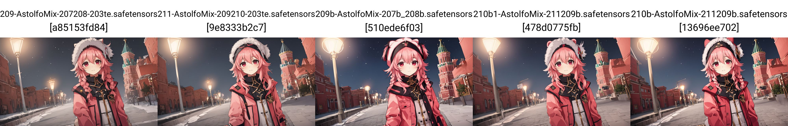

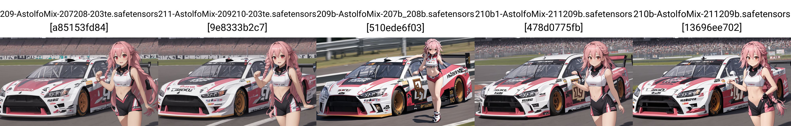

- Other effect is similar to SD1's "21b", I won't repeat again. L2 graph is similar to SD1.

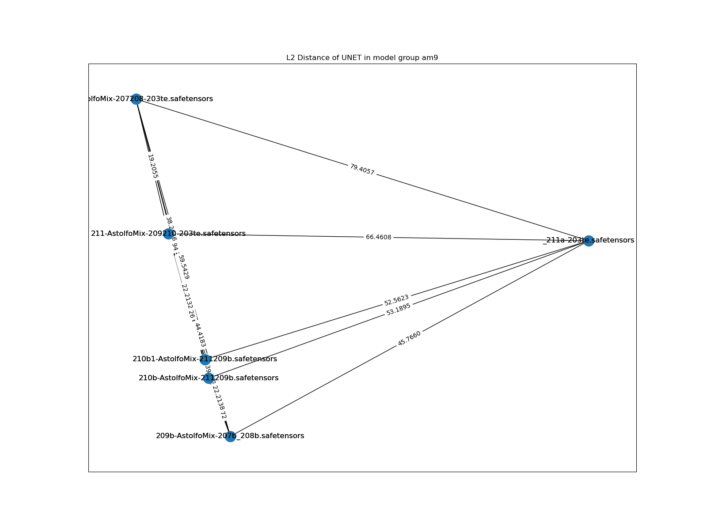

## Model merge / MBW / AutoMBW works, but reason matters ##

*Given the nice models circulating in internet, such methodology should be explained scientifically, instead of naively asserted with mystic and random theory. In artistic study, reasoning and critical thinking is still essential.*

- Picking models to merge: [Model selection](https://en.wikipedia.org/wiki/Model_selection) (Human did this without acknowledge)

- "Uniform Merge": [Ensemble Averaging](https://en.wikipedia.org/wiki/Ensemble_averaging_(machine_learning)) 

- MBW: [Feature extraction](https://en.wikipedia.org/wiki/Feature_engineering) (27 parameters in somewhat useful areas)

- AutoMBW / Bayesian merge: [Reinforcement learning](https://en.wikipedia.org/wiki/Reinforcement_learning) (with proper reward models / payloads as environment), or [Multi-armed bandit](https://en.wikipedia.org/wiki/Multi-armed_bandit) in a more strict and specific sense.