# Chapter 05-XL: Astolfo mix XL. #

- [CivitAI model page.](https://civitai.com/models/309514) The style there is a bit different.

- [HuggingFace model page.](https://huggingface.co/6DammK9/AstolfoMix-XL) The style is also different.

- (Coming soon) [CivitAI article page.](https://civitai.com/articles/3409) Summary of here (as additional content with SD1).
## What is the mix? ##

- Currently, it is an Ensemble averaging ~~Uniform merge~~ of 32 UNETS + (19+26) CLIPS (from 21 models), selected from ~~44~~ 50 discovered SDXL models.

- I will include *exclusive findings* here only. Read the ["master" article](./README.MD) and ["SD2" article](./README_SD2.MD) *(yes it applies also)* for general ideas.

## Generated Images ##

- ["AstolfoMix" in Pixiv.](https://www.pixiv.net/en/tags/AstolfoMix/artworks)

## Why make such a model? ##

- Given the ~~asserted~~ success of previous experience (SD1 and SD2), I think I shuold keep it up on recent architecture, SDXL ~~Turbo / LCM will be examined  later~~, which is larger and more complicated then both SD1 and SD2, and try to make the model as *useful* as the SD2 version.

## My discoveries ##

### It is using the exact same CLIP as SD1 ###

- [ch03/view_unet/view_unet.ipynb](../ch03/view_unet/view_unet.ipynb): You will find that [the config of TE0 from SDXL](https://huggingface.co/stabilityai/stable-diffusion-xl-base-1.0/blob/main/text_encoder/config.json) is the exact same of [the config in SD1](https://huggingface.co/runwayml/stable-diffusion-v1-5/blob/main/text_encoder/config.json). 

This is directly quoted from HuggingFace (SDXL):

> Model Description: This is a model that can be used to generate and modify images based on text prompts. It is a Latent Diffusion Model that uses two fixed, pretrained text encoders (OpenCLIP-ViT/G and CLIP-ViT/L).

And then SD1:

> Model Description: This is a model that can be used to generate and modify images based on text prompts. It is a Latent Diffusion Model that uses a fixed, pretrained text encoder (CLIP ViT-L/14) as suggested in the Imagen paper.

It is the *same* ViT-L. However we all noticed "finetuned models" are all "SD models". Can we have other methods to check?

- Yes. Once again we use [stable-diffusion-webui-model-toolkit](https://github.com/arenasys/stable-diffusion-webui-model-toolkit) by *exporting CLIP (not CLIP-AUX) from SDXL and then import it to SD1.* And... it shows the clean `0000` hash. Note that `21b` is the latest model in SD1, and `x39a` is the current version of merged SDXL, and `_x25` is the original SDXL model, `te2` means "both CLIPs are explicitly imported".


- Making the mixed CLIP from `x39a` will obviously yield a different image. `x25a` is same as `_x25`.


### Will Greedy approach work? ###

- [Started from the discovery of "associative property"](./README.MD#associative-property), [and the independent consideration of model components](./README_SD2.MD#considering-clip--te-combinations-individually), I think it is plausible to follow a [greedy approach](https://en.wikipedia.org/wiki/Greedy_algorithm). By [breaking the massive problem into subproblems](https://medium.com/@srosamazaid/the-greedy-algorithm-pattern-an-in-depth-analysis-7bb28d5dbfa7), and naively choose the best (or good) results, brings me towards the desired effect. Also, [the special case of add diff and convergence of averaging](./README.MD#findings-on-astolfomix-21b) supports my view to not considering too much on [covariance](https://en.wikipedia.org/wiki/Covariance) between components. *I have not experiened any unexpected result yet, when I confirm I'm following my procedure correctly.*

- Also, [since model selection is a combination optimization problem](./README_SD2.md#model-selection), choosing it by *intuition* may not work when the model count is large (**currently discovered 44 models**), such greedy approach can *estimate* and make prediction from a NP time complexity into linear time ( $O(N)$ ), with only a few iterlations of comparasions, ~~and control the space complexity even it already used over 1TB on storing intermediate merged models. Unless I develop a N-way merger from scratch,~~ space requirement will outnumber the traditional fine tune approach also even I have a N-way merger (see below). ~~Looks like I'm trying to rationalize a random approach, but I really don't have solid idea since there is absolutely no reference in this world.~~

- *I may try applying score metric, or algorithms on model comparasions on model selection, instead of human evalulation, although it is effective. Hopefully I don't have to code everything from scratch.*

- Therefore, the procedure is further extended from SD2 (and SD1): Since SDXL has 2 CLIPs, I compare the CLIPs seperately. The starting point is still blindly average out all discovered models.

### I have the N-way merger! ###

- An **E2E single-click solution** has been found. ~~Sorry I'm too lazy to write code.~~ See [this notebook](./uniform_merge.ipynb) for details. **Efficiency has been increased very much** because I have saved so many disk space, and merging time reduced from 60+ minutes to around 8 minutes for 40 models. However I still need a few sets of models for components comparasion, hence the space complexity remains unchanged.

- Although I'm too lazy to implement the binary tree approach and let floating point error propogates through the math series approach, it is still looking almost identical, because *it overcome the limitation on A1111 WebUI*.


### I also "fixed" the pruned models ###

- Some models **cannot be swapped between components, or mergeable.** A1111's OG merger requires valid model metadata to operate, which some models may have its own metadata and fails the merge, meanwhile some models have deviation in model structure (even it may works well in WebUI) and make the toolkit failed to swap components from them.

- For example, it will show "VAE-v1-BROKEN" when parsing the model: 


- And it may throw error while merging:


- After some investigation (along with `sd-mecha`'s development), I've found that the root cause if "VAE-v1-BROKEN" is **pruned SDXL models**. It is easy to fix with A1111 OG merger, just use original SDXL as base model (model A) and apply M=1.0 a.k.a take all weights from foreigner model.


- For the models **both have custom metadata and pruned**, I modify the N-way merger (using customized `meh` as backend) to perform the merge.


- Then the image is close to identical:


### More findings on merging CLIP and MBW layers ###

- *This is discovered by chance.* From paper ["Localizing and Editing Knowledge in Text-to-Image Generative Models"](https://arxiv.org/abs/2310.13730), concepts are being represented by scattered activated neuron / layers in UNET with distribution, but being centralized within a single neuron in CLIP.

> Notably, we find a distinct distribution of causal states across visual attributes in the UNet, while the text-encoder maintains a single causal state.


- It implies the great risk and scarification with "Train Text Encoder" option while fintuning a massive base model, and more important, **merging with different finetuned CLIPs**. This problem is dodged in SD1, [because I sticked with the OG CLIP](./README.MD#the-power-of-the-original-sd-1xs-text-encoder), and experienced in SD2. Agressively merging 2 CLIPs in the SDXL will make the model failed to understand most concepts. More in the next section.

## Discovered models ##

- There is 50 models discovered. Here is a full list of discovered models:

<details>
    <summary>Table with 40+ rows. Click to open.</summary>

*mega table coming soon*

```log
_x01-deepDarkHentaiMixNSFW_v12.safetensors
_x02-animeAntifreezingSolutionXL_v10.safetensors
_x03-hsxl_base_1.0.f16.safetensors
_x04-OpenDalleV1.1.safetensors
_x05-copaxTimelessxlSDXL1_v8.safetensors
_x06-juggernautXL_v8Rundiffusion.safetensors
_x07-kohakuXLBeta_beta7.safetensors
_x08-animagineXLV3_v30.safetensors
_x09-animeboysxl_v10.safetensors
_x10-dreamshaperXL_alpha2Xl10.safetensors
_x11-SDXLRonghua_v40.safetensors
_x12-bluePencilXL_v310.safetensors
_x13-leosamsHelloworldSDXL_helloworldSDXL32DPO.safetensors
_x14-ponyDiffusionV6XL_v6.safetensors
_x15-animagineXL_v20.safetensors
_x16-wdxl-aesthetic-0.9.safetensors
_x17-leosamsHelloworldSDXLModel_helloworldSDXL10.safetensors
_x18-nekoray-xl-1.5m-fp16mixed_e02.safetensors
_x19-nekoray-xl-1.5m-pdg32_e02.safetensors
_x20-explicitFreedomNSFW_beta.safetensors
_x21-nd-run8-weighted-3.safetensors
_x22-kohakuXL_alpha7.safetensors
_x23-nekorayxl_v06W3.safetensors
_x24-SwimInLatent-alpha.fp16.safetensors
_x25-sd_xl_base_1.0.safetensors
_x26-enjoyXLAdvancedEdition_v7AdvancedVersion.safetensors
_x27-explicitFreedomNSFW_alpha.safetensors
_x28-heartOfAppleXL_v10.safetensors
_x29-kohakuXLGamma_rev1.safetensors
_x30-aamXLAnimeMix_v10.safetensors
_x31-counterfeitxl_v25.safetensors
_x32-enjoyPandoraXL_v10.safetensors
_x33-4Guofeng4XL_v12.safetensors
_x34-animeIllustDiffusion_v061.safetensors
_x35-brightprotonukeBPNNo_bpn13.safetensors
_x36-devlishphotorealism_sdxl15.safetensors
_x37-himawarimix_xlV4.safetensors
_x38-aio_v10.safetensors
_x39-sakumix_v10.safetensors
_x40-218xl_.safetensors
_x41-riotDiffusionXLLeagueOfLegendsSplash_v20.safetensors
_x42-himawarimix_xlV5.safetensors
_x43-SDXLAnimeBulldozer_v20.safetensors
_x44-kohakuXLGamma_rev2.safetensors
_x45-awmo-xl.safetensors
_x46-realvisxlV30Turbo_v30Bakedvae.safetensors
_x47-jruTheJourneyRemains_v10XL.safetensors
_x48-js2prony_v10.safetensors
_x49-heartOfAppleXL_v20.safetensors
_x50-auroraXLBasePonyXL_v10.safetensors
```

</details>

## Deriving the "recipe" a.k.a model selection (Round 1, x39a) ##

- *I have found that I need to loosen the criteria and fix model to try to accept recent popular models. However the basic concept is unchanged. See Round 2 for additonal consideration.*

- First, it is less obvious when I view the raw model:

<details>
    <summary>Full of XY plot. Click to open.</summary>

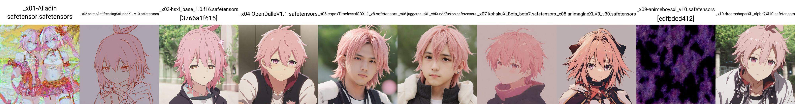

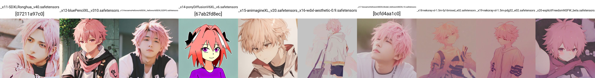

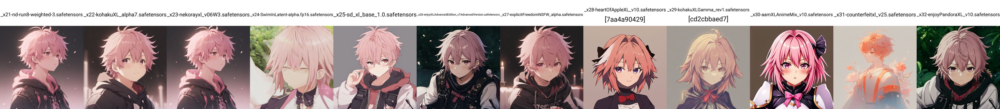

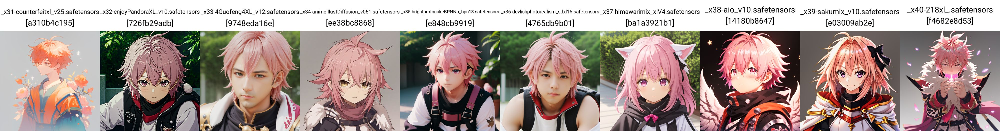

</details>

- For selecting CLIPs, UNET is `x39a` which is the global average model. VAE is the original VAE of SDXL.

- First I choose **CLIP**, or `conditioner.embedders.0`:

<details>
    <summary>Full of XY plot. Click to open.</summary>


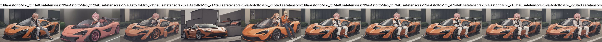


</details>

- Then I choose **CLIP-AUX**, or `conditioner.embedders.1`:

<details>
    <summary>Full of XY plot. Click to open.</summary>


</details>

- For reference, I also see what will happen when I apply both CLIPs:

<details>
    <summary>Full of XY plot. Click to open.</summary>


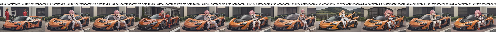

</details>

- For selecting UNETs, CLIPs will be the merged model which is `x13te0` and `x14te1`. Note that I have reused the merge models to save disk space.

<details>
    <summary>Full of XY plot. Click to open.</summary>

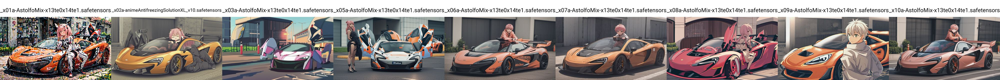

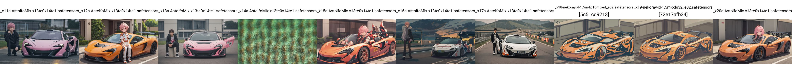


</details>

- Afterthat, I record all the accept model IDs and start merging pairwise. 

- This time [parallel merge](https://en.wikipedia.org/wiki/Merge_algorithm) **is required.** Storing around 6x40 SDXL models requires **around 1.5TB in disk space**, therefore I must try to reuse models as much as possible. Moreover, with this shear amount of model counts, making image preview on them are not fesiable.

### Selected models ###

- `te0`: Models selected for using the **CLIP**, or `conditioner.embedders.0`. 

- `te1`: Models selected for using the **CLIP-AUX**, or `conditioner.embedders.1`. 

- `te2`: Models looks acceptable with both CLIPs applied. Not for selection, just for reference.

- `=sd`: Models has the exact same CLIP pair as the original SDXL `_x25`.

- `--` is used for placeholder because I need to figure out the model pairs to be merged.

- Total / subtotal count will be shown as `=xx`.

- `xxa` e.g. `09a` is the merge of `_x17` and `_x18`, because of model deviation. It introduce some error on expected model weight, but will be negligible when the scale is large.

```
te0: --,--,03,05,--,10,11,--,--,16,17,09a,10a,20,11a,22,23,24,25,26,27,32,--,36,--,--,41,--=19
te1: 01,02,03,05,06,10,--,12,14,16,17,09a,10a,20,11a,22,--,24,25,26,27,32,33,36,37,38,41,42=26
te2: 01,--,03,05,06,10,--,--,--,16,17,09a,10a,20,11a,22,--,24,25,--,27,32,33,36,37,38,41,--=21
=sd: --,--,03,--,--,10,--,12,--,16,--,-18,-19,--,---,--,--,--,25,--,--,--,--,--,--,--,--,--=7
```
- Excluding the `=sd` for the actual merge will be shown below. Intermediate model name will be `x01te1-AstolfoMix-_x01_x02`.

```
te0:--,--,05,--,11,--,--,17,20,11a,22,23,24,25,26,27,32,--,36,--,--,41,--=14
te1:01,02,05,06,--,12,14,17,20,11a,22,--,24,25,26,27,32,33,36,37,38,41,42=21
```

- `unet`: Models selected for using the UNET.

- `nsfw`: Models selected for using the UNET. This time I used a NSFW prompt for test.

- To keep it easy to trace (originaly it is 33 / 15), I adjust it to be a perfect $2^n$. It will be handy for future merge, when new model appears.

- `x01a`: Model pairs which are already available for merge. Therefore I can reuse for saving disk space, a lot.

```
unet: 01,02,06,07,09,10,11,12,13,15,16,17,20,21,22,23,25,26,27,28,30,31,32,33,34,--,37,38,39,40,42,43,44=32
nsfw: 01,--,06,07,--,--,11,12,13,15,--,--,20,21,22,23,--,--,27,--,--,31,--,--,--,36,--,--,--,40,--,43,--=16
x01a: 01,02,--,--,09,10,11,12,--,15,16,--,--,21,22,--,25,26,27,28,--,31,32,33,34,--,37,38,39,40,--,43,44
```
- Finally here is the result model name:

```
base=x17-AstolfoMix-x13te0x14te1.safetensors
nsfw=x11c-AstolfoMix-x13te0x14te1.safetensors
```

- File list as the full merging list will be provided soon.

## Model selection Round 2, x49a ##

- With the model fix and new models, now I have more models to pick:

<details>
    <summary>Full of XY plot. Click to open.</summary>

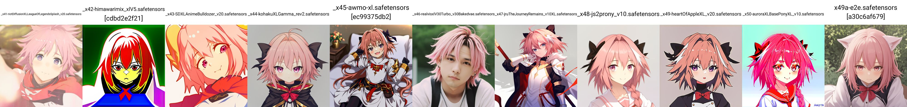

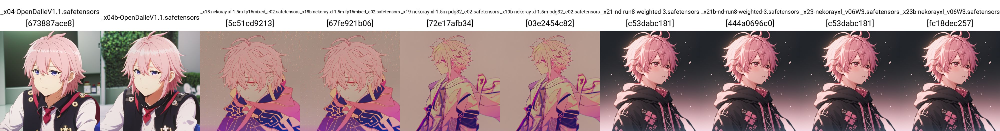

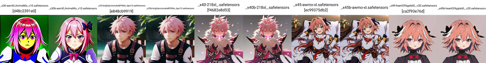

</details>

- Only `_30b` is showing difference because of modified VAE.

- Then I run the CLIP test for the new models:

<details>
    <summary>Full of XY plot. Click to open.</summary>


</details>

- And then the "repaired models":

<details>
    <summary>Full of XY plot. Click to open.</summary>


</details>

- Since I want to bring more models to the mix, I switched the seed to the same prompt, to hopefully select more models:

<details>
    <summary>Full of XY plot. Click to open.</summary>

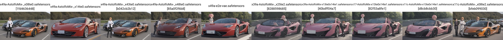


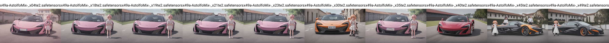

</details>

- With the passing CLIPs, this time I decided to reconstruct all 50 models to test the UNETs:

<details>
    <summary>Full of XY plot. Click to open.</summary>

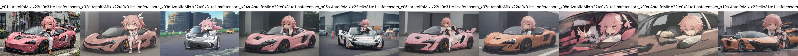


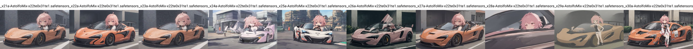


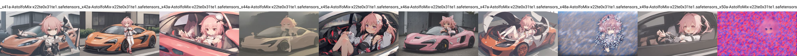

</details>

- Then I reconstruct the whole recipe:

```
te0: --,--,03,04,05,--,08,10,11,--,14,16,17,18,19,20,21,22,23,24,25,26,27,--,32,--,35,36,--,--,--,41,--,43,--,45,46,48,--,--=27
te1: 01,02,03,04,05,06,--,10,--,12,14,16,17,18,19,20,21,22,23,24,25,26,27,30,32,33,35,36,37,38,40,41,42,--,44,45,46,48,49,50=37
te2: 01,--,03,04,05,06,--,10,--,--,--,16,17,18,19,20,21,22,23,24,25,--,27,--,32,33,35,36,37,38,40,41,--,--,--,--,--,--,--,--=25
=sd: --,--,03,--,--,--,--,10,--,12,--,16,--,18,19,--,--,--,--,--,25,--,--,--,--,--,--,--,--,--,--,--,--,--,--,--,--,--,--,--=7

te0: 04,05,08,11,14,17,20,21,22,23,24,25,26,27,32,35,36,41,43,45,46,48=22
te1: 01,02,04,05,06,14,17,20,21,22,23,24,25,26,27,30,32,33,35,36,37,38,40,41,42,44,45,46,48,49,50=31
unet: 01,02,--,04,05,06,07,08,09,10,11,12,13,--,15,--,17,18,19,20,21,22,23,--,25,26,27,28,29,30,31,32,33,34,35,36,37,38,39,40,41,42,43,44,45,46,47,--,49,--=44
```

## Model selection Round 3, x52a ##

- Since [sd-mecha](https://github.com/ljleb/sd-mecha) is in active development, meanwhile there is a script to "merge CLIP" seperately, **also the generated images are being different** because of "structure autofix" along with **fp64 merging**, I think I can rewrite the script to *generate all intermediate models* in full auto. [And... I am really doing it.](./astolfo_mix_e2e.ipynb) Now I'm totally not operating WebUI to merge models. [As shown in the recipe](x45-AstolfoMix-x39te0x39te1-e2e-240222-60d0764.mecha), it is in serialized form, which looks like [assembly code](https://en.wikipedia.org/wiki/Assembly_language).

- I've found that **the output image is no longer same as the previously merged model.** It is possibly caused by *close to perfect precision* (FP64 merge with pure floating point ratio), which *dual CLIP structure is extra sensitive here,* and the un-pruning process (directly predefine known good structure) is different from A1111's "union of discovered layers".


- This is a test of merging 4 random models, which exclude the floating point error:


- However, this time I don't want to fill in the comparasion images again, and I'll post the selection result directly.

<details>
    <summary>Full of XY plot. Click to open.</summary>

- te0

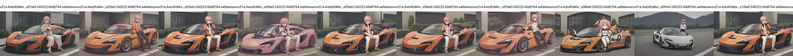

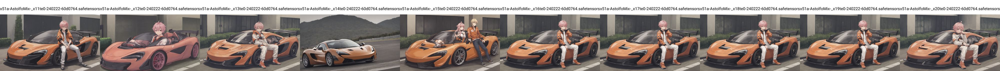

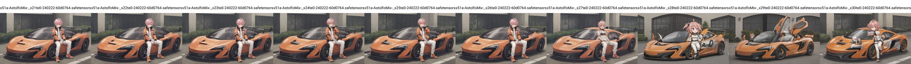

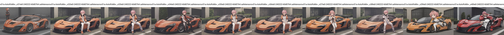

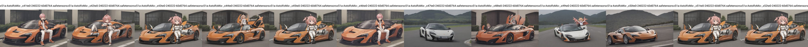

- te1

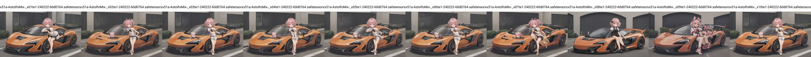

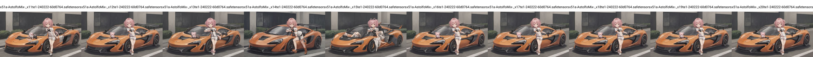

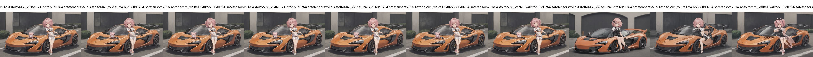

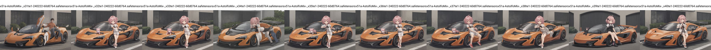

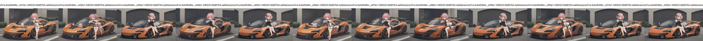

- te2

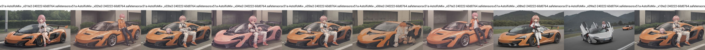

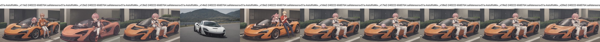

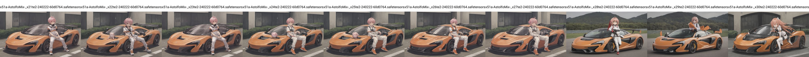

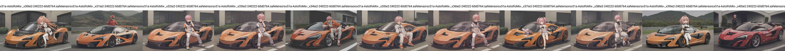

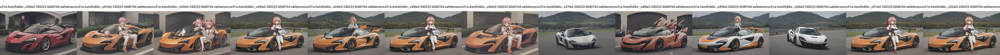

- unet

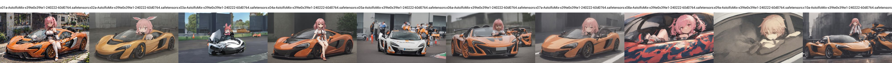

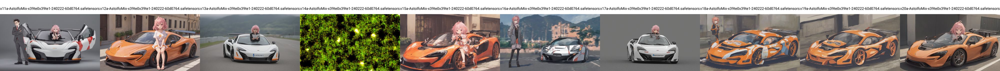

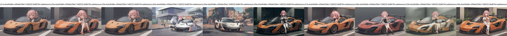

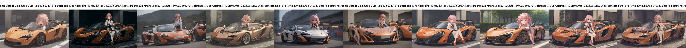

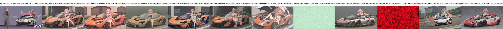

</details>

```
te0: --,--,07,--,--,--,--,15,--,--,--,--,29,--,--,--,--,40,--,44,48,--=-6
te1: --,--,--,09,--,--,--,15,--,--,--,--,29,--,31,34,--,--,--,--,48,--=-6
te2: --,06,--,09,--,11,12,15,--,--,--,--,29,30,31,34,38,40,42,44,48,49=-15
=sd: 03,--,--,--,10,--,12,--,16,18,19,25=-7

te0: 03,07,10,12,15,16,18,19,29,40,44,48=-12
te1: 03,09,10,12,15,16,18,19,29,31,34,48=-12

unet: 03,09,14,24,48,50=-6
```

- Another round of model selection, this time is exclusion instead of inclusion.
Looks like add-diff is a bad thing: Most merged model's CLIP have been dropped. Example: Kohaku (07,29,44), a2 (15), AID (34), 218 (40), and js2prony (48)

- Let's see if my merge has the same issue tomorrow. Need to make the next stage of models and sleep.


## Finding on "SDXL Baseline Merge" ##

- *I will have a "round 2" soon, because there are so many model released recently, along with merging tools. The docuement here is referring "x39a" only.*

### Compromised model merge ###

- From the "recipe" above, you will find that I've dropped `_x14-ponyDiffusionV6XL_v6` and `_x08-animagineXLV3_v30`, which have became the most popular anime models recently. Both of their model weights are far beyond to the majority models, and making the `x39a` generate random contents instead of prompted contents.

- As stated by the author (no reference yet), `_x14-ponyDiffusionV6XL_v6` has been trained with **large learning rate** to steer the model weights away, and it can be shown in L2 diagrams. Also, from the dual CLIP structure, the image will break with low L2 (below 20).

<details>
    <summary>Gallery of L2 diagrams. Click to open.</summary>

- sdxl0 = models from `_x01` to `_x10`, with `_x25` for reference.


- sdxl1 = models from `_x11` to `_x20`, with `_x25` for reference.


- sdxl2 = models from `_x21` to `_x30`, with `_x25` for reference.


- sdxl3 = models from `_x31` to `_x41`, with `_x25` for reference.


- sdxl4 = 10 handpicked models, with `_x25` for reference.


- sdxl5 = models from `_x41` to `_x50`, with `_x25` for reference.


</details>


- Such "randomess" is soon discovered that the CLIPs should be filtered and work within a "limited range" of model weights.


- As soon as getting the `x17`, it understand well in most concepts, *but it failed to understand characteristics of anime characters.* Making the "more nsfw" `x11c` (which is a subset of `x17` actually) make it understands a bit better, but as consequence, non anime concepts are understand worse.


- Before dumping GPU hours to the AutoMBW part, I need to explore either **more models** (yes, it reached 50!) or **more methods**, which [happened just in time](../ch01/rebasin.md). Git Re-Basin was once considered *not a merging method for SD* by me, but as soon as I've found and watch the seminar, I think the existing implementation is not applying well, or there is some misconception to prevent merging whole model with the algorithm.

### Quality tags are not required anymore ###

- *It also applies to both SD1 and SD2 version.*

- Quality tags only being requied if the model training involves quality tagging intentionally. Once it is not exist, *or I merge the models which contradicts in model weights*, they will be no longer effective, returning the desired contents regardless "quality control". 


## My action list ##

- *Wait* for the [upcoming merger](https://github.com/ljleb/sd-mecha)

- Keep exploring more models

- And see if situation changes drastically in round 2.
