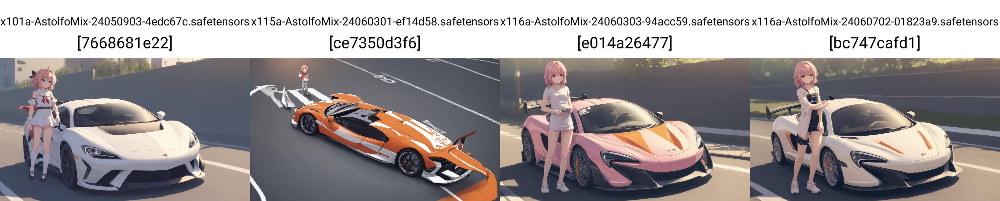
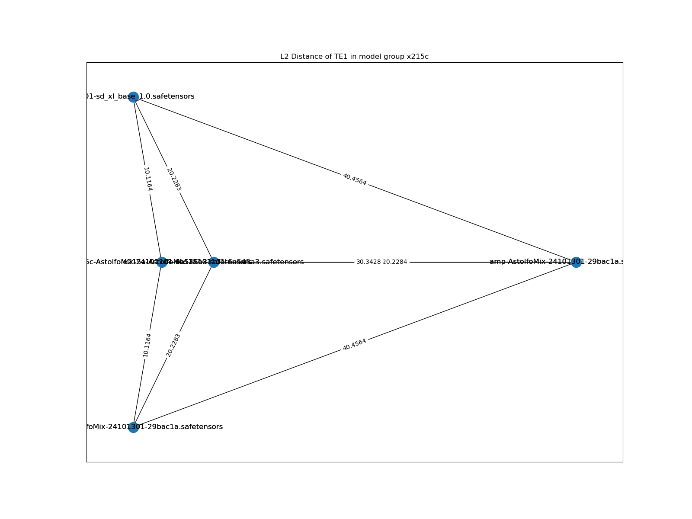

# Chapter 05-XL: AstolfoMix-XL. #

- [CivitAI model page.](https://civitai.com/models/309514) The style there is a bit different.

- [HuggingFace model page.](https://huggingface.co/6DammK9/AstolfoMix-XL) The style is also different.

- [CivitAI article page.](https://civitai.com/articles/3409) Summary of here (as additional content with SD1).


## What is the mix? ##

- Currently, it is an experimental merge with [immediately accessible merging algorithms](https://github.com/ljleb/sd-mecha/blob/main/sd_mecha/merge_methods.py) under discovered SDXL models.

- Baseline model will be *ensemble averaging*, same as "model soup".

- I will include *exclusive findings* here only. Read the ["master" article](./README.MD) and ["SD2" article](./README_SD2.MD) *(yes it applies also)* for general ideas.

## Generated Images ##

- ["AstolfoMix" in Pixiv.](https://www.pixiv.net/en/tags/AstolfoMix/artworks)

## Why make such a model? ##

- Given the ~~asserted~~ success of previous experience (SD1 and SD2), I think I shuold keep it up on recent architecture, SDXL ~~Turbo / LCM will be examined  later~~, which is larger and more complicated then both SD1 and SD2, and try to make the model as *useful* as the SD2 version.

## My discoveries ##

### Coincidence, now I can cite on something ###

- [Do the Frankenstein, or how to achieve better out-of-distribution performance with manifold mixing model soup](https://arxiv.org/abs/2309.08610)


- *Note: ValAcc(ζ) is close to the Reward Model used in AutoMBW / Bayesian Merging.*

- **Important: It only shows improvement! It won't "solve" specified tasks e.g. Importing Pony V6's NSFW into Animagine v3.1!**

### It is using the exact same CLIP as SD1 ###

- [ch03/view_unet/view_unet.ipynb](../ch03/view_unet/view_unet.ipynb): You will find that [the config of TE0 from SDXL](https://huggingface.co/stabilityai/stable-diffusion-xl-base-1.0/blob/main/text_encoder/config.json) is the exact same of [the config in SD1](https://huggingface.co/runwayml/stable-diffusion-v1-5/blob/main/text_encoder/config.json). 

This is directly quoted from HuggingFace (SDXL):

> Model Description: This is a model that can be used to generate and modify images based on text prompts. It is a Latent Diffusion Model that uses two fixed, pretrained text encoders (OpenCLIP-ViT/G and CLIP-ViT/L).

And then SD1:

> Model Description: This is a model that can be used to generate and modify images based on text prompts. It is a Latent Diffusion Model that uses a fixed, pretrained text encoder (CLIP ViT-L/14) as suggested in the Imagen paper.

It is the *same* ViT-L. However we all noticed "finetuned models" are all "SD models". Can we have other methods to check?

- Yes. Once again we use [stable-diffusion-webui-model-toolkit](https://github.com/arenasys/stable-diffusion-webui-model-toolkit) by *exporting CLIP (not CLIP-AUX) from SDXL and then import it to SD1.* And... it shows the clean `0000` hash. Note that `21b` is the latest model in SD1, and `x39a` is the current version of merged SDXL, and `_x25` is the original SDXL model, `te2` means "both CLIPs are explicitly imported".


- Making the mixed CLIP from `x39a` will obviously yield a different image. `x25a` is same as `_x25`.


### Will Greedy approach work? ###

- [Started from the discovery of "associative property"](./README.MD#associative-property), [and the independent consideration of model components](./README_SD2.MD#considering-clip--te-combinations-individually), I think it is plausible to follow a [greedy approach](https://en.wikipedia.org/wiki/Greedy_algorithm). By [breaking the massive problem into subproblems](https://medium.com/@srosamazaid/the-greedy-algorithm-pattern-an-in-depth-analysis-7bb28d5dbfa7), and naively choose the best (or good) results, brings me towards the desired effect. Also, [the special case of add diff and convergence of averaging](./README.MD#findings-on-astolfomix-21b) supports my view to not considering too much on [covariance](https://en.wikipedia.org/wiki/Covariance) between components. *I have not experiened any unexpected result yet, when I confirm I'm following my procedure correctly.*

- Also, [since model selection is a combination optimization problem](./README_SD2.md#model-selection), choosing it by *intuition* may not work when the model count is large (**currently discovered 44 models**), such greedy approach can *estimate* and make prediction from a NP time complexity into linear time ( $O(N)$ ), with only a few iterlations of comparasions, ~~and control the space complexity even it already used over 1TB on storing intermediate merged models. Unless I develop a N-way merger from scratch,~~ space requirement will outnumber the traditional fine tune approach also even I have a N-way merger (see below). ~~Looks like I'm trying to rationalize a random approach, but I really don't have solid idea since there is absolutely no reference in this world.~~

- *I may try applying score metric, or algorithms on model comparasions on model selection, instead of human evalulation, although it is effective. Hopefully I don't have to code everything from scratch.*

- Therefore, the procedure is further extended from SD2 (and SD1): Since SDXL has 2 CLIPs, I compare the CLIPs seperately. The starting point is still blindly average out all discovered models.

### I have the N-way merger! ###

- An **E2E single-click solution** has been found. ~~Sorry I'm too lazy to write code.~~ See [this notebook](./astolfo_mix_e2e.ipynb) for details. **Efficiency has been increased very much** because I have saved so many disk space, and merging time reduced from 60+ minutes to around 8 minutes for 40 models. However I still need a few sets of models for components comparasion, hence the space complexity remains unchanged.

- Although I'm too lazy to implement the binary tree approach and let floating point error propogates through the math series approach, it is still looking almost identical, because *it overcome the limitation on A1111 WebUI*.


### I also "fixed" the pruned models ###

- Some models **cannot be swapped between components, or mergeable.** A1111's OG merger requires valid model metadata to operate, which some models may have its own metadata and fails the merge, meanwhile some models have deviation in model structure (even it may works well in WebUI) and make the toolkit failed to swap components from them.

- For example, it will show "VAE-v1-BROKEN" when parsing the model: 


- And it may throw error while merging:


- After some investigation (along with `sd-mecha`'s development), I've found that the root cause if "VAE-v1-BROKEN" is **pruned SDXL models**. It is easy to fix with A1111 OG merger, just use original SDXL as base model (model A) and apply M=1.0 a.k.a take all weights from foreigner model.


- For the models **both have custom metadata and pruned**, I modify the N-way merger (using customized `meh` as backend) to perform the merge.


- Then the image is close to identical:


### More findings on merging CLIP and MBW layers ###

- *This is discovered by chance.* From paper ["Localizing and Editing Knowledge in Text-to-Image Generative Models"](https://arxiv.org/abs/2310.13730), concepts are being represented by scattered activated neuron / layers in UNET with distribution, but being centralized within a single neuron in CLIP.

> Notably, we find a distinct distribution of causal states across visual attributes in the UNet, while the text-encoder maintains a single causal state.


- It implies the great risk and scarification with "Train Text Encoder" option while fintuning a massive base model, and more important, **merging with different finetuned CLIPs**. This problem is dodged in SD1, [because I sticked with the OG CLIP](./README.MD#the-power-of-the-original-sd-1xs-text-encoder), and experienced in SD2. Agressively merging 2 CLIPs in the SDXL will make the model failed to understand most concepts. More in the next section.

### Changing docuement style ###

- I didn't expect model selection across ongoing community developement will involve so many iterlations. It yields so many docuements and making this page too large for a mobile to load (I view this othen in outdoor). I'll move most boring stuffs to other places.

- Read docuemnts there for how I derive the model selection from the discovered models. I'll do put the statistic here.

|Round|Algo|Model Name|RAW|UNET|TE0|TE1|Recipe|
|---|---|---|---|---|---|---|---|
|01|Uniform Soup|`x17-AstolfoMix-x13te0x14te1.safetensors`|42|32|14|21|[json](./recipes/recipe-x39a.json)|
|02|Uniform Soup|`x43-AstolfoMix-x22te0x31te1.safetensors`|50|44|22|31|[mecha](./recipes/x43-AstolfoMix-x21te0x30te1-e2e-240222-60d0764.mecha)|
|03|Uniform Soup|`x45-AstolfoMix-x39te0x39te1-e2e-240222-60d0764.safetensors`|52|46|40|40|[mecha](./recipes/x45-AstolfoMix-x39te0x39te1-e2e-240222-60d0764.mecha)|
|04|Uniform Soup|`x63-AstolfoMix-x60te0x41te1-e2e-240407-feefbf4.safetensors`|70|52|61|42|[mecha](./recipes/x63-AstolfoMix-x60te0x41te1-e2e-240407-feefbf4.mecha)|
|05|TIES-SOUP|`x72a-AstolfoMix-240421-feefbf4.safetensors`|73|73|73|73|[mecha](./recipes/x72a-AstolfoMix-240421-feefbf4.mecha)|
|06|TSD: TIES-SOUP w/ DROP|`x101a-AstolfoMix-24050903-4edc67c.safetensors`|102|102|102|102|[mecha](./recipes/x101a-AstolfoMix-24050903-4edc67c.mecha)|
|07|TGMD: TIES-GeometricMedian w/ DROP|`x116a-AstolfoMix-24060702-01823a9.safetensors`|117|117|117|117|[mecha](./recipes/x116a-AstolfoMix-24060702-01823a9.mecha)|
|08|TGMD-192: Scaled up from TGMD|`x191a-AstolfoMix-24083001-3360d18.safetensors`|192|192|192|192|[mecha](./recipes/x191a-AstolfoMix-24083001-3360d18.mecha)|
|09|DGMLA-216: Drop w/ GeoMedian and LA|`x215a-AstolfoMix-24101101-6e545a3.safetensors`|216|216|216|216|[mecha](./recipes/x215a-AstolfoMix-24101101-6e545a3.mecha)|
|10|215c: Permutation from the Fermat Point|`x215c-AstolfoMix-24101101-6e545a3.safetensors`|216|216|216|216|n/a|
|11|255c: Scale up from 215c|`x255c-AstolfoMix-25022801-1458190.safetensors`|256|256|256|256|n/a|

### Discovered models ###

- Moved to [AstolfoMix-XL: Discovered models](./xl_docs/discovered_models.md)

### Deriving the "recipe" a.k.a model selection (Round 1, x39a) ###

- Moved to [AstolfoMix-XL: Model selection Round 1 (x39a)](./xl_docs/r01_x39a.md).

### Model selection Round 2, x49a ###

- Moved to [AstolfoMix-XL: Model selection Round 2 (x49a)](./xl_docs/r02_x49a.md).

### Finding on "SDXL Baseline Merge" ###

- *I will have a "round 2" soon, because there are so many model released recently, along with merging tools. The docuement here is referring "x39a" only.*

### Compromised model merge ###

- From the "recipe" above, you will find that I've dropped `_x14-ponyDiffusionV6XL_v6` and `_x08-animagineXLV3_v30`, which have became the most popular anime models recently. Both of their model weights are far beyond to the majority models, and making the `x39a` generate random contents instead of prompted contents.

- As stated by the author (no reference yet), `_x14-ponyDiffusionV6XL_v6` has been trained with **large learning rate** to steer the model weights away, and it can be shown in L2 diagrams. Also, from the dual CLIP structure, the image will break with low L2 (below 20).

- *I have a WS powerful enough to include all models, see next chapter.*

<details>
    <summary>Gallery of L2 diagrams. Click to open.</summary>

- sdxl0 = models from `_x01` to `_x10`, with `_x25` for reference.


- sdxl1 = models from `_x11` to `_x20`, with `_x25` for reference.


- sdxl2 = models from `_x21` to `_x30`, with `_x25` for reference.


- sdxl3 = models from `_x31` to `_x41`, with `_x25` for reference.


- sdxl4 = 10 handpicked models, with `_x25` for reference.


- sdxl5 = models from `_x41` to `_x50`, with `_x25` for reference.


</details>


- Such "randomess" is soon discovered that the CLIPs should be filtered and work within a "limited range" of model weights.


- As soon as getting the `x17`, it understand well in most concepts, *but it failed to understand characteristics of anime characters.* Making the "more nsfw" `x11c` (which is a subset of `x17` actually) make it understands a bit better, but as consequence, non anime concepts are understand worse.


- Before dumping GPU hours to the AutoMBW part, I need to explore either **more models** (yes, it reached 50!) or **more methods**, which [happened just in time](../ch01/rebasin.md). Git Re-Basin was once considered *not a merging method for SD* by me, but as soon as I've found and watch the seminar, I think the existing implementation is not applying well, or there is some misconception to prevent merging whole model with the algorithm.

### Quality tags are not required anymore ###

- *It also applies to both SD1 and SD2 version.*

- Quality tags only being requied if the model training involves quality tagging intentionally. Once it is not exist, *or I merge the models which contradicts in model weights*, they will be no longer effective, returning the desired contents regardless "quality control". 


### My action list (after Baseline merge) ###

- *Wait* for the [upcoming merger](https://github.com/ljleb/sd-mecha) and [modified toolkit](https://github.com/silveroxides/stable-diffusion-webui-model-toolkit-revisited)

- Keep exploring more models and algorithms

- And see if situation changes drastically in round 2. *Yes*

- ~~[Built a workstation for merging, which is by chance.](../ch04/ice_lake_ws.md)~~

## Findings on "SDXL Extended FP64 Merge" ##

*I decided to split the chapter. Technically it is no longer the OG pairwise merge, solely using external tools.*

- *The new Workstation is lit!*


### Refreshed global L2 chart ###

<details>
    <summary>Gallery of L2 diagrams. Click to open.</summary>


</details>

### Model selection Round 3, x52a ###

- The stuffs similar to previous rounds has been moved to [AstolfoMix-XL: Model selection Round 3 (x52a)](./xl_docs/r03_x52a.md).

- Since [sd-mecha](https://github.com/ljleb/sd-mecha) is in active development, meanwhile there is a script to "merge CLIP" seperately, **also the generated images are being different** because of "structure autofix" along with **fp64 merging**, I think I can rewrite the script to *generate all intermediate models* in full auto. [And... I am really doing it.](./astolfo_mix_e2e.ipynb) Now I'm totally not operating WebUI to merge models. [As shown in the recipe](x45-AstolfoMix-x39te0x39te1-e2e-240222-60d0764.mecha), it is in serialized form, which looks like [assembly code](https://en.wikipedia.org/wiki/Assembly_language).

- I've found that **the output image is no longer same as the previously merged model.** It is possibly caused by *close to perfect precision* (FP64 merge with pure floating point ratio), which *dual CLIP structure is extra sensitive here,* and the un-pruning process (directly predefine known good structure) is different from A1111's "union of discovered layers".


- This is a test of merging 4 random models, which exclude the floating point error:


- After whole procedss, I found that even casting FP16 from FP64 for a few times will cause difference also, the `e2e` is true FP64 merge for the whole process:


- Another round (round 3.5) of model selection, this time is exclusion instead of inclusion.
Looks like add-diff is a bad thing: Most merged model's CLIP have been dropped. Example: Kohaku (07,29,44), a2 (15), AID (34), 218 (40), and js2prony (48)


### Model selection Round 4, x63a ###

- The stuffs similar to previous rounds has been moved to [AstolfoMix-XL: Model selection Round 4 (x69a)](./xl_docs/r04_x69a.md).

- Situation is getting similar after I scaled up the model pool, with adding more models in 2403. Pony series models are not mergible at this moment. 

- Human details is slightly more refeined, but the *background* is a lot more rich and realistic (content wise, not style).


### Rich background is back! ###

- [Cherrypicked images as model page.](https://civitai.com/models/309514?modelVersionId=456931)

- Precision and more model works! Also it drift towards more in anime style, but less stable with realistic contents.

- Time to move on to the next chapter, because it is still kind of baseline model.

## Findings on "SDXL TIES" ##

- Decided to move to ch01 because the discovery is more general: [ties.md](../ch01/ties.md)

### Naive TIES merge is nice but not suitable for SD ###

- **Notes: Soon I find out the implementation was wrong.** PR was made to the merger. See [ties.md](../ch01/ties.md) for details. ~~spoiler: the timeline is parallel to here.~~

- Given nice prompts (e.g. prompts which PonyXL does well), it output great images.

- However, for seriously untouched knowledge (yes, the "car with person"), it fails hard and produce pure noise like PonyXL.

- Replacing with *averaged CLIP* or *original CLIP* will recover it, however breaking the image style.

- *Left to right:
All TIES, UNET TIES + CLIP average, UNET TIES + CLIP "TIES of model subset", All Average (with subset)*


- I'm not sure if the greedy approach still works (i.e. test against $O(N)$ CLIPs and pick the nice CLIPs), I'll still try for once.

- Also, I found that my E2E script will be too complicated if I include one more dimension (algorithm) in the process, therefore I set it as global variable and pick the mode instead.

### Hyperparameter tuning in TIES ###

- I have found that $k=1.0$ would be not good. It produce broken images even the implementation is been rectified. 


- In comparasion, this is the flawed generation with $k=1.0$. Either $k$ or $\lambda$ should be reduced.


- No matter I'm using $k=0.2$ or $\lambda=0.2$, it will crash miserably.


- It forced me to reconsider the "flawed implementation" again, and theorized that *it is more balanced to this challenging problem.* [Now I call it "TIES-SOUP"](../ch01/ties.md#spinoff-ties-soup), because it respects the nature of averaging (Model SOUP), meanwhile keeping its own "sign election" mechanism (TIES), i.e. TIES-SOUP.

- By switching the car, it still able to draw my usual "car with person" image. The model turns out forgets half from every models, but in random pattern.


### Model selection Round 5, x72a ###

- The stuffs similar to previous rounds has been moved to [AstolfoMix-XL: Model selection Round 5 (x72a)](./xl_docs/r05_x72a.md).

- Pay attention that the "pure noise" is mainly come from:

|id|remark|
|---|---|
|`te1`|`x69a` onward|
|`txt2`|`sd_mecha` (240406 onward)|
|`CLIP`|`toolkit`|
|ViT-G|By component size|

- It is bizzare that the model only able to generate images with **down to half of the selected UNETs**, which the result is actually far worse then the unfiltered version. ~~No image because it is too bad.~~ I find that **the greedy approach is not working for TIES merging.** Therefore this version I will simply publish the raw TIES version directly.

## Findings on "SDXL TIES w/ DARE" ##

- [PR in progress.](https://github.com/ljleb/sd-mecha/pull/28)

- [Did some research, and found it was suprisingly simple.](../ch01/dare.md)

- And... this round of model selection reached **100+ models**.

### The Workstation is screaming ###

- However, since the merge is not inline at the same place, I received my first OOM while merging 102 SDXL models.


- Looks like I need to drop some models for the first time.

- Setting the merger with `threads=1` i.e. strictly merge 1 key at a time, it successfully prevented OOM, **with 382GB of RAM usage.**


- However it is 3x slower (4420 seconds vs 13222 seconds), [thread pool](https://en.wikipedia.org/wiki/Thread_pool) still have its effect. *I think 16 threads should be fine.*

```log
#thread=None, no DARE (400GB)

INFO: Saving to F:\NOVELAI\astolfo_mix\sdxl\x101a-AstolfoMix-24050904-4edc67c.safetensors
Merging recipe: 100%|██████████| 2515/2515 [1:13:34<00:00,  1.76s/it, key=model.diffusion_model.time_embed.2.weight, shape=[1280, 1280]]                                            
Merge time: 4420 sec

#thread=1 (382GB)

INFO: Saving to F:\NOVELAI\astolfo_mix\sdxl\x101a-AstolfoMix-240507-4edc67c.safetensors
Merging recipe: 100%|██████████| 2515/2515 [3:40:20<00:00,  5.26s/it, key=model.diffusion_model.time_embed.2.weight, shape=[1280, 1280]]                                             
Merge time: 13222 sec

#thread=4 (391GB)

INFO: Saving to F:\NOVELAI\astolfo_mix\sdxl\x101a-AstolfoMix-240508-4edc67c.safetensors
Merging recipe: 100%|██████████| 2515/2515 [2:13:37<00:00,  3.19s/it, key=model.diffusion_model.time_embed.2.weight, shape=[1280, 1280]]                                             
Merge time: 8023 sec

#thread=8 (410GB)

INFO: Saving to F:\NOVELAI\astolfo_mix\sdxl\x101a-AstolfoMix-24050803-4edc67c.safetensors
Merging recipe: 100%|██████████| 2515/2515 [1:55:24<00:00,  2.75s/it, key=model.diffusion_model.time_embed.2.weight, shape=[1280, 1280]]                                             
Merge time: 6930 sec

#thread=16 (449GB)

INFO: Saving to F:\NOVELAI\astolfo_mix\sdxl\x101a-AstolfoMix-24050902-4edc67c.safetensors
Merging recipe: 100%|██████████| 2515/2515 [1:46:01<00:00,  2.53s/it, key=model.diffusion_model.time_embed.2.weight, shape=[1280, 1280]]                                             
Merge time: 6367 sec

#Averaging (fits inside GPU)

INFO: Saving to F:\NOVELAI\astolfo_mix\sdxl\x101a-AstolfoMix-24051501-29bac1a.safetensors
Merging recipe: 100%|██████████| 2515/2515 [1:06:07<00:00,  1.58s/it, key=model.diffusion_model.time_embed.2.weight, shape=[1280, 1280]]                                           
Merge time: 3972 sec
```

-  Meanwhile I got my first PSU trip (OCP maybe) even it was a mighty [EVGA 1600 P2](https://www.evga.com/products/product.aspx?pn=220-P2-1600-X1). So now I can't generate images while merging (is this a luxuary?)


### Plain DARE is not working either ###

- In progress. See [Spinoff: DROP without rescale](../ch01/dare.md#spinoff-drop-without-rescale).

### Hyperparameter tuning in DARE ###

- From left to right: $p=(0,0.1,0.25,0.5,0.75)$. Note that $p=0$ means TIES itself. **Looks like 0.1 will yield more details with balance.**


- Since randomness is introduced, `seed` will be a parameter also. You will find that `seed` only changes *unspecified details* (unconditional part of CFG), with others remains unchanged. ~~Should I make 10 of them and perform averaging again?~~ 


## Findings on "SDXL Re-basin" ##

- [Again, this is a real PR to the only repo I think is implemented correctly.](https://github.com/ogkalu2/Merge-Stable-Diffusion-models-without-distortion/pull/46)

- The result is still under investigation. Currently **the merge will take 4 hours to complete,** [eliminating most large scale merging in this series](https://github.com/ogkalu2/Merge-Stable-Diffusion-models-without-distortion/issues/47). It will replace AutoMBW / Bayesian merge instead. TIES-SOUP trades a lot more desired contents with general contents, merging it again with the averaged version will neutralize the effect.


- After a while, when I have the DARE merge available, I think I can revisit this session again. Since rebasin take the [mid point](https://en.wikipedia.org/wiki/Midpoint) first, and try to shift it *slightly* for even better neuron activation, I can apply a trick to further improve the DARE model. [This time I need an amplifier for the weight shift](./amplify_diff.ipynb). I can make this via A1111 with another hack on `ui-config.json`, but I decide to stick with `sd-mecha` for reliable performance.

```json
"modelmerger/Multiplier (M) - set to 0 to get model A/maximum": 2.0,
```

- After a few days of testing, I made the merge successfully (just a few hours). However, it is worse than the TSD merge. The model drifts towards averaging and making the model a lot less stable, or forgetting too many anime contents. So I decided to upload to [HF](https://huggingface.co/6DammK9/AstolfoMix-XL/blob/main/basin-AstolfoMix-24051501-29bac1a.safetensors) and put it away. It may be usefull if I have more idea on model selection.


## Findings on "SDXL Model Stock" and "SDXL Geometric Median" ##

- [Still the same PR there.](https://github.com/ljleb/sd-mecha/pull/28)

- Now it use so many RAMs. This is just `threads=16`. [I have upgraded my WS to have 4TB RAM](../ch04/ice_lake_ws.md#memory).


- The result is still under investigation. Left to right: TSD from avove, plain average of new model set, Geometric Median alone, TGMD for "TIES-GeometricMedian w/ DROP".



- (This may be inaccurate) This is the concept illustration on how and why it works:


## Findings on scalling up with the "SDXL Geometric Median" ##

- [Finally the PR has been merged.](https://github.com/ljleb/sd-mecha/pull/37) However I was staying with my own fork because of the great code modification.

- I was hoarding many models for around 2 months, and then being interested if more "Pony Realistic" models can make the original TGMD support more NSFW contents (although I think the idea is not good: all you need is finetune from a merged model). *Also I have 4TB of RAM so I'm also wanna know how huge a model merge can be.*

- This algorithm should be linear a.k.a $O(N)$ in both time and space complexity, however the time required looks like it is reaching $O(NlogN)$.

|Date|Model counts|Threads|RAM Usage (TB, FP64)|Time used (Hours, Xeon 8358 x2)|
|---|---|---|---|---|
|240607|117|16|1.214|14|
|240622|133|8|0.900|12.5|
|240830|192|8|1.446|41.5|


- So looks like I finally merged the Pony (literally the Pony):


- But not quite actually:


- If I focusing on characters, I think I loss most of them because of the contradiction between the model weights. If I focusing on NSFW concepts, strangely it preserves with low extent (as most realistic models have slight NSFW contents trained) and it still loss most of the "action scenes" (same reason). *Would I look into model weights, and risk to preserve the bias and loss all the others?* 

- [From this LoRA in CivitAI](https://civitai.com/models/626713?modelVersionId=716304), [I think a merged model should ultimately be a "better base model", and worth finetuning again.](../ch01/merge.md#not-merge-but-worth-mentioning) 

## Findings on "SDXL DGMLA (modified DELLA)" ##

- *Under construction.*

- [PR in progress.](https://github.com/ljleb/sd-mecha/pull/41)

- See [Spinoff: DGMLA](../ch01/della.md#spinoff-dgmla) for algorithm analysis.

|Date|Algo|Model counts|Threads|RAM Usage (TB, FP64)|Time used (Hours, Xeon 8358 x2)|
|---|---|---|---|---|---|
|240607|TGMD|117|16|1.214|14|
|240622|TGMD|133|8|< 1.0|12.5|
|240830|TGMD|192|8|1.446|41.5|
|241002|DGMLA|192|16|1.452|39.1|
|241006|DGMLA|20|48|0.358|2.33|
|241011|DGMLA|216|48|3.500|36.2|


This is the *recent* merging log.

- DGMLA: `24100201`. 192 models. `p=0.1,eps=-0.05`. Baseline.
- DGMLA: `24100601`. 20 models. `p=0.1,eps=-0.05`. Still works.
- DGMLA: `24100602`. 20 models. `p=0.3,eps=-0.30`. Doesn't work.
- DGMLA: `24100603`. 20 models. `p=0.1,eps=0.05`. Works in a different way.
- DGMLA: `24100604`. 20 models. `p=0.1,eps=-0.1`. Works in the same way.
- DGMLA: `24101101`. 216 models. `p=0.1,eps=-0.1`. Works as expected.


- Despite the effectiveness of the algorithm, the massive model count is now experiencing [diminishing return](https://en.wikipedia.org/wiki/Diminishing_returns), as shown as the slight change since `x116`. I make this iterlation is majorly because of the rise of heavy Kohaku XL finetune such as [Illustrious XL](https://huggingface.co/OnomaAIResearch/Illustrious-xl-early-release-v0) and [Kohaku-Delta-Alpha](https://civitai.com/models/693222?modelVersionId=775789). This should introduce some impact on the current "Pony issue".

- I have also tried [Rebasin again.](../ch01/rebasin.md#special-case-model-b-but-in-different-direction) However result does not looks good, with the model weights behaves as expected. `215a` and `215b` is also at the same spot (keeping GeometricMedian models only).


 

## Findings on "SDXL Re-basin" again ##

- I have revisited [rebasin](../ch01/rebasin.md#spinoff-permutation-from-the-fermat-point) and somehow figured out how to make it effective. 

- Actually I have missed the "one more merge" like what "21b" did before. *After 72 seconds, it works.*


- The greatest change is majorly in TE1, meanwhile I believe that the < 1.0 distance in UNET also does some effect.



- BTW now I use a [new sampling stack](../ch01/cfgpp_pag_seg.md) which has new characteristic which undonditional stuffs shines.

## Good time to conclude and move to the next chapter? ##

- It is written after a month, starting [ch06](../ch06/readme.md) with an incident, and focusing formal finetuning (data gathering / preprocessing etc.), and probably [Evolutionary Merge](https://arxiv.org/abs/2403.13187) with a new finetuned model based from this final ["215c" version](https://civitai.com/models/309514/astolfomix-xl).

- The "development process" is already a lot longer then my expectation (more than a year for a hobby project!?). I experienced my ["art style" changes over time](https://www.vangoghmuseum.nl/en/art-and-stories/vincents-life-1853-1890/from-dark-to-light), even with such a concentrated methodology (it is just merging with low parameter counts!), and lack of *clear objective* (e.g. propose a validation loss, any meterics, or [KPI](https://en.wikipedia.org/wiki/Performance_indicator)). My primary goal was just want to regain my confidence on explaining what I have explored, across SD1 and SD2 models. SDXL is way too complicated for this abstract task, model diversity is so large, even CivitAI was explictly marking Pony and IL as distinct base models, which they are obviously still finetuned SDXL models in definition. Now I think I have done the job, and start seeing my XL mix being superior then the SD1 "way more simple merge".

- I have already explored the [mathematical properites](https://www.marktechpost.com/2024/10/23/15-fundamental-mathematics-theories-needed-to-understand-ai/) of this complicated LDM model, which has experienced the [(abstract) gradient problem of a LDM, which use MDP, inherits from RNN, which is a autoregressive model](https://medium.com/@roelljr/the-ultimate-guide-rnns-vs-transformers-vs-diffusion-models-5e841a8184f3). [Inserting the MDP=AR(1) quote again.](https://stats.stackexchange.com/questions/23789/is-ar1-a-markov-process). Somehow my sophisticated **modified merging algorithms** has been smoothed the gradient so much and preserved as much (pre)trained content as I can.

- Although I am still not motivated enough to make a (troll) post to arxiv, with looking back to [my understanding of art](../ch01/aesthetic.md#my-theorey), I think the new discoveries are legit and I can make this happen again in a more croweded area (conventional finetuning). Currently the finetuning theories in SD are still very confusing, maybe a **simple, proven, rigorously tested methods** will yield to easy life (may not be superior, "just good art"), without the urge need to proposing fancy unproven methods. *Maybe we just need a base model instead, and now I have it*.

## Revisit from the next chapter: Updating the model... and it is an epic fail (without finetune) ##

- Slightly updated the methodology: I added parallelism for the Re-basin code, to make the merge 6.75x faster (9h > 1.2h). [Commit, not PR](https://github.com/6DammK9/Merge-Stable-Diffusion-models-without-distortion/commit/aa0d507abb2640dba05338cdf71fb6c9bdf158d2)

- The major "255a" merge was still tedious and super memory intensive.

- The additional 40 models are mainly **my old mixes (13)** and **illustrious xl** related models. Now the "large weight shifting models" are even more, tearing the "geometric median" more outward from the dense area.

- And the result is out of my expectation: It is *borderline breaking*. The "base model weight" has less effect now.

- The `255b` barely works, and `255c` breaks a lot. I continued finetuning on both models, [but it belongs in the next chapter.](../ch06/gallery.md#effect-on-switching-to-the-updated-base-model)


- Based from [previous session](#good-time-to-conclude-and-move-to-the-next-chapter), it actually **learns a lot more effective** because the contradicted weights appears **pseudorandom** which cannot be activated. Once it continues training, a tiny switch of specific model weight will reactivate the whole network. It is different from both pretraining (train from scratch = initialized (real) random weights) and finetuning (train from learnt weights, which has less "gradient" for explorartion). Discussion will be contuned in [ch06](../ch06/gallery.md#effect-on-switching-to-the-updated-base-model-and-implied-batch-size).


## Evolutionary merge "215c Evo" is finally here, but move on ##

- After months, finally I have a "trained model" to test [this theory](../ch01/merge.md#not-merge-but-worth-mentioning). Meanwhile, [pretraining from a merged model](https://arxiv.org/abs/2505.12082v1) (especially from 255c instead of 215c) is viable if you merge with a proper mindset.

- However since it is overlapped in 2 chapters, I will split the image results to [ch06](../ch06/gallery.md#merging-again-as-215c-evo). 

## Considering Model Pool and evolve to AstolfoKarmix ##

- Since the apperance of Karmix ([doc](https://rentry.co/-introducing-karcher-mean-experimental-model-v0), [mirror](https://huggingface.co/chemwolf/Karmix-XL-v0)), I'm interested to consider *model pool* instead of merging algorithms. After a few attempts, now it becomes [AstolfoKarmix](./README_AK.md).

## Findings on "SDXL ISO-Z (modified Isotropic Merge ISO-C)" ##

- See [Spinoff: Iso-Z](../ch01/isotropic.md#spinoff-iso-z) for algorithm analysis.

- By following the official implementation, it was unsuccess.


- After I figure out applying [Z score](https://en.wikipedia.org/wiki/Standard_score) as the trick, I *naively* correlates "RGBA channels" and "Unitary matrix" to the "mixture of finetuned models with unknown history". Then proceed to search for parameter.


- Now the merge is success, with slightly tradeoff between character accuracy and richness of backgound. It also provide a few "variants" with different parameter, which 0.8 looks like AK and 2.0 looks like 215c.


