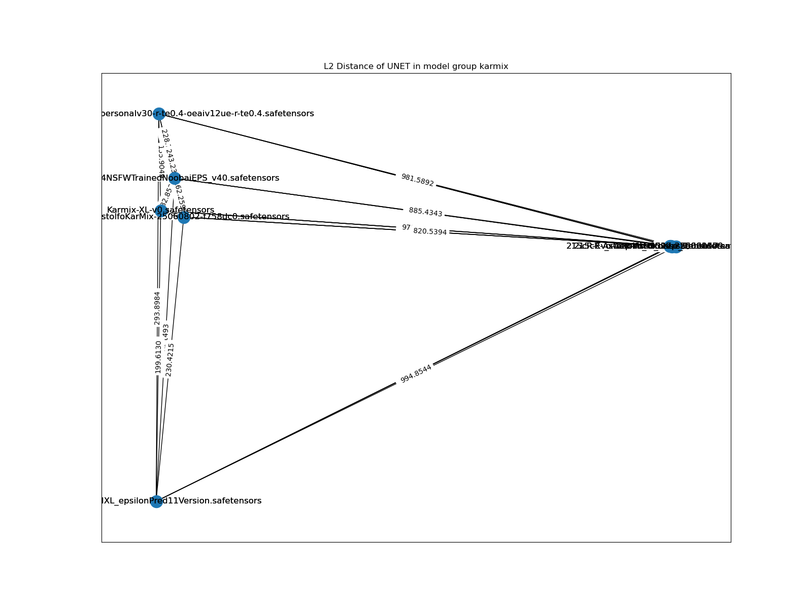
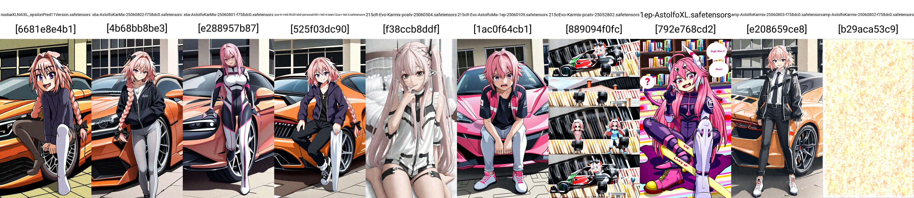

# Merge Log of "215c Evo" #

## Notice ##

- I do not put in the [README_XL](../README_XL.MD) because it needs to be explored, meanwhile it starts to be not 100% original idea. This time I rely on [Karmix](../../ch02/karmix.md) and [9527R](https://civitai.com/models/176449/9527-detail-realistic-xl) (the realistic finetune over 215c), or [JANKU v4](https://civitai.com/models/1277670/janku-v4-nsfw-trained-noobai-eps-rouwei-illustrious-xl).

- *From the experience in ch05, all WeightedSum (default $\alpha=0.5$) are enhanced with "BasinSum". Math proof... [Rebasin](../../ch01/readme.md) has expected value in $\alpha$ obviously*

${BasinSum}(A,B,\alpha) \leftarrow ( \alpha (\alpha A + (1-\alpha) B) + (1-\alpha) Rebasin(A,B,\alpha) )$

- It has been used since 215c and 255c. Note: 215a = "DGMLA-216", "amp" is the [amplify_diff](../../ch05/amplify_diff.ipynb), and the "base" is the base model "SDXL1.0". 1EP is the result in [finetuned model](../../ch06/) from 255c with 1EP.

${215c} \leftarrow {BasinSum}(215a,amp(215a,base,2.0),0.5)$

- Since BasinSum takes around an hour, but the native 0.5 is just 10 seconds, I can decide if it works the "phase shift".

- My accept criteria is still "man with car" which represents knowledge preservation from the base model. Realife location is optional (that is not a single concept from background). Mainstream "character / artist style recognition" will be ignored because I think [NoobAI-XL](https://civitai.com/models/833294/noobai-xl-nai-xl) has made a great job here ~~especially it really requires dozens of EPs.~~

## Merge Log ##

- "215cEvo-AstolfoMix-1ep-25052801": BasinSum(215c, 1EP, 0.5). Generally tends towards 215c but with enhanced varity of content. However still poor in character / artist style recognition.

- [215cEvo-Karmix-pcatv-25052802](https://huggingface.co/6DammK9/AstolfoMix-XL/blob/main/215cEvo-Karmix-pcatv-25052802.safetensors): 0.7 "Karmix pca-tv-mtd" + 0.3 "215cEvo-AstolfoMix-1ep-25052801". Works fine, with some images broken.

- "215cEvo-Karmix-pcatv-25060103": BasinSum("215cEvo-AstolfoMix-1ep-25052801", "Karmix pca-tv-mtd", 0.5). *Completely broken.*

- "215cR-AstolfoMix-9527-25060107": BasinSum(215c, 9527R, 0.5). [Uncanny valley](https://en.wikipedia.org/wiki/Uncanny_valley) occurs, maybe 9527R alone is fine.

- "215cR-Evo-AstolfoMix-1ep-25060109": BasinSum(215cR, 1EP, 0.5). Generally tends towards 215cEvo but with enhanced character anatomy. Probably anthro only and not feral.

- "215cR-Evo-Janku-25060501": 0.5(215cR + Janku). Suffers like "215cEvo-Karmix-pcatv-25052802".

- "215cR-Evo-Janku-25060503": 0.75 * 215cR + 0.25 * Janku. *Broken.*

- "215cR-Evo-Karmix-pcatv-25060502": "215cEvo-Karmix-pcatv-25052802" UNET + "215cR-Evo-AstolfoMix-1ep-25060109" CLIP. *Completely broken.*

- "215cR-Evo-Karmix-pcatv-25060504": 0.75 * 215cR + 0.25 * Karmix. *Completely broken.*

- ["x6a-AstolfoKarMix-25060802-f758dc0"](https://huggingface.co/6DammK9/AstolfoMix-XL/blob/main/x6a-AstolfoKarMix-25060802-f758dc0.safetensors): DGMLA merge with 7 models, with base model assigned as `noobaiXLNAIXL_epsilonPred11Version`. Improvement over Karmix confirmed. Most conflict resolved by either 215cR-Evo or the base model, even it is just around 12.5% of weight.

## Supplementary Contents ##

```log
PS F:\NOVELAI\astolfo_mix\sdxl\raw> dir


    目錄: F:\NOVELAI\astolfo_mix\sdxl\raw


Mode                 LastWriteTime         Length Name
----                 -------------         ------ ----
-a----         10/5/2025     10:08     6938040744 1ep-AstolfoXL.safetensors
-a----          2/6/2025      2:40     6938066682 215cR-AstolfoMix-9527-25060107.safetensors
-a----          2/6/2025      6:56     6938067922 215cR-Evo-AstolfoMix-1ep-25060109.safetensors
-a----          4/6/2025     23:40     6938040674 JANKUV4NSFWTrainedNoobaiEPS_v40.safetensors
-a----         12/5/2025     23:26     6938039854 Karmix-XL-v0.safetensors
-a----         30/1/2025     23:24     7105349958 noobaiXLNAIXL_epsilonPred11Version.safetensors
-a----         14/5/2025     20:45     6938040318 pca-tv-mtd-illv20-idx0-personalv30-r-te0.4-oeaiv12ue-r-te0.4.safetensors
```



## Comparasion ##


