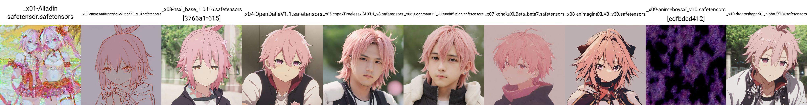
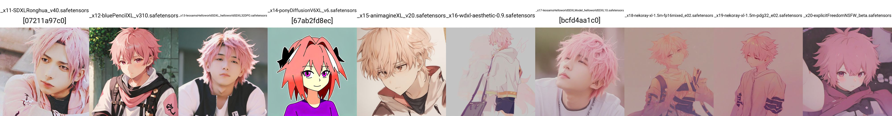
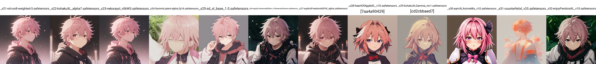
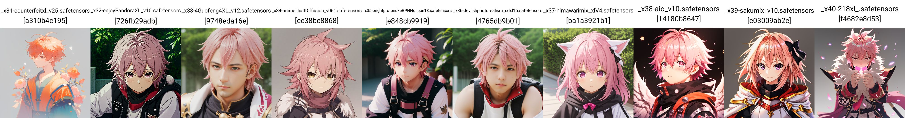
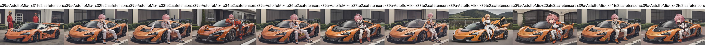
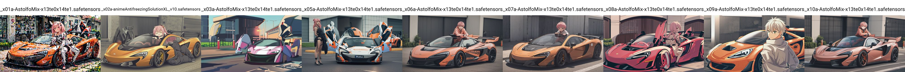
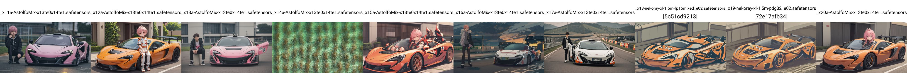
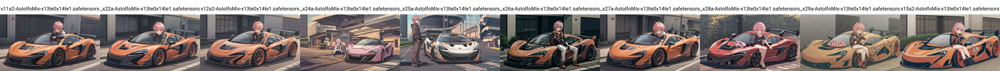

# AstolfoMix-XL: Model selection Round 1 (x39a) #

- [Back to main page](../README_XL.MD#deriving-the-recipe-aka-model-selection-round-1-x39a).

- *I have found that I need to loosen the criteria and fix model to try to accept recent popular models. However the basic concept is unchanged. See Round 2 for additonal consideration.*

- First, it is less obvious when I view the raw model:

<details>
    <summary>Full of XY plot. Click to open.</summary>









</details>

- For selecting CLIPs, UNET is `x39a` which is the global average model. VAE is the original VAE of SDXL.

- First I choose **CLIP**, or `conditioner.embedders.0`:

<details>
    <summary>Full of XY plot. Click to open.</summary>


</details>

- Then I choose **CLIP-AUX**, or `conditioner.embedders.1`:

<details>
    <summary>Full of XY plot. Click to open.</summary>


</details>

- For reference, I also see what will happen when I apply both CLIPs:

<details>
    <summary>Full of XY plot. Click to open.</summary>




</details>

- For selecting UNETs, CLIPs will be the merged model which is `x13te0` and `x14te1`. Note that I have reused the merge models to save disk space.

<details>
    <summary>Full of XY plot. Click to open.</summary>








</details>

- Afterthat, I record all the accept model IDs and start merging pairwise. 

- This time [parallel merge](https://en.wikipedia.org/wiki/Merge_algorithm) **is required.** Storing around 6x40 SDXL models requires **around 1.5TB in disk space**, therefore I must try to reuse models as much as possible. Moreover, with this shear amount of model counts, making image preview on them are not fesiable.

### Selected models ###

- `te0`: Models selected for using the **CLIP**, or `conditioner.embedders.0`. 

- `te1`: Models selected for using the **CLIP-AUX**, or `conditioner.embedders.1`. 

- `te2`: Models looks acceptable with both CLIPs applied. Not for selection, just for reference.

- `=sd`: Models has the exact same CLIP pair as the original SDXL `_x25`.

- `--` is used for placeholder because I need to figure out the model pairs to be merged.

- Total / subtotal count will be shown as `=xx`.

- `xxa` e.g. `09a` is the merge of `_x17` and `_x18`, because of model deviation. It introduce some error on expected model weight, but will be negligible when the scale is large.

```
te0: --,--,03,05,--,10,11,--,--,16,17,09a,10a,20,11a,22,23,24,25,26,27,32,--,36,--,--,41,--=19
te1: 01,02,03,05,06,10,--,12,14,16,17,09a,10a,20,11a,22,--,24,25,26,27,32,33,36,37,38,41,42=26
te2: 01,--,03,05,06,10,--,--,--,16,17,09a,10a,20,11a,22,--,24,25,--,27,32,33,36,37,38,41,--=21
=sd: --,--,03,--,--,10,--,12,--,16,--,-18,-19,--,---,--,--,--,25,--,--,--,--,--,--,--,--,--=7
```
- Excluding the `=sd` for the actual merge will be shown below. Intermediate model name will be `x01te1-AstolfoMix-_x01_x02`.

```
te0:--,--,05,--,11,--,--,17,20,11a,22,23,24,25,26,27,32,--,36,--,--,41,--=14
te1:01,02,05,06,--,12,14,17,20,11a,22,--,24,25,26,27,32,33,36,37,38,41,42=21
```

- `unet`: Models selected for using the UNET.

- `nsfw`: Models selected for using the UNET. This time I used a NSFW prompt for test.

- To keep it easy to trace (originaly it is 33 / 15), I adjust it to be a perfect $2^n$. It will be handy for future merge, when new model appears.

- `x01a`: Model pairs which are already available for merge. Therefore I can reuse for saving disk space, a lot.

```
unet: 01,02,06,07,09,10,11,12,13,15,16,17,20,21,22,23,25,26,27,28,30,31,32,33,34,--,37,38,39,40,42,43,44=32
nsfw: 01,--,06,07,--,--,11,12,13,15,--,--,20,21,22,23,--,--,27,--,--,31,--,--,--,36,--,--,--,40,--,43,--=16
x01a: 01,02,--,--,09,10,11,12,--,15,16,--,--,21,22,--,25,26,27,28,--,31,32,33,34,--,37,38,39,40,--,43,44
```
- Finally here is the result model name:

```
base=x17-AstolfoMix-x13te0x14te1.safetensors
nsfw=x11c-AstolfoMix-x13te0x14te1.safetensors
```

- File list as the full merging list will be provided soon.