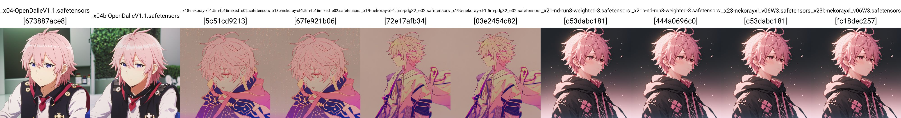

# AstolfoMix-XL: Model selection Round 2 (x49a) #

- [Back to main page](../README_XL.MD#model-selection-round-2-x49a).

- With the model fix and new models, now I have more models to pick:

<details>
    <summary>Full of XY plot. Click to open.</summary>





</details>

- Only `_30b` is showing difference because of modified VAE.

- Then I run the CLIP test for the new models:

<details>
    <summary>Full of XY plot. Click to open.</summary>


</details>

- And then the "repaired models":

<details>
    <summary>Full of XY plot. Click to open.</summary>


</details>

- Since I want to bring more models to the mix, I switched the seed to the same prompt, to hopefully select more models:

<details>
    <summary>Full of XY plot. Click to open.</summary>


</details>

- With the passing CLIPs, this time I decided to reconstruct all 50 models to test the UNETs:

<details>
    <summary>Full of XY plot. Click to open.</summary>


</details>

- Then I reconstruct the whole recipe:

```
te0: --,--,03,04,05,--,08,10,11,--,14,16,17,18,19,20,21,22,23,24,25,26,27,--,32,--,35,36,--,--,--,41,--,43,--,45,46,48,--,--=27
te1: 01,02,03,04,05,06,--,10,--,12,14,16,17,18,19,20,21,22,23,24,25,26,27,30,32,33,35,36,37,38,40,41,42,--,44,45,46,48,49,50=37
te2: 01,--,03,04,05,06,--,10,--,--,--,16,17,18,19,20,21,22,23,24,25,--,27,--,32,33,35,36,37,38,40,41,--,--,--,--,--,--,--,--=25
=sd: --,--,03,--,--,--,--,10,--,12,--,16,--,18,19,--,--,--,--,--,25,--,--,--,--,--,--,--,--,--,--,--,--,--,--,--,--,--,--,--=7

te0: 04,05,08,11,14,17,20,21,22,23,24,25,26,27,32,35,36,41,43,45,46,48=22
te1: 01,02,04,05,06,14,17,20,21,22,23,24,25,26,27,30,32,33,35,36,37,38,40,41,42,44,45,46,48,49,50=31
unet: 01,02,--,04,05,06,07,08,09,10,11,12,13,--,15,--,17,18,19,20,21,22,23,--,25,26,27,28,29,30,31,32,33,34,35,36,37,38,39,40,41,42,43,44,45,46,47,--,49,--=44
```