# AstolfoMix-XL: Model selection Round 4 (x69a) #

- [Back to main page](../README_XL.MD#model-selection-round-4-x69a).


<details>
    <summary>Full of XY plot. Click to open.</summary>

- te0


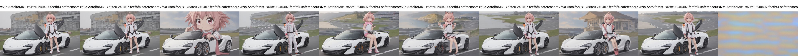

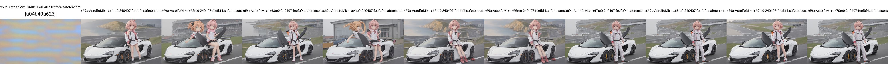

- te1

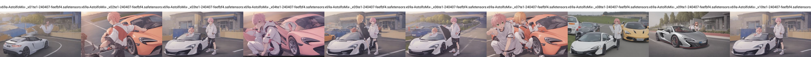

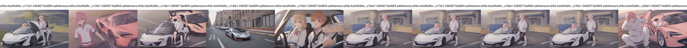


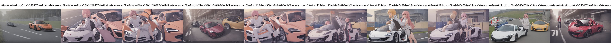

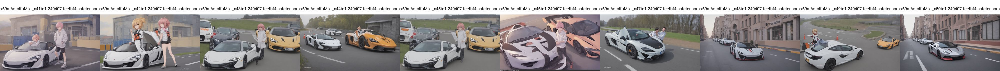

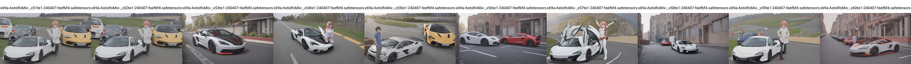

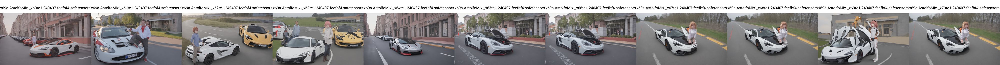

- te2


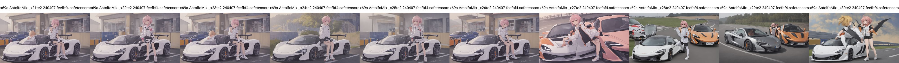

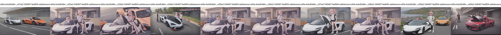

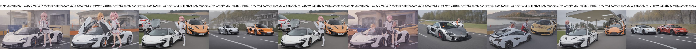

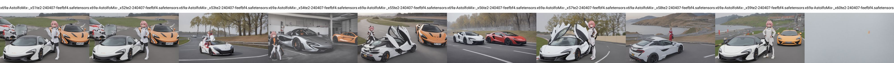

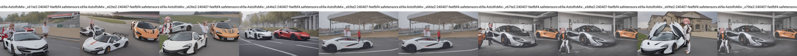

- unet

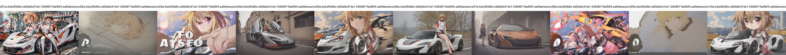

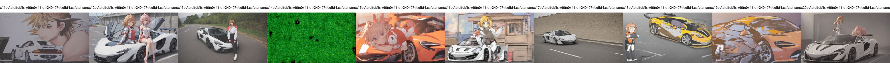

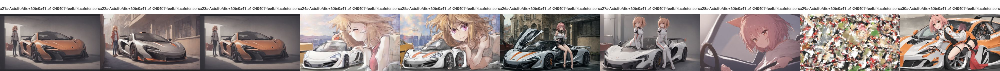

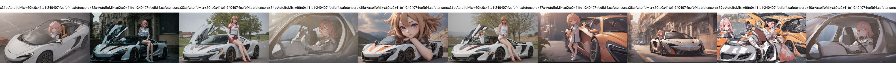

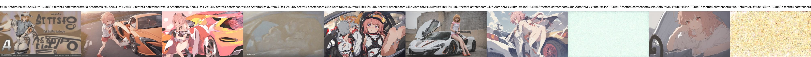

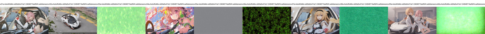

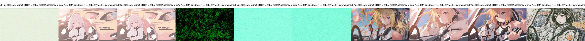

</details>

### Merge Log ###

- It is useful to track time. It will be updated along with the e2e notebook.

```log
INFO: Saving to F:\NOVELAI\astolfo_mix\sdxl\x69a-AstolfoMix-240407-feefbf4.safetensors
Merging recipe: 100%|██████████| 2515/2515 [11:01<00:00,  3.80it/s, key=model.diffusion_model.time_embed.2.weight, shape=[1280, 1280]]                                              
Merge time: 666 sec

INFO: Saving to F:\NOVELAI\astolfo_mix\sdxl\clip\x69a-AstolfoMix-_x70te2-240407-feefbf4.safetensors
Merging recipe: 100%|██████████| 2515/2515 [01:38<00:00, 25.59it/s, key=model.diffusion_model.time_embed.2.weight, shape=[1280, 1280]]                                             
Merge time: 20382 sec

INFO: Saving to F:\NOVELAI\astolfo_mix\sdxl\x69a-AstolfoMix-x57te0x57te1-240407-feefbf4.safetensors
Merging recipe: 100%|██████████| 2515/2515 [17:34<00:00,  2.39it/s, key=model.diffusion_model.time_embed.2.weight, shape=[1280, 1280]]                                            
Merge time: 1055 sec

INFO: Saving to F:\NOVELAI\astolfo_mix\sdxl\x69a-AstolfoMix-x60te0x41te1-240407-feefbf4.safetensors
Merging recipe: 100%|██████████| 2515/2515 [1:07:06<00:00,  1.60s/it, key=model.diffusion_model.time_embed.2.weight, shape=[1280, 1280]]                                            
Merge time: 4031 sec
                                       
INFO: Saving to F:\NOVELAI\astolfo_mix\sdxl\unet\x70a-AstolfoMix-x60te0x41te1-240407-feefbf4.safetensors
Merging recipe: 100%|██████████| 2515/2515 [02:51<00:00, 14.65it/s, key=model.diffusion_model.time_embed.2.weight, shape=[1280, 1280]]                                             
Merge time: 12043 sec

INFO: Saving to F:\NOVELAI\astolfo_mix\sdxl\x51-AstolfoMix-x60te0x41te1-240407-feefbf4.safetensors
Merging recipe: 100%|██████████| 2515/2515 [43:48<00:00,  1.05s/it, key=model.diffusion_model.time_embed.2.weight, shape=[1280, 1280]]                                              
Merge time: 2629 sec
```

### Result to obtain models to exclude ###

- Note that the count is in negative number which is exclusion.

- Later the model count will be counted in auto: `TE0:61,TE1:42,UNET:52`.

```log
te0: --,--,--,--,--,--,--,--,--,--,--,--,--,--,40,--,--,--,--,--,--,--,--,60,--,--,--,--=-2
te1: 01,--,09,--,--,14,15,--,--,--,--,29,31,34,40,44,47,48,49,50,53,56,58,60,61,64,65,66=-21
te2: --,--,09,--,--,14,15,--,--,--,--,--,31,34,40,44,47,48,--,50,53,56,58,60,61,64,65,66=-18
=sd: --,03,--,10,12,--,--,16,18,19,25=-7

te0: 03,10,12,16,18,19,25,40,60=-9
te1: 01,03,09,10,12,14,15,16,18,19,25,29,31,34,40,44,47,48,49,50,53,56,58,60,61,64,65,66=-28
unet: 02,08,14,29,39,41,44,48,50,53,55,56,58,60,61,64,65,66=-18
```