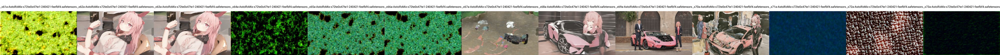

# AstolfoMix-XL: Model selection Round 5 (x72a) #

- [Back to main page](../README_XL.MD#model-selection-round-5-x72a).

- **In progress.** Hint: ~~Is implementation of TIES all correct?~~ WTF time to explore!

- This session has only 20 models compared because ~~I found a flaw in the implementation~~ I found a new theory to support this implementation but the prompt is still not applicable for this test.

<details>
    <summary>Full of XY plot. Click to open.</summary>

- te0


- te1


- te2


</details>

- This round will be in different prompt (another car).


<details>
    <summary>Full of XY plot. Click to open.</summary>

*Model `x70` to `x73` will be groupped.*

- te0


- te1


- te2


- 70 


- UNET




</details>


### Merge Log ###

- It is useful to track time. It will be updated along with the e2e notebook.

```log
INFO: Saving to F:\NOVELAI\astolfo_mix\sdxl\x72a-AstolfoMix-24042502-a53faef.safetensors
Merging recipe: 100%|██████████| 2515/2515 [56:28<00:00,  1.35s/it, key=model.diffusion_model.time_embed.2.weight, shape=[1280, 1280]]                                              
Merge time: 3389 sec

INFO: Saving to F:\NOVELAI\astolfo_mix\sdxl\clip\x72a-AstolfoMix-_x73te2-240421-feefbf4.safetensors
Output is truncated. View as a scrollable element or open in a text editor. Adjust cell output settings...
Merge time: 16446 sec

INFO: Saving to F:\NOVELAI\astolfo_mix\sdxl\x72a-AstolfoMix-x72te0x47te1-240421-feefbf4.safetensors
Merging recipe: 100%|██████████| 2515/2515 [1:25:09<00:00,  2.03s/it, key=model.diffusion_model.time_embed.2.weight, shape=[1280, 1280]]                                            
Merge time: 5115 sec
                                       
INFO: Saving to F:\NOVELAI\astolfo_mix\sdxl\unet\_x73a-AstolfoMix-x72te0x47te1-240421-feefbf4.safetensors
Merging recipe: 100%|██████████| 2515/2515 [01:25<00:00, 29.40it/s, key=model.diffusion_model.time_embed.2.weight, shape=[1280, 1280]]                                             
Merge time: 6182 sec
```