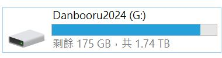

# (not) cheesechaser speedrun # 

- Respond to incident: [Huggingface is not an unlimited model storage anymore: new limit is 500 Gb per free account.](https://www.reddit.com/r/LocalLLaMA/comments/1h53x33/huggingface_is_not_an_unlimited_model_storage/)

- Speedrun to scrape [danbooru2024](htps://huggingface.co/datasets/deepghs/danbooru2024-webp-4Mpixel) and [e621](https://huggingface.co/datasets/deepghs/e621_newest-webp-4Mpixel) via ~~[cheesechaser](https://github.com/deepghs/cheesechaser)~~ hand crafted script.

- *Since I have no time to organize / code anything, this is just a guide, with some sample code to run.*

- Maybe I'll make some jupyter notebook again for "pseudo GUI" approach.

- ~~Observed from chat~~ "webp-4Mpixel" variant is recommended. I don't know if there should be conversion before finetune, but download first.

- No `.gitignore` here because I always do operations seperately.

## Setting up environment ##

- Safety first.

```sh
conda create -n cheesechaser-env python=3.12
conda activate cheesechaser-env

pip install cheesechaser
```

## Notes on danbooru2024 ##

- Create folder. 
```sh
mkdir danbooru2024-webp-4Mpixel
mkdir danbooru2024-webp-4Mpixel/data
mkdir danbooru2024-webp-4Mpixel/data/exp2_sutr
cd danbooru2024-webp-4Mpixel
```

- Manually down a few files first.

```log
./metadata.parquet
./meta.json
```

- It takes up to 70GB of RAM to load metadata.

```sh
python metadata-booru2024.py
```

- Now test for a few files. **I have edited this to limit to first 100 images, otherwise HF will block me for exceeding rate limit.**

```sh
python dl-booru2024-sample.py
```

```log
>python dl-booru2024-sample.py
[1039096, 1176244, 1307128, 1333515, 1342091, ...]
0096.json: 100%|█████████████████████████████████| 1.07M/1.07M [00:00<00:00, 28.2MB/s]
C:\Users\User\.conda\envs\cheesechaser-env\Lib\site-packages\huggingface_hub\file_download.py:139: UserWarning: `huggingface_hub` cache-system uses symlinks by default to efficiently store duplicated files but your machine does not support them in F:\WORKS\HUGGINGFACE\hub\datasets--deepghs--danbooru2024-webp-4Mpixel. Caching files will still work but in a degraded version that might require more space on your disk. This warning can be disabled by setting the `HF_HUB_DISABLE_SYMLINKS_WARNING` environment variable. For more details, see https://huggingface.co/docs/huggingface_hub/how-to-cache#limitations.
To support symlinks on Windows, you either need to activate Developer Mode or to run Python as an administrator. In order to activate developer mode, see this article: https://docs.microsoft.com/en-us/windows/apps/get-started/enable-your-device-for-development
  warnings.warn(message)
0244.json: 100%|███████████████████████████████| 1.07M/1.07M [00:00<00:00, 12.7MB/s]
0128.json: 100%|███████████████████████████████| 1.07M/1.07M [00:00<00:00, 26.0MB/s]
0515.json: 100%|███████████████████████████████| 1.06M/1.06M [00:00<00:00, 14.0MB/s]
...
2540959.webp: 100%|████████████████████████████| 83.5k/83.5k [00:00<00:00, 12.0MB/s] 
2542064.webp: 100%|████████████████████████████| 96.9k/96.9k [00:00<00:00, 13.0MB/s] 
0521.json: 100%|███████████████████████████████| 1.06M/1.06M [00:00<00:00, 6.95MB/s] 
2542518.webp: 100%|████████████████████████████| 164k/164k [00:00<00:00, 4.58MB/s] 
2542521.webp: 100%|████████████████████████████| 195k/195k [00:00<00:00, 756kB/s] 
Download Count: 100it [00:50,  2.00it/s]███████| 100/100 [00:50<00:00,  1.33it/s]
Files Downloaded: 100it [00:50,  2.00it/s]           | 0.00/164k [00:00<?, ?B/s]
Batch Downloading: 100%|███████████████████████| 100/100 [00:50<00:00,  2.00it/s]
```

- Then manually download `0000.tar` to inspect. (There are still way too many API calls which may have me blocked)

```log
./data/0000.tar
```

- And... looks like it is what I'm expecting for.

```log
> python dl-booru2024-hfhub.py
images/0001.json
0001.json: 100%|██████████████████████████████| 1.06M/1.06M [00:00<00:00, 17.6MB/s]
images/0001.tar
0001.tar: 100%|███████████████████████████████| 1.70G/1.70G [01:09<00:00, 24.6MB/s]
```

- Identical for E621.

```log
> python dl-e621-hfhub.py
0000.json: 100%|██████████████████████████████| 63.4k/63.4k [00:00<?, ?B/s]
0000.tar: 100%|███████████████████████████████| 114M/114M [00:04<00:00, 23.0MB/s]
```

- Now the harder part to extract tags. Straight from HF preview, other than the original `tag_string`, there is a groupped chunks like `tag_string_character`, which will be extra good for TE.

- I'll rearrange the tag as **character > copyright > artist > general > meta**. It is because I'm finetuning from a merged model, which can handle general `1girl 1boy` well. 

```log
> python metadata-booru2024-tags-old.py
> tail tags/1.txt
kousaka_tamaki, to_heart_(series), to_heart_2, kyogoku_shin, 1girl, 2000s_(style), ;p, animal_ear_fluff, animal_ears, aqua_panties, blue_bow, blush, border, bow, bow_panties, breasts, brown_eyes, cat_ears, cat_girl, cat_tail, collarbone, colored_stripes, cowboy_shot, groin, hands_up, kemonomimi_mode, large_breasts, long_hair, long_sleeves, looking_at_viewer, no_pants, one_eye_closed, orange_background, outside_border, panties, parted_bangs, pink_shirt, red_hair, red_sailor_collar, sailor_collar, school_uniform, serafuku, shirt, sidelocks, simple_background, smile, solo, standing, straight_hair, striped_background, striped_clothes, striped_panties, tail, thigh_gap, thighhighs, thighs, tongue, tongue_out, two_side_up, underwear, very_long_hair, w_arms, white_border, white_panties, white_thighhighs, bad_id, bad_link, commentary
```

- Since 8M files is too stressful for a disk drive, we convert back to `FFFF.tar` format.

```log
>python metadata-booru2024-tags.py
Extracting Tags: 8005010it [1:00:04, 2220.60it/s]
Making *.tar Files:   2%|███▍               | 160/10000 [1:58:16<130:26:40, 47.72s/it]
```

- Now we have the "metadata" to export `*.txt`, and the images for `*.webp`, which should be sufficient for basic finetuning.



- The [preferred trainer "khoyas-ss"](https://github.com/kohya-ss/sd-scripts) requires dedicated `meta_lat.json` with caption side preprocessing, we extract all the `*.tar` into the same directory. Since the `id.*` are aligned (**parquet Row ID = file name**), it will be fine.

```log
> python extract-booru2024.py
Extracting *.tar Files:   0%|                                    | 0/1 [
Extracting *.tar Files: 100%|████████████████████████████| 1/1 [00:09<00
```

- Finally, instead the [official guide](https://github.com/kohya-ss/sd-scripts/blob/main/docs/fine_tune_README_ja.md) (a bit messy), follow this [reddit post](https://www.reddit.com/r/StableDiffusion/comments/163097n/getting_started_fine_tuning/?rdt=34904) to **make the metadata JSON file (with ARB)** and start finetuning.