# Finetune findings (and gallery) #

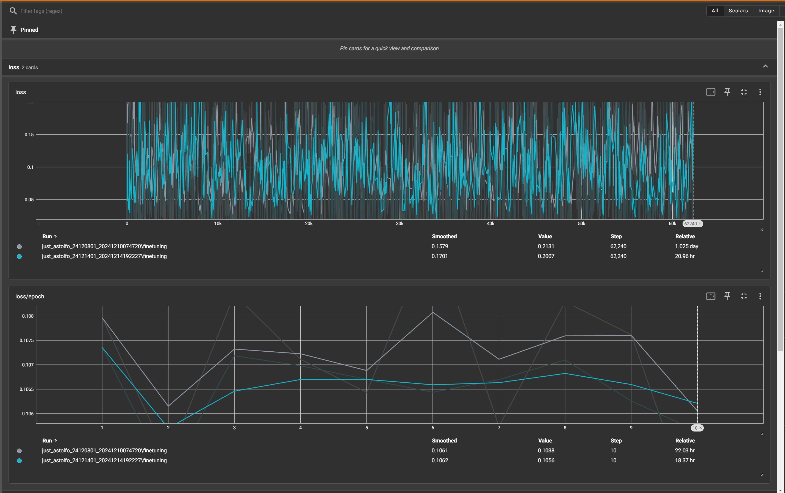

- *Since most of my recipe are models finetuned from the same dataset (with different tags)*, it converges quite fast. Astolfo got his facial features back within 1EP.

- **Training loss (L2 / Huber) has no correlation to image content.** It is fine when it doesn't rise / drop drastically. [From common practice](https://www.stablediffusion-cn.com/sd/sd-knowledge/1761.html), 0.1 is a good reference. The training loss here applies to the inference for each denoising step, under the MDP chain inside the SD model. Advanced validation loss are required, *or just be responsible to art and be the first audience*.

- TTE off may have lower loss, although it is close to meaningless to end result.

## When TTE is off ##

- If the concept is recognizable already (usually incomplete, e.g. Astolfo vs generic pink hair and slight hair intake), styles / details can be recovered well.

- Most unrelated but recognizable concept are mostly untouched. Cars, other characters, costumes, locations, are having style change only.

- However, if the concept is unrecognizable before train, it won't be effective. For example, some characters, artists, NSFW concepts, were wiped out while merging.

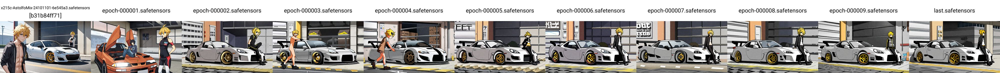

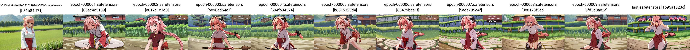

## When TTE is on ##

- It will be effective when the concept is unrecognizable before train. For example, *Astolfo is a boy now*.

- However, with improper parameter and data distribution, concepts recognizable before train can be forgotten. Characters, costumes may survive, but cars, locations may be gone.

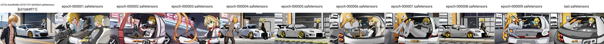

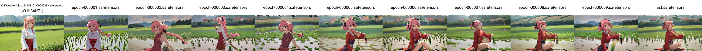

## When TTE only ##

- It will be similar with TTE off. Notice that the content will change, instead of the representation of content. Academically training alternatively between UNET and TE and freezing each others is safe, however it requires double effort. Otherwise I need to seperate the dataset for parts for different stages.

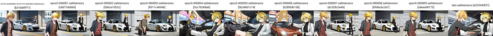

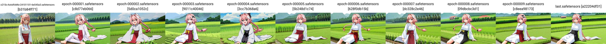

## When TTE is on with only part of UNET is trained ##

- *The learning rate has been reduced, which is referenced from similar models.* I believe that the learning rate of UNET may be smaller than TE, but it requires extentsive testing.

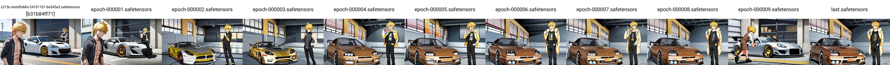

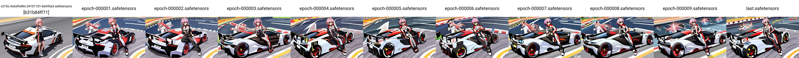

## Some personal direct quotes (need time to consolidate) ##

- [Discussion of TTE in UD.](https://discord.com/channels/1010980909568245801/1011105234820542554/1326822489153863764)

## Comparasion between community finetuned models ##

- [I have compared with 2 recent community finetuned models.](./readme.md#comparasion-with-similar-large-scale-finetune)

- *AnimagineV4 tends to add quality tags to the back*, meanwhile *NoobAI-XL tends to add quality tags to the front*. **My "test" model has quality tags absent.** The effect of the position of the tags matters, as discussed in the SD1.5 era.

- I expect my "at most 1EP" may not able to describe the characters well, but pretrained content (e.g. cars) will be preserved.

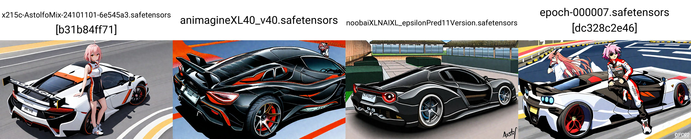

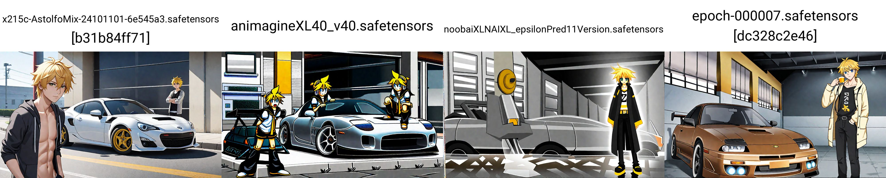

## Comparasion between TTE settings (on / off / only) ##

- See [model description](./sd-scripts-runtime/logs/readme.md). Generally forgetting pretrained knowledge can be avoided with proper learning rate and absent of quality tags, which **"quality tags" is a kind of misalignment**.

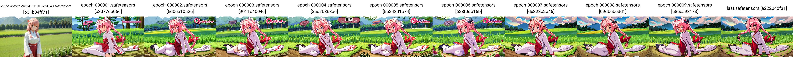

## Unconditional Image Generation ##

- *It still works.*

