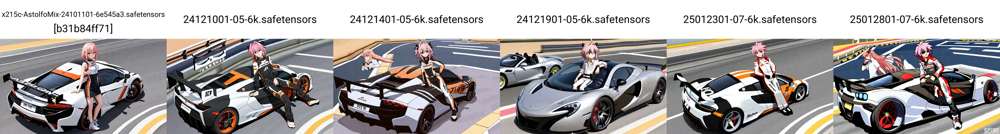
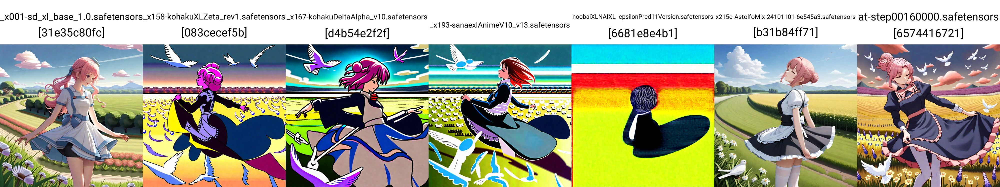

# Finetune findings (and gallery) #

It is documented in chronological order. Go to bottom for newest state.

## Loss curve for 6k dataset ##


- *Since most of my recipe are models finetuned from the same dataset (with different tags)*, it converges quite fast. Astolfo got his facial features back within 1EP.

- **Training loss (L2 / Huber) has no correlation to image content.** It is fine when it doesn't rise / drop drastically. [From common practice](https://www.stablediffusion-cn.com/sd/sd-knowledge/1761.html), 0.1 is a good reference. The training loss here applies to the inference for each denoising step, under the MDP chain inside the SD model. Advanced validation loss are required, *or just be responsible to art and be the first audience*.

- TTE off may have lower loss, although it is close to meaningless to end result.

## When TTE is off ##

- If the concept is recognizable already (usually incomplete, e.g. Astolfo vs generic pink hair and slight hair intake), styles / details can be recovered well.

- Most unrelated but recognizable concept are mostly untouched. Cars, other characters, costumes, locations, are having style change only.

- However, if the concept is unrecognizable before train, it won't be effective. For example, some characters, artists, NSFW concepts, were wiped out while merging.


## When TTE is on ##

- It will be effective when the concept is unrecognizable before train. For example, *Astolfo is a boy now*.

- However, with improper parameter and data distribution, concepts recognizable before train can be forgotten. Characters, costumes may survive, but cars, locations may be gone.


## When TTE only ##

- It will be similar with TTE off. Notice that the content will change, instead of the representation of content. Academically training alternatively between UNET and TE and freezing each others is safe, however it requires double effort. Otherwise I need to seperate the dataset for parts for different stages.


## When TTE is on with only part of UNET (63%) is trained ##

- *The learning rate has been reduced, which is referenced from similar models.* I believe that the learning rate of UNET may be smaller than TE, but it requires extentsive testing.


## Some personal direct quotes (need time to consolidate) ##

- [Discussion of TTE in UD.](https://discord.com/channels/1010980909568245801/1011105234820542554/1326822489153863764)

## Comparasion between community finetuned models ##

- [I have compared with 2 recent community finetuned models.](./readme.md#comparasion-with-similar-large-scale-finetune)

- *AnimagineV4 tends to add quality tags to the back*, meanwhile *NoobAI-XL tends to add quality tags to the front*. **My "test" model has quality tags absent.** The effect of the position of the tags matters, as discussed in the SD1.5 era.

- I expect my "at most 1EP" may not able to describe the characters well, but pretrained content (e.g. cars) will be preserved.


## Comparasion between TTE settings (on / off / only) ##

- See [model description](./sd-scripts-runtime/logs/readme.md). Generally forgetting pretrained knowledge can be avoided with proper learning rate and absent of quality tags, which **"quality tags" is a kind of misalignment**.



- For effects on artist, **TTE is recommended**. The following 2 are `(1boy:0), [astolfo]` and `cle_masahiro, (1boy:0), [astolfo]`. Notice that the artist tag in this 6k dataset only appears once or twice.


## Unconditional Image Generation ##

<details>
    <summary> It still works. </summary>

    

    ```txt
    parameters

    Steps: 48, Sampler: DDIM CFG++, Schedule type: Automatic, CFG scale: 6, Seed: 3581144351, Size: 1024x1024, Model hash: a22204df31, Model: last, VAE hash: 235745af8d, VAE: sdxl-vae-fp16-fix.vae.safetensors, Clip skip: 2, SEG Active: True, SEG Blur Sigma: 11, SEG Start Step: 0, SEG End Step: 2048, PAG Active: True, PAG SANF: True, PAG Scale: 1, PAG Start Step: 0, PAG End Step: 2048, Version: v1.10.1
    ```
</details>

## Effect in dual caption / tags, and exploring on learning rate ##

These images are arrange in order.

- `model_out_25022101`: SDXL, 6k dataset, Dual Tag (pick caption or tags), TTE on + 63% UNET, 5e-6 + 3e-6
- `model_out_25022102`: SDXL, 6k dataset, Dual Tag (concat, a1111 token trick), TTE on + 63% UNET, 5e-6 + 3e-6
- `model_out_25022103`: SDXL, 6k dataset, Dual Tag (concat, a1111 token trick), TTE on + 63% UNET, 1e-6 + 1e-5


- The disussion is listed in [the session with the codes.](./sd-scripts-runtime/kohyas.md#how-dual-tags--caption-will-be-passed-into-the-model) General pretrained knowledge has been preserved a lot more when the input text is a lot more diversified. Notice that generated captions is a kind of synthetic data, which has risk on [model collapse](https://en.wikipedia.org/wiki/Model_collapse). Make sure the content must be [monitored closely](./tipo-toriigate-runtime/readme.md).


## Effect of gradient accumulation (full UNET) ##


- The noticeable difference is the loss curve is smooth in the first half of the training progress, then it fluctuates. Although the magnitude of the MSE has no correlation to the image content, *it fluctuates when the learning process is completed,* with the magnitude stays at a constant range, and sometimes spikes for some outliers. It ensembles to a longitudinal wave, which looks like a typical loss cure while finetuning, but within a constant range.

- To further *imagine* the root cause, may be the (artistic) task in *unsupervised learning approach* (pre-trianing with many objectives, close to pattern matching) is really expect the model to "overfit", or being "confident" enough to not being distracted / confused to "predict" what the model has been learnt.

- For the "longitudinal wave", the "stablization of content" in XY plot matches the "longitudinal wave" in the loss curve.

- The image still break when the learning rate is too high (the learning rate has been doubled).


## Effect of gradient accumulation (part of UNET, 71%) ##

- There was a discussion to increase learning rate when gradient accumulation is enabled. [Ref.](https://stackoverflow.com/questions/75701437/why-do-we-multiply-learning-rate-by-gradient-accumulation-steps-in-pytorch) However, *turns out I don't have to increse it, meanwhile it converges better.*

- Since it boosted the efficiency, I have found the optimal learning rate which can **balance learned intended content and preserve general pretrained knowledge.** 

- ~~The prompt has an artist name, which consist of only 1-2 images out of 6.2k. Meanwhile the "rin with rx7" is not even included in the dataset.~~


- Check for [model description](./sd-scripts-runtime/logs/readme.md) for the setting of the corrosponding model name. Although there is no clear definition to describe "overfitting" in T2I or even generative task (some may call that "it just learnt effectively, unrelated content should not be cared"), I still call it "overfit" when the model start forgetting general contents which is out of the finetuning dataset ~~I think this is both (large) finetuning and (small) pretrain~~.

- However the model still requiree **more than 1 epoch** to learn the entire dataset effectively, which ranges from 6-9 epochs. *Maybe I should really rent a powerful mahcine when the first EP is a success.* 


- If we increase the accumulation steps (from 4 to 16), it trains faster but it tends to fail to converge and being underfit after many epochs. However this may make sure the model is still being robust to unseen contents.


## Effect on switching to the updated base model (and implied batch size) ##

- Good news: **Parameters remains unchanged.** Bad news: **Base model still determine the success of the finetune.**

- Warning: **Very counterintuitive.** I doubted myself, but I persist to run the full procedure. Now the end result is even better.

- *The 250403 is invalid.* I run the training task as single GPU with `--gradient_accumulation_steps=4`. The image quality is difference because of implied batch size of multi GPU.

- After rerun with 4 GPUs, the result is actually a bit worse, but after a bit of struggle, *I decided to use 255c whatsever*.

- I think 255c has archieved ["pseudorandom"](../ch05/README_XL.MD#revisit-from-the-next-chapter-updating-the-model-and-it-is-an-epic-fail-without-finetune), which enables a hybird learning mode between pretrain and finetune. Pretrain occurs in contradicted weights to "resurrect the network", and the finetune will keep its own process.


- With such pattern, *I have hope on effective learning with only 1EP*. It may break after 5-6EP, but I'm quite sure I won't be there unless I have DGX 8x BH200 (that will violate whole chapter!)


## Effect on trying on full dataset ##

- Notice that the "human / non human" ratio is so low (2:1 instead of 100+:1), with such "unconditional focused" model / sampler / prompts, we can expect something "wild" (wildlife), but it magically keeps in its own balance, because my objective / "task" is still very general, and the technical details is still making the model as robust as it can.

- Here is some *empty prompts*.


- And here is a `1girl, solo` which `solo` is quite troublesome in many models (it introduce randomness: the character can be any where).


- The model will "forget too many things and confused" in the first 160k images (160k over 12.4M, 10k steps), just be patient. If you are in panic mode, adjust prompt weights (mine is always very light), and even keep prompt `car, wrc` for sanity check. Notice that it is only valid for testing if the model is already broken. The training may not be effective.

- Suprisingly, some images drifts towards 215c's preferred content. Maybe it is an illusion that it is drifting towards SDXL 1.0 content actulally.


## Further investigation on full dataset ##

- *Notice that 1 step = 4 GPU * batch size 1 * gradient accumulation steps 4 = 16 images.*

- (Not included for obvious reason) Furry contents may work, but mostly forced to be NSFW. It is hard to keep it "formal" in content.

- (Discovered by community, because I never train / use LoRA), it works extra well with LoRA regardless the base model (A3 / Pony / SDXL 1.0 / IL / NB etc.)


- It is slowly catching up the common concepts which is visible from 215c.

 

- The "pseudorandom" as conflicted weights are being replaced with trained content (although it is so underfit).

 

- **It does forget things.** However I think it is minimalized. The **text and comic** contents are actually not the "unintended training content" (which was noticeable in NAIv1), it is just the "randomness" from the "nearest predicton of representation". 

- *Word characters (symbols) is highly abstract which fills up the voids in the latent space.* 

- Meanwhile *comics represents the AI agent has no idea where to represent the concepts what was not ignored.* Using back the plain euler / DDIM sampler will see the *blured blobs with some fragmented lines*.

- It is reasonable: *Some uncommon pretrained contents are being replaced with furry contents.*


- This model is [underfitting](https://www.ibm.com/think/topics/overfitting-vs-underfitting) instead of most overfitting models. It choose to ignore unknown contents instead of overemphasizing known contents. 

- Instead of [bias-variance tradeoff](https://en.wikipedia.org/wiki/Bias%E2%80%93variance_tradeoff) which is focusing on definitive targets, it is more like [exploration–exploitation dilemma](https://en.wikipedia.org/wiki/Exploration%E2%80%93exploitation_dilemma) which balancing "explore art" and "exploit visual impact".

- Combining the "macroscopic approach" of LDM (noise prediction) / CFG (unconditional priors) / large scale pretraining with MSE loss (unsupervised learning), it resemble [effortless action](https://en.wikipedia.org/wiki/Wu_wei) which always try to free machine to make prediction based from contradicted knowledge / situation. *This is the exact opposite on training LoRAs, which is mostly have a precise training target.*

- As shown in CivitAI, I usually test models aginst random prompts from community, and currently I just pick random prompts from training dataset. Combining my prior short prompts, it covers most of the board case.

 

## Situation keeps emerging ##

- When I start including e621 prompts, the output images is being different. 


- It starts making my previous prompts invalid also. Making same content requires longer prompts, someties mixing all tags and captions. *Basically I quit using my old prompts which involves prompt weights.*


## Loss curve after full 1EP ##

- Notebook: [parse_tb.ipynb](./sd-scripts-runtime/parse_tb.ipynb)

- Since the training code is not perfect all the time, the curve is accurate since step 50k, until 778k.

- For the [interpreption](https://developers.google.com/machine-learning/crash-course/overfitting/interpreting-loss-curves), curation may help, but I think all metrics / KPI does not represent any end result. The only meaningful information is it does not converge (learn the entire denoising process ~~not image quality!~~) or diverge (break itself all the way). The MSE alone in computer vision is one of the least intiutive metric, meanwhile the "training loss" **does not measure against the final image**.


## T2I settings needs be changed ## 

- *Make sure [FreeU](../ch01/freeu.md) is deactivated. It starts to break images for newer models.* Meanwhile, [CFG++](../ch01/cfgpp_pag_seg.md) no longer works as intended (PAG + SEG still OK), and the CFG of Euler should raise a bit higher (3.0 to 4.0, still lower than 4.5). [Hires](../ch01/hires_fix.md) remains 1.5x with strength 0.7 is fine.

## Does it learnt anything? ##

- Yes. The model bias has shifted with variance maintained. *The total knowledge remains constant.* ~~Forgetting specific location is never concerned.~~

- However the "flat marcoscopic landscape" does not mean there are examples showing steady learning process. 


- Since the dataset is similar, using unconditional prompt generation with [TIPO](https://github.com/KohakuBlueleaf/z-tipo-extension) shows good result consistently.


- Unfortunately, given that the model neighter converges and diverges for "predicting noise", the "total knowledge" remains constant. The forgotten concepts is mainly locations (not scenes, locations with name).


- Unconditional generation still works. However I must hide some contents because the model tends to be NSFW especially clothing is less common in E621 dataset.


- *More coming soon. Worth testing for days.*

## Model weight shift ##

- *The result is boring.* Weight shift in UNET is very low in magnitude. It is less then 20 comparing to typical around 100 (realistic) and 1000 (anime).


- The weight shift in TE is also low (20x smaller than anime model, close to realistic model). However the *trajectory* is non-linear.


## Merging again, as "215c Evo" ##

- *It is what I'm planned since I start this chapter.* [The "Evolutionary merge"](../ch05/README_XL.MD#evolutionary-merge-215c-evo-is-finally-here-but-move-on). *Theory discussion will be there.* It needs further study, especially I don't know how many e621 stuffs has been introduced towards 215c. However the "selection towards left or right" is still quite easy to guess.

- However no new knowledge has been introduced. It is still very poor in character and style reconstruction. *Probably better when I'm in 10EP instead of 1.*


