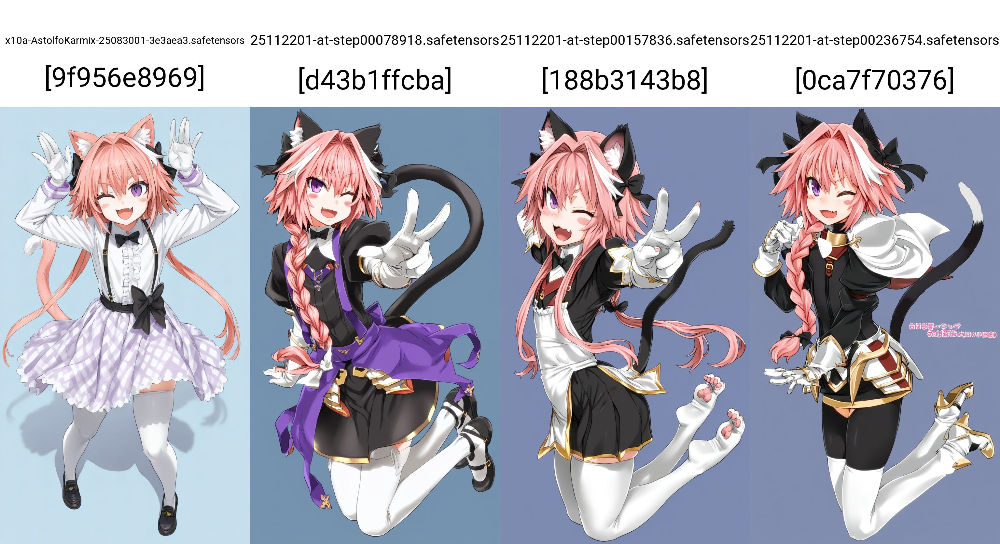
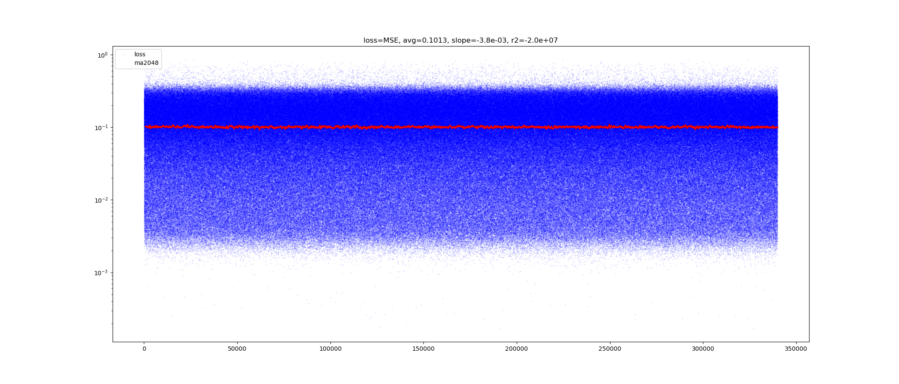
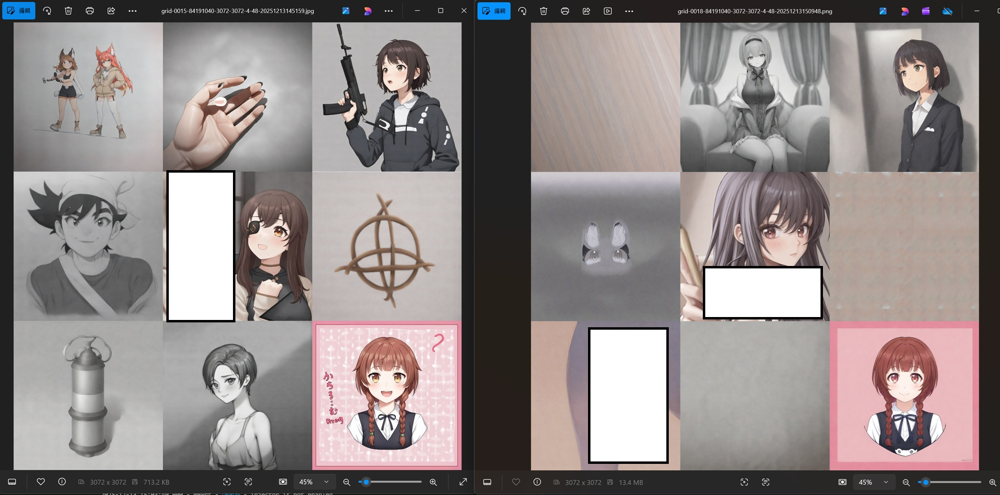
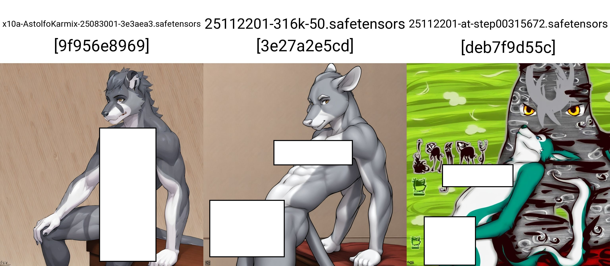
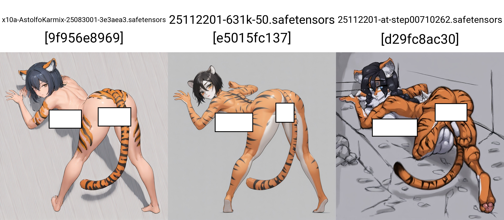
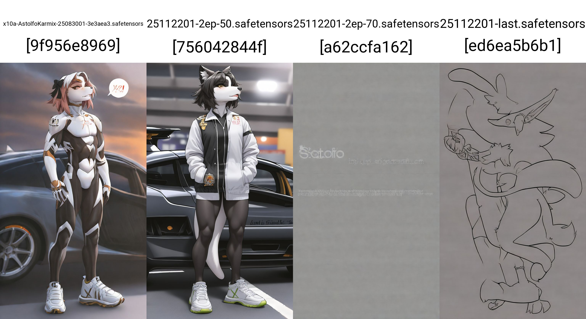
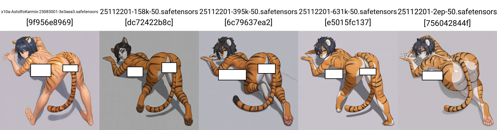
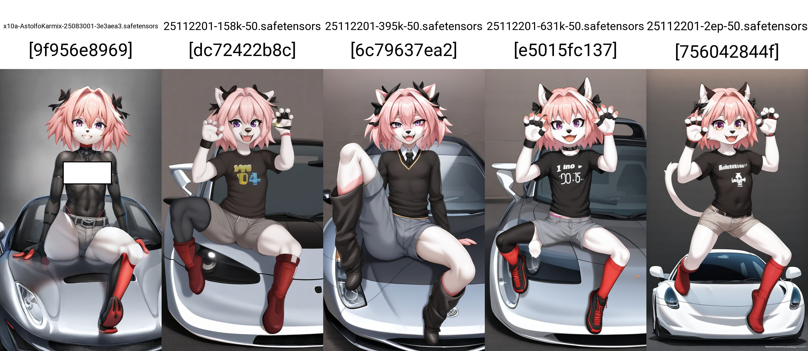
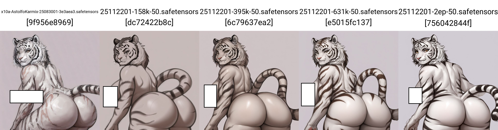

# Finetune findings (and gallery) for 2nd run #

- This is close to risk free, and becomes a smooth sail. Human with car was not strictly enforced (knowledge was lost long ago back in IL and NoobAI), then the entire training process is aligned with the general anime art contents.




- Obviously, all features are optional, it is not forced on, it has been validated on the 6k dataset test. The change in model bias is still very small, comparing with the base model (2EP from mine vs 40EP in NoobAI).


- Meanwhile, the flat loss curve is still maintained, even the altitude (average MSE loss) is almost the same. Given the bad result in vpred training (with a almost ideal loss curve), this may be a good sign as a neutral result.



- The trained model seems quite broken for short prompts because of noisy ["cosmic latent background"](https://en.wikipedia.org/wiki/Cosmic_microwave_background), as seen in "1EP", it can merge back to base model with extended content and fixing the "striped / bluured background", which seems to be part of the problem left from [extensive merging](../ch05/README_XL.MD#revise-255c-as-256c).

- I wonder if the final "2EP" form will be as same as this "1.5EP", which I can consider a lower LR for next run (if exists).



- One of the expected major effect is the *unfiltered E621 contents* (IL completely dropped, NoobAI filtered quite heavily), besides the *western furry style* (contrast to Eastern style out of this platform) ~~realistic sketching but over simple MS paint?~~, it just contributes many [explicit contents](./cheesechaser-runtime/e621_newest-webp-4Mpixel/inspect_parquet.ipynb) which broke many models before (fragmented bodies, like the "1EP").

```
rating
e    3072274
s    1177482
q     938021
Name: count, dtype: int64
```




- Furry / Realistic image regained, generally outperform current AC.

- It is happy to scale up with highres fix, which is approx 1024x1024 x2.0, outperform the AstolfoMix SD1.5. It can max out your VRAM in 3090.


## Findings after train ##

- **The trained model is still not quite useable.** It will requires TIPO like previous 1EP. I suspect the root cause is the super long concatenated captions.

- However, with merging, I confirm the merge ratio is still performing best with **0.5**.

- First of all, it shows good understanding on pure NL prompts, without the booru / e6 prompt format.



- Then for the chaotic short prompt, it breaks when the 2EP content is being major.



- Across *the merge with the trained steps*, seems that the model learnt the major content as soon as 0.1EP is reached, however the "content coherence" is envolving.



- The final step is generally being the best, or 2nd best across the steps.



- Also, the varity is enhanced with the bias shifted towards more minor, or *less aesthetic / normalized* contents. ~~However it is where fetish belongs to.~~



- With the success of the EPS version of the merge, I can move back to [vpred](../ch05/README_AC.md#retry-with-the-ak-evo-2ep) and figure out if I can make any breakthrough on switching prediction objectives, which involves greatly in unconditional generation.
