# Finetune findings (and gallery) for 3rd run #

- The progress is **interleaved** from previous works. Since directly using the trained weight is closed to have no use, I'll directly post the merged model instead.

## The "interleaved" past ##

- Things were not going as planned, eventually I had a new incident and having 2 models to publish.

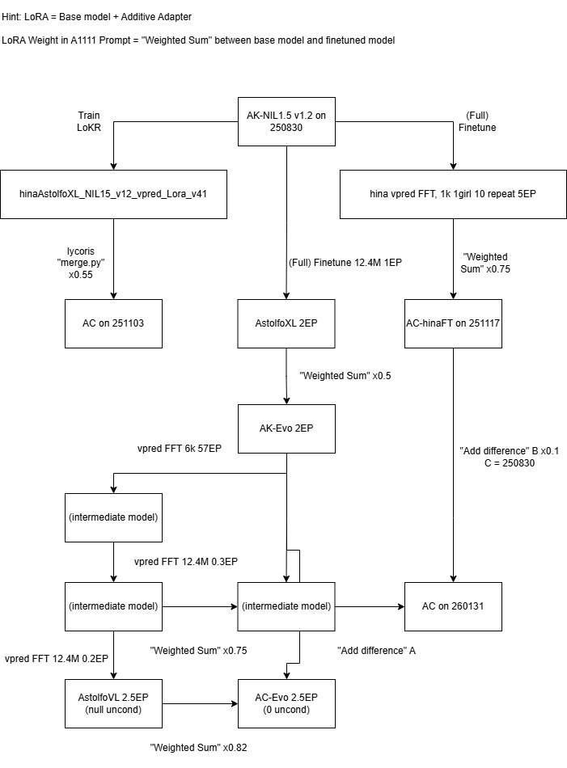

- First of all, hinted with the ["anypred effect"](../ch01/rf.md#image-comparasion) (multitasking on different objective variable), image improves when introducing merge ratio as an hyperparameter. This may not applies to all trained models: *It may relate to the "0 uc" issue*. This will be discussed afterward.

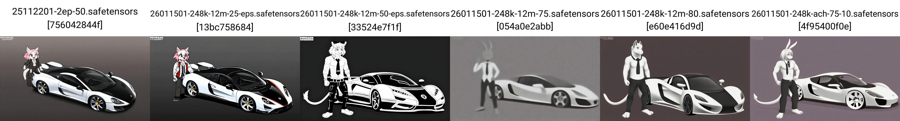

- Despite suffering with the "0 uc" issue*, the issue slowly improves, which I don't have to introduce external model weights to forcefully introducing model bias.

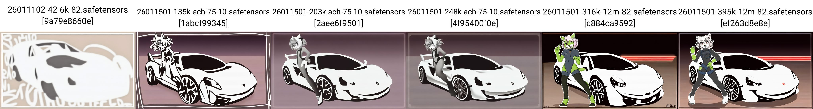

## Hitting the math corner ##

- *This is where the accident started*. Under unconventional trining methods (treating model merging / decompressing LoRA as PEFT), or even switing objective (math variable, like eps to vpred), model bias may suddenly spikes, to make the "null uncond" (condition as [empty set](https://en.wikipedia.org/wiki/Empty_set)) in [CFG Denoising](../ch01/cfg_step.md) not small enough to be [infinitesimal](https://en.wikipedia.org/wiki/Infinitesimal) and assume as zero. For example, when the eps model was made to have infinitesimal model bias, then suddenly change to vpred, model bias won't be infinitesimal.

```py
uncond==te("")!=0 #torch.zeros_like
```

- When the post training precess ~~merge with eps~~ was optimized for either one side between "zero uncond" and "null uncond", it will cause unexpected behaviour. For example, when WebUIs like [A1111](https://github.com/AUTOMATIC1111/stable-diffusion-webui/blame/master/modules/sd_samplers_cfg_denoiser.py#L257) and [reForge](https://github.com/Panchovix/stable-diffusion-webui-reForge/blame/main/ldm_patched/modules/samplers.py#L389) goes to "zero uncond" and ComfyUI went to "null uncond" (absense of node [ConditioningZeroOut](https://comfyui-wiki.com/en/comfyui-nodes/advanced/conditioning/conditioning-zero-out)), it will suprise users and lead to [misunderstand](https://civitai.com/images/121759127).

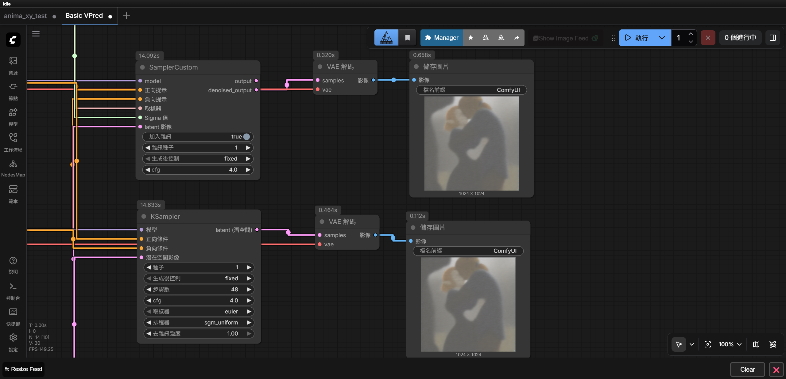

- Manually creating "(closely) null uncond" is easy in WebUIs, by placing known placeholder characters like a single `,`, which `te(",")~0`, then archieving head to head comparasions. For ComfyUI ~~my first day of ComfyUI went to this~~, due to overcomplicated code pattern, the effect is less clear to be shown.

- First of all, I need to show that I am hitting a special case, which happens to this EP2.5 model only. This can be done via [proof by exhaustion](https://en.wikipedia.org/wiki/Proof_by_exhaustion).

- My base model (weakened eps), base model with *full strength*, a old RF model, a newer RF model, are all showing little difference. *Common eps / vpred models can be omitted as contradiction.*


- Then my previous AC model shows a lot larger difference, but not large enough to determine if there are any recognizable contents.


- At last, the recent model showing massive difference.

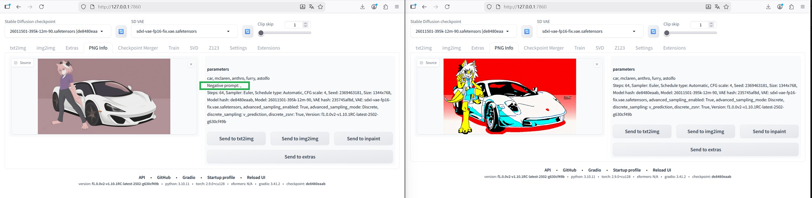

- If `ConditioningZeroOut` is unavailable, **raise CFG** (from 4 to 7) to forcefully deny the uncond, however it is still being heavily blurred. If `ConditioningZeroOut` is available, since it looks like setting the "zero uncond" for *all sampling steps* (WebUI just init for first step), apply [ConditioningAverage](https://comfyui-wiki.com/en/comfyui-nodes/conditioning/conditioning-average) with ratio similar to [highres fix](../ch01/hires_fix.md). 

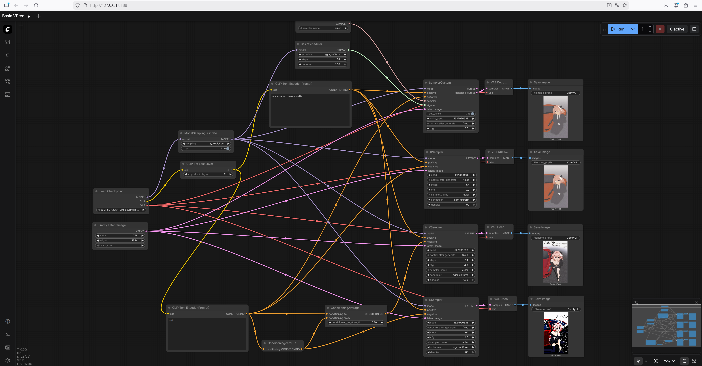

- Finally, since "zero uncond" is out of spec, redo the merging ratio is fine... until I found that **I can apply full strength**, which can be publish as seperated model.

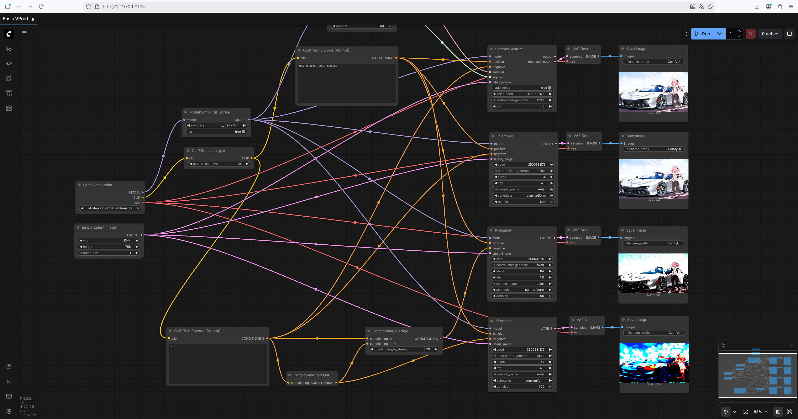

- [Sampling additives](../ch01/cfgpp_pag_seg.md) show minor difference only, unless I use different samplers. Now I am highly confident for the next 0.5EP... which is RF instead of vpred.

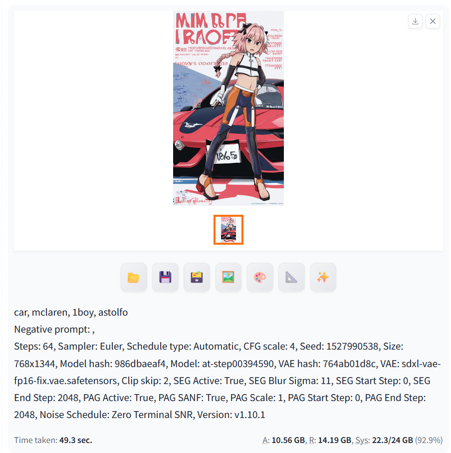

## Feeling good and going to RF ##

- Returning to small dataset, however *it is single 3090 since I'm using my RGB Windows Workstation now*. And... it seems too easy. Looks like the dataset alignment is real.

- Since I still don't figure out how to make A1111 runs RF in native (the "SD3 sampling" has different code base), I'm using ReForge with plain settings.

This is VPred + ZTSNR:

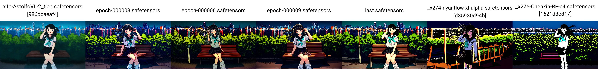

This is RF = SD3(3.0):

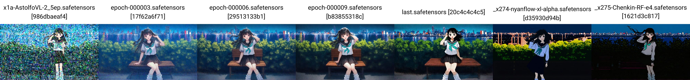

Contents are preserved quite well.


- The loss has been 8x to 0.633 (from 0.0863), meanwhile the *local color shifting patches* has been spotted. Otherwise it just looks great, and I'm feeling good to complete the remaining 0.5EP.

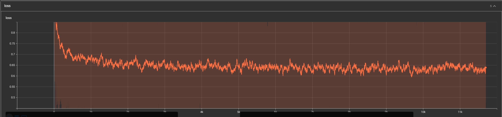