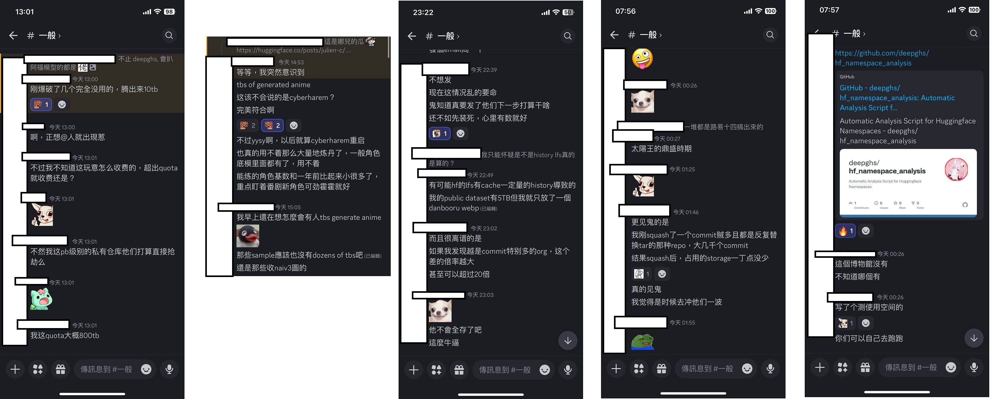
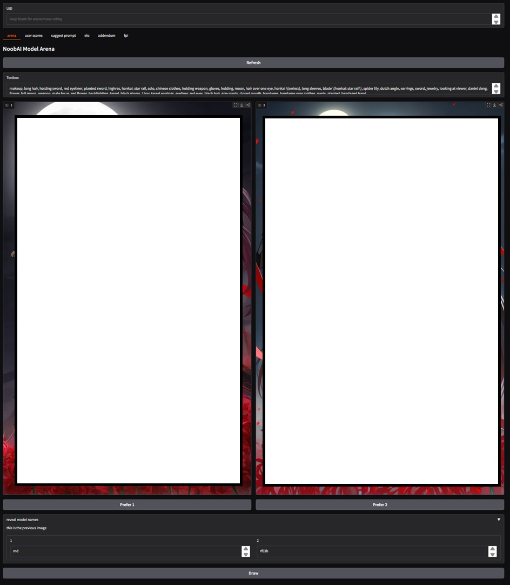
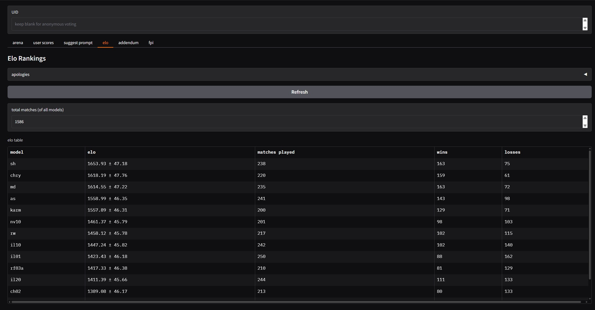
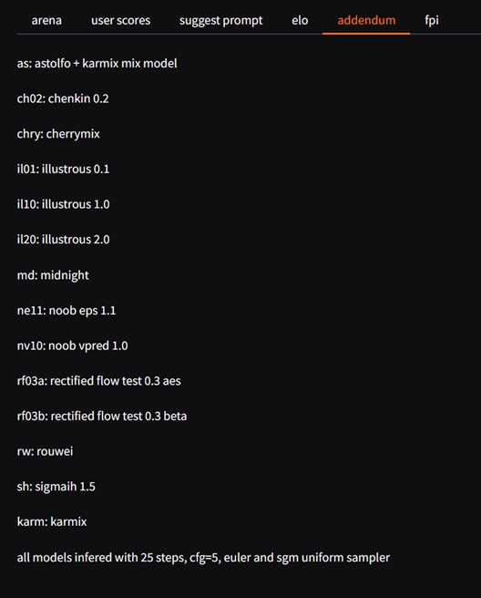

# Chapter 06: Finetuning in vanilla approach. #

[Joining the cult of Arch linux.](./manjaro/readme.md)

- [cheesechaser-runtime](./cheesechaser-runtime): Definitely not dataset speedrun via [deepghs/cheesechaser](https://github.com/deepghs/cheesechaser).
- [sd-scripts-runtime](./sd-scripts-runtime): Definitely not finetune speedrun via [kohya-ss/sd-scripts](https://github.com/kohya-ss/sd-scripts).
- [tipo-toriigate-runtime](./tipo-toriigate-runtime): Trying to generate a NLP styke caption for knowledge integration. [KBlueLeaf/TIPO-500M-ft](https://huggingface.co/KBlueLeaf/TIPO-500M-ft) and [Minthy/ToriiGate-v0.4-7B](https://huggingface.co/Minthy/ToriiGate-v0.4-7B).

## Hey ChatGPT, what is Astolfo saying about? ##

- It is about [finetuning](https://huggingface.co/learn/diffusion-course/unit2/1) SDXL with *the most straight forward approach*. This will be a step by step guide with community tools.

- Instead of the [community guide in CivitAI](https://civitai.com/articles?view=feed&tags=128645), which are focused in LoRAs under particular topic, mine is **full scale finetune** with **full scale dataset** (theoretically).

- There are some **primary sources** involved (and coding), so I'm confident that previous attempts are [as few as we have seen](../ch02/model_history.md#model-history-sdxl).

- Instead of any customization throught the process, I decided to execute in the [vanilla way](https://www.investopedia.com/terms/v/vanilla-strategy.asp). There should be a [reproducible](https://en.wikipedia.org/wiki/Reproducibility) [baseline](https://medium.com/@preethi_prakash/understanding-baseline-models-in-machine-learning-3ed94f03d645) for further research, especially the topic is being [abstract and psychological](../ch01/aesthetic.md).

- With a clear and easy guide to follow, all you need is gather some sponser, or just save some earnings to make this with lowest risk. Technology is never mature, you have rights to justify what is correct in science.

- The "toy dataset" will be the 6k images with "Astolfo". Without only little idea on creation (e.g. I only know a little artists / characters / animate series), [knowing the data distribution](https://huggingface.co/tasks/unconditional-image-generation), will help me to identify if the model learn the "denoising process" (not "draw thing") effectively. There is **close to no correlation** between the low level training loss (L2 / Huber) and abstract validation loss (CCIP / ImageReward / "XP" loss as fetish score) without tedious model evaluation (image generation). Therefore, such vanilla approach, with "common tools", [and a "general" magic number](https://www.stablediffusion-cn.com/sd/sd-knowledge/1761.html) will help me to focus the "AI" side of this training task.

- Finally, here is my hypothesis: Model merging, as a subcategory of [PEFT](https://huggingface.co/docs/peft/developer_guides/model_merging), if have a [proper merge](../ch01/merge.md#blue-pill-but-in-academic-paper), you can iterlate between both "merging" and "finetuning" to archieve the learning task with huge efficiency. Instead, although lack of academic discussion, it is hard to finetune from a *burnt model*, even a [burnt distillated model](https://www.reddit.com/r/StableDiffusion/comments/1fuukwz/fluxdevdedistill_an_undistilled_version_of_flux/?rdt=33807), meanwhile finetuning from pretrianed model (the SDXL 1.0) will be inefficient. 

- Therefore, I'm here to explore for any options, under limited resources, and hopefully empower more people to join without processional knowledge. ~~It shouldn't be limited to full time student and researchers. I hate the "gate".~~

## Why now, why so late? ##

- *I have bought 4x RTX3090 blower without dedicated use case.* My [career](../ch97/rag_with_doc.md) may require them, however it is likely to use (OpenAI) API because of [commercial reason](https://www.atlassian.com/agile/project-management/project-baseline).

- *I rushed for datase* because of the [fear of banning the great contents](https://huggingface.co/docs/hub/storage-limits#storage-plans), meanwhile the "Best-effort" is [indicating the target](https://github.com/deepghs/cyberharem).

- *I have a workstation already* for [merging in large scale](../ch05/README_XL.MD).

- *I have professional knowledge* even I treat this as a [hobby](../ch00/about_me.md).

- Therefore, *this is a great chance for me to contribute*. I can do it for art, instead for the [rat race](https://en.wikipedia.org/wiki/Rat_race). *I just have limited spare time and motivation,* before I [mentally break down](https://en.wikipedia.org/wiki/Health_of_Vincent_van_Gogh) with such a dumb idea.

- Lore of the "Best-effort" (it ends up in this [HF discussion post](https://huggingface.co/posts/julien-c/388331843225875) after their discord server is blown): 

## Finetune findings ##

- Moved to [gallery.md](./gallery.md).

- [2511 run from AK-NIL1.5](./gallery_2511.md).

### Comparasion with similar "Large scale finetune" ###

- *I'm not going to join the rat race, I just want to find a way to finetune in such large scale with my methodology.*

- [NoobAI-XL EPS 1.1](https://civitai.com/models/833294?modelVersionId=1116447): 34EP on "8M + 4.6M" ([Ref](https://civitai.com/models/833294?modelVersionId=1022833))

- [Animagine XL 4.0](https://civitai.com/models/1188071?modelVersionId=1337429): 10EP on "7.6M + 0.6M", "2.5e-6 + 1.25e-6" ([Ref](https://vxtwitter.com/linaqruf_/status/1885133039837339962?s=46&t=dXf0NAr7rWjORrF_wVe6_A))

- [nyaflow-xl [alpha]](https://huggingface.co/nyanko7/nyaflow-xl-alpha): ??EP on 3.6M filtered, "5e-6 + 3e-6" ([Ref](https://github.com/Mikubill/naifu/blob/main/config/train_sdxl_original.yaml). [flow commit](https://github.com/Mikubill/naifu/commit/0b4640d8977efd9895e9cfbef777b62c576d3af6#diff-70747fe1ebda2f6a3ea340f401e8dfb53c09bc9495e6ecc5ba535ae0de373a62))

- [Animagine XL 3.1](https://huggingface.co/cagliostrolab/animagine-xl-3.1): ??EP on 2.1M, "1e-5"

- [Kohaku XL Zeta](https://huggingface.co/KBlueLeaf/Kohaku-XL-Zeta): 1EP on 8.4M, "1e-5", LoKr with unknown `network_dim`. "3090x4 with 18 days" [from author](https://discord.com/channels/1027129024054575174/1027407524334411816/1356142067025449031)
 
- [Kohaku XL Delta Alpha](https://civitai.com/models/693222/kohaku-delta-alpha): 60EP on ~~6M~~ 6.5M (0.4B seen), lr unknown, LoKr with unknown `network_dim`. "3090 / 4090 mix ~~x8~~ x50 with 45 days" [from author overriding CivitAI model card](https://discord.com/channels/1230387092014501918/1230387093793013883/1356138387899420733), [in this discord group](https://github.com/ljleb/sd-mecha)

- [SanaeXL](https://huggingface.co/SanaeLab/SanaeXL-anime-v1.0). 1EP on "7.8M + 1.4M + 2.2M + 2.4M = 13.8M", lr unknown. ["4090x1 with 120+ days"](https://civitai.com/models/647664/sanaexl-anime-v10?dialog=commentThread&commentId=526387)

- ["Ours"](https://huggingface.co/6DammK9/AstolfoXL) [(mirror)](https://civitai.com/models/1489964?modelVersionId=1771150) ~~draft~~: ~~At most~~ 1EP on "~~at most~~ 8M + 4.6M", "1.5e-6 + 1.2e-5". [3090x4 with 45+ days.](./sd-scripts-runtime/logs/readme.md) [2000 kWh with around 3000HKD spent.](https://www.clp.com.hk/en/residential/bills-payment-tariffs-residential/bill-calculator). *I will continue training when it gets enough impact, or it gets dirt cheap to rush to 5EP.*  ~~Obviously a lot cheaper than renting cloud because I own the cards (as hobby, take it or leave it).~~

### Public Evaluation on my models ###

- Scoreboard of [NoobAI based "weeb-arena"](https://huggingface.co/spaces/yoinked/weeb-arena-results), created by [yoinked](https://huggingface.co/yoinked). Many thanks for the kindness to include my model (and Karmix in s2).

- Despite quite a naive approach of the arena design, which community use highly customized (ComfyUI) workflows, or extended (reForge) WebUI with extensions most of the time, it is very rare to have enough dedication and resources to organize such a open public evaluation. It is very valuable to record this event.

- Since my approach is taking most varity with least bias, I expect for neutral result (or being middle / mediocre / ["golden mean"](https://en.wikipedia.org/wiki/Golden_mean_(philosophy)) ~~中庸~~), which is [ELO 1500 or 50% rate](https://en.wikipedia.org/wiki/Elo_rating_system), and s2 is quite towards that point.

- *The meta bias towards "merged model (usually in multiple iterlations) > trained model (just once or twice)", "nice bias > no bias > wrong bias", which may change when rules / prompts / "cherrypicking images" are changed.*

- The arena is not hosted for long time, so the links are not quite meaningful. Meanwhile they are just published Gradio App with random URLs.

- My application model is the [AK-Evo 2EP](./gallery_2511.md#findings-after-train).

