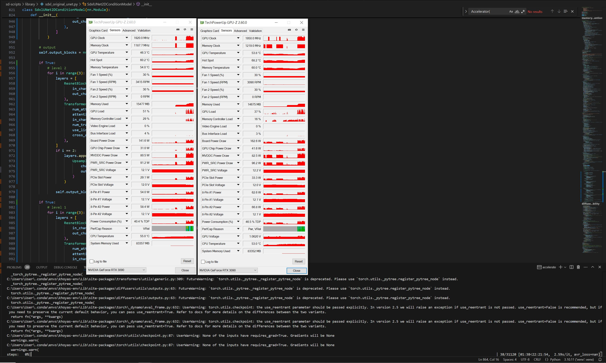

# Notes on finetuning SDXL from full dataset #

## General guide / posts ##

- Assumed that you have followed the guide from building the dataset, and having a single folder having many `F.webp` and `F.txt` in a single folder.

- [Official guide.](https://github.com/kohya-ss/sd-scripts/blob/main/docs/fine_tune_README_ja.md)

- [Reddit post.](https://www.reddit.com/r/StableDiffusion/comments/163097n/getting_started_fine_tuning/?rdt=34904) Clean and simple. I'm going to follow this guide.

- First, follow the official guide. I have cloned it long time ago to convert `*.safetensors` to `diffusers` like `convert_original_stable_diffusion_to_diffusers.py` and `convert_sdxl_to_diffusers.py`.

```sh
git clone https://github.com/kohya-ss/sd-scripts.git
cd sd-scripts
```

- (250329) If you are training with **multiple GPUs**, looks for [GLOO (not working)](#compromised-trining-with-multigpu-overhead-gloo), [NCCL (working)](../manjaro-runtime/readme.md#3-compromised-trining-with-multigpu-overhead-nccl), [install latest libraries directly](../manjaro-runtime/readme.md#4-notes-on-updating-systems-and-libraries), and jump to [the optimization / workarounds](#exploring-accelerate-out-of-community-guide). This guide is being long and messy, meanwhile I have no idea how to split them clearly.

## Setting up environments ##

- Instead of `venv`, I make another `conda` environment.

- **Pay attention of** `torch==2.3.1` (must be < 2.4 for winodws. [Download page](https://pytorch.org/get-started/previous-versions/#v231)). 
- I have experienced [this issue / PR](https://github.com/kohya-ss/sd-scripts/pull/1686) for 2.5.0. It requires [dedicated workaround](./libuv_torch25_win10.md) and [this workaround](./accelerator_gloo.md), **requires code change in pytorch.** See next session if interested.

- (250201) If you get `RuntimeError: operator torchvision::nms does not exist`, match the version of `torch torchvision xformers`.

```sh
conda create -n kohyas-env python=3.12
conda activate kohyas-env

pip install torch torchvision xformers --index-url https://download.pytorch.org/whl/cu124
pip install --upgrade -r requirements.txt
```

- Install `deepspeed==0.15.4` to enable "Zero 2" if you need further memory reduction (because multi GPU overhead). [Why lock this version.](https://github.com/deepspeedai/DeepSpeed/issues/6793). Also **it requires Ampere or later (3000 series or later).**

```sh
pip install deepspeed
```

- Install `triton` and via "windows wheels".

- [flash-attention wheels](https://huggingface.co/lldacing/flash-attention-windows-wheel/tree/main), [triton wheels](https://huggingface.co/madbuda/triton-windows-builds/tree/main)

```sh
pip install flash_attn-2.7.0.post2+cu124torch2.5.0cxx11abiFALSE-cp312-cp312-win_amd64.whl
pip install triton-3.0.0-cp312-cp312-win_amd64.whl
```

- Install `bitsandbytes==0.45.0` explictly for the library stack, otherwise you will see CUDA Toolkit errors and somehow cannot install CUDA Toolkit either (it may be my OS problem).

- (Optional) Install [CUDA Toolkit 12.4](https://developer.nvidia.com/cuda-12-4-0-download-archive), and choose [custom installation](https://forums.developer.nvidia.com/t/windows-10-cuda-installation-failure-solved/64389/2), uncheck everything except the "dev toolkit" and "runtime". **Nothing else**.

```sh
pip install bitsandbytes==0.45.0 
```

- Install `0.43.0` or even the "Windows friendly" `0.41.0` will have this issue.

```logs
C:\Users\User\.conda\envs\kohyas-env did not contain ['cudart64_110.dll', 'cudart64_12.dll'] as expected!
```

- Run `python -m bitsandbytes` first to install CUDA integrations:

- It still have this "debug message" after you install CUDA toolkit / added to many environment paths. Seems that it relies on the built library core, and user have no change to rectify.

```sh
> python -m bitsandbytes 
++++++++++++++++++++++++++++++++++++++++++++++++++++++++++++
++++++++++++++++++ BUG REPORT INFORMATION ++++++++++++++++++
++++++++++++++++++++++++++++++++++++++++++++++++++++++++++++
++++++++++++++++++++++++++ OTHER +++++++++++++++++++++++++++
CUDA specs: CUDASpecs(highest_compute_capability=(8, 6), cuda_version_string='124', cuda_version_tuple=(12, 4))
PyTorch settings found: CUDA_VERSION=124, Highest Compute Capability: (8, 6).
To manually override the PyTorch CUDA version please see: https://github.com/TimDettmers/bitsandbytes/blob/main/docs/source/nonpytorchcuda.mdx
The directory listed in your path is found to be non-existent: \Users\User
The directory listed in your path is found to be non-existent: \\DESKTOP-Z114514
The directory listed in your path is found to be non-existent: PATH=E\x3a\NOVELAI\stable-diffusion-webui\stable-diffusion-webui\venv\Scripts
The directory listed in your path is found to be non-existent: PROMPT=(venv) $P$G:VIRTUAL_ENV=E\x3a\NOVELAI\stable-diffusion-webui\stable-diffusion-webui\venv:VIRTUAL_ENV_PROMPT=(venv) :_OLD_VIRTUAL_PROMPT=$P$G
CUDA SETUP: WARNING! CUDA runtime files not found in any environmental path.
++++++++++++++++++++++++++++++++++++++++++++++++++++++++++++
++++++++++++++++++++++ DEBUG INFO END ++++++++++++++++++++++
++++++++++++++++++++++++++++++++++++++++++++++++++++++++++++
Checking that the library is importable and CUDA is callable...
SUCCESS!
Installation was successful!
```

- `pip list` should see the `+cu124` stuffs. Now configure the `accelerate`, [kohya implements some of Accelerate.](https://www.reddit.com/r/StableDiffusion/comments/160z10m/how_do_i_do_multi_gpu_lora_training/)
- You can explictly set the config in CLI stage later. 
- Reminder: Assumed that you are using `pytorch==2.3.1` and NOT facing `libuv` error. See [my workaround](./libuv_torch25_win10.md) and [this workaround](./accelerator_gloo.md).
- *This is the safe single GPU version:*

```log
> accelerate config
--------------------------------------------------------------------------------------
In which compute environment are you running?
This machine
--------------------------------------------------------------------------------------
Which type of machine are you using?
No distributed training
Do you want to run your training on CPU only (even if a GPU / Apple Silicon / Ascend NPU device is available)? [yes/NO]:NO
Do you wish to optimize your script with torch dynamo?[yes/NO]:NO
Do you want to use DeepSpeed? [yes/NO]: NO
What GPU(s) (by id) should be used for training on this machine as a comma-seperated list? [all]:all
--------------------------------------------------------------------------------------
Do you wish to use FP16 or BF16 (mixed precision)?
bf16
accelerate configuration saved at F:\WORKS\HUGGINGFACE\accelerate\default_config.yaml
```

- This is the multi-gpu version with most options enabled. Gradient accumulation steps and gradient clipping need to be paired, see [this session](./readme.md#exploring-accelerate-out-of-community-guide). Ignore the `accelerate launch` stuffs in between.  

```log
accelerate config
----------------------------------------------------------------------------------------------------------------------------------------------------------------------
In which compute environment are you running?
This machine                                                                                                                                                          
----------------------------------------------------------------------------------------------------------------------------------------------------------------------
Which type of machine are you using?                                                                                                                                  
multi-GPU                                                                                                                                                             
How many different machines will you use (use more than 1 for multi-node training)? [1]: 1                                                                            
Should distributed operations be checked while running for errors? This can avoid timeout issues but will be slower. [yes/NO]: NO                                     
Do you wish to optimize your script with torch dynamo?[yes/NO]:yes                                                                                                    
----------------------------------------------------------------------------------------------------------------------------------------------------------------------
Which dynamo backend would you like to use?                                                                                                                           
inductor                                                                                                                                                              
Do you want to customize the defaults sent to torch.compile? [yes/NO]: NO                                                                                             
Do you want to use DeepSpeed? [yes/NO]: yes                                                                                                                           
Do you want to specify a json file to a DeepSpeed config? [yes/NO]: NO                                                                                                
----------------------------------------------------------------------------------------------------------------------------------------------------------------------
What should be your DeepSpeed's ZeRO optimization stage?                                                                                                              
2                                                                                                                                                                     
----------------------------------------------------------------------------------------------------------------------------------------------------------------------
Where to offload optimizer states?                                                                                                                                    
none                                                                                                                                                                  
----------------------------------------------------------------------------------------------------------------------------------------------------------------------
Where to offload parameters?                                                                                                                                          
none                                                                                                                                                                  
How many gradient accumulation steps you're passing in your script? [1]: 4                                                                                            
Do you want to use gradient clipping? [yes/NO]: NO                                                                                                                    
Do you want to enable `deepspeed.zero.Init` when using ZeRO Stage-3 for constructing massive models? [yes/NO]: NO                                                     
Do you want to enable Mixture-of-Experts training (MoE)? [yes/NO]: NO
How many GPU(s) should be used for distributed training? [1]:4
----------------------------------------------------------------------------------------------------------------------------------------------------------------------
Do you wish to use FP16 or BF16 (mixed precision)?
bf16                                                                                                                                                                  
accelerate configuration saved at /home/user/.cache/huggingface/accelerate/default_config.yaml 
```

```yaml
compute_environment: LOCAL_MACHINE
debug: false
deepspeed_config:
  gradient_accumulation_steps: 4
  offload_optimizer_device: none
  offload_param_device: none
  zero3_init_flag: false
  zero_stage: 2
distributed_type: DEEPSPEED
downcast_bf16: 'no'
dynamo_config:
  dynamo_backend: INDUCTOR
enable_cpu_affinity: false
machine_rank: 0
main_training_function: main
mixed_precision: bf16
num_machines: 1
num_processes: 4
rdzv_backend: static
same_network: true
tpu_env: []
tpu_use_cluster: false
tpu_use_sudo: false
use_cpu: false
```

- For the most speedy one, [use my own fork](https://github.com/6DammK9/sd-scripts/tree/train-native). [PR is likely won't be merged.](https://github.com/kohya-ss/sd-scripts/pull/1950), and use the [71% UNET instead](sdxl_original_unet_71.py). Many options is disabled again, for *enabling risky static memory usage*. The command line is in the [same session](./readme.md#exploring-accelerate-out-of-community-guide).

```log
accelerate config
bash: accelerate: command not found
(base) [user@user-x299dark novelai]$ conda activate kohyas-env
(kohyas-env) [user@user-x299dark novelai]$ accelerate config
--------------------------------------------------------------------------------------------------------------------------------------------------------------------
In which compute environment are you running?
This machine                                                                                                                                                        
--------------------------------------------------------------------------------------------------------------------------------------------------------------------
Which type of machine are you using?                                                                                                                                
multi-GPU                                                                                                                                                           
How many different machines will you use (use more than 1 for multi-node training)? [1]: 1                                                                          
Should distributed operations be checked while running for errors? This can avoid timeout issues but will be slower. [yes/NO]: NO                                   
Do you wish to optimize your script with torch dynamo?[yes/NO]:NO                                                                                                   
Do you want to use DeepSpeed? [yes/NO]: NO                                                                                                                          
Do you want to use FullyShardedDataParallel? [yes/NO]: NO                                                                                                           
Do you want to use Megatron-LM ? [yes/NO]: NO                                                                                                                       
How many GPU(s) should be used for distributed training? [1]:4                                                                                                      
What GPU(s) (by id) should be used for training on this machine as a comma-seperated list? [all]:0,1,2,3                                                            
Would you like to enable numa efficiency? (Currently only supported on NVIDIA hardware). [yes/NO]: NO
--------------------------------------------------------------------------------------------------------------------------------------------------------------------
Do you wish to use FP16 or BF16 (mixed precision)?
bf16                                                                                                                                                                
accelerate configuration saved at /home/user/.cache/huggingface/accelerate/default_config.yaml   
```

- Now try that guide and inspect the `*.json`. Since the dataset guide has enforced to whole dataset, it may be great to limit the dataset into a small and obvious dataset.

- I have made my own subset which has obvious training target.

```log
> python just-astolfo.py
6224 pairs to be copied.
Copying image-caption pairs: 100%|████████████████████████████████████████████████| 6224/6224 [01:27<00:00, 70.81it/s
```

- (Cultural difference) My case is called "DD Tags", which is "Danbooru Tags". E621 falls in this category also. 

## Preprocess stage ##

- Requried by trainer. It may provide random crop by default, it requires you crop the image to fit the VAE first. Therefore, prepare ARB latent is recommended.

- Currently the fastest way is to run [metadata-booru2024-ddtag-parallel.py](../cheesechaser-runtime/danbooru2024-webp-4Mpixel/metadata-booru2024-ddtag-parallel.py) and [metadata-e621-ddtag-parallel.py](../cheesechaser-runtime/e621_newest-webp-4Mpixel/metadata-e621-ddtag-parallel.py). *It runs silently but it completes within 10 minutes.* *It also splits in 4 for later use.*

```log
> python metadata-booru2024-ddtag-parallel.py
8005010it [00:26, 296821.16it/s]
Tags found: 8005010
Dump complete.

> python metadata-e621-ddtag-parallel.py
5187777it [00:16, 311676.61it/s]
Tags found: 5187777
Dump complete.
```

- [Official guide](https://github.com/kohya-ss/sd-scripts/blob/main/docs/train_README-ja.md) use `meta_cap_dd.json` and `meta_lat.json`, ~~so I'm going to follow them~~ **They are slow and consider my version above.**

```log
> python ./finetune/merge_dd_tags_to_metadata.py "H:/just_astolfo/kohyas_finetune" "H:/just_astolfo/meta_cap_dd.json"
2024-12-08 14:44:59 INFO     found 6224 images.                                         merge_dd_tags_to_metadata.py:23                    
                    INFO     new metadata will be created /                             merge_dd_tags_to_metadata.py:33                             
新しいメタデータファイルが作成されます
                    INFO     merge tags to metadata json.                               merge_dd_tags_to_metadata.py:36
100%|███████████████████████████████████████████████████████████████████████████|  6224/6224 [00:01<00:00, 5094.49it/s] 
2024-12-08 14:45:01 INFO     writing metadata: H:/just_astolfo/meta_cap_dd.json         merge_dd_tags_to_metadata.py:53                    
                    INFO     done!                                                      merge_dd_tags_to_metadata.py:56
```

```log
> python ./finetune/merge_dd_tags_to_metadata.py "H:/e621_newest-webp-4Mpixel/kohyas_finetune" "H:/e621_newest-webp-4Mpixel/meta_cap_dd.json"

2024-12-08 15:17:51 INFO     found 4441660 images.                                              merge_dd_tags_to_metadata.py:23                    
                    INFO     new metadata will be created /                                     merge_dd_tags_to_metadata.py:33
新しいメタデータファイルが作成されます
5%|███▍                                                                          |  223765/4441660 [21:54<6:55:24, 169.22it/s]
100%|█████████████████████████████████████████████████████████████████████████████| 4441660/4441660 [7:03:24<00:00, 174.84it/s]
2024-12-08 22:21:15 INFO     writing metadata: H:/e621_newest-webp-4Mpixel/meta_cap_dd.json     merge_dd_tags_to_metadata.py:53
2024-12-08 22:21:52 INFO     done!                                                              merge_dd_tags_to_metadata.py:56
```

```log
> python ./finetune/merge_dd_tags_to_metadata.py "H:/danbooru2024-webp-4Mpixel/kohyas_finetune" "H:/danbooru2024-webp-4Mpixel/meta_cap_dd.json"

2024-12-08 15:20:32 INFO     found 8005010 images.                                              merge_dd_tags_to_metadata.py:23
                    INFO     new metadata will be created /                                     merge_dd_tags_to_metadata.py:33
新しいメタデータファイルが作成されます
2%|█▋                                                                           |  192542/8005010 [19:13<13:42:23, 158.33it/s]
100%|████████████████████████████████████████████████████████████████████████████| 8005010/8005010 [13:05:21<00:00, 169.88it/s]
2024-12-09 04:25:53 INFO     writing metadata: H:/danbooru2024-webp-4Mpixel/meta_cap_dd.json    merge_dd_tags_to_metadata.py:53
2024-12-09 04:27:01 INFO     done!                                                              merge_dd_tags_to_metadata.py:56
```

- To "prepare ARB latents", **it reuires a SDXL or VAE model to run.** 

- Currently there are [no official support from FLUX.1](https://github.com/kohya-ss/sd-scripts/issues/1542), meanwhile the developer are active in `sd3` branch. See next session for details.

- For SDXL, I prefer [madebyollin/sdxl-vae-fp16-fix](https://huggingface.co/madebyollin/sdxl-vae-fp16-fix) if this script is safe to use. `batch_size` is somewhat optimal in 4 even it doesn't use many VRAM. It is tied with IOPS with the disk.

- For 1k to 100k scale, I think you can ignore next sentence ~~I just made my own scripts and didn't expose any CLI options (I'll post the result to HF instead).~~ **For large datasets, most programming techniques won't work. You must consider a lot for scalable and optimization.** See next session for how I alter the process.

- Make sure you have readed the suggested resolution for the model. For example, applying 1024x1024 in SD2.1 will require even more VRAM than SDXL, even it is somewhat 4x in size difference.

- This is the straightforward approach for "not large" dataset. *Simple.*

```log
> python ./finetune/prepare_buckets_latents.py "F:/just_astolfo/kohyas_finetune" "F:/just_astolfo/meta_cap_dd.json" "F:/just_astolfo/meta_lat.json" "E:/stable-diffusion-webui/models/VAE/sdxl-vae-fp16-fix.vae.afetensors" --batch_size 4 --max_resolution 1024,1024 --mixed_precision fp16

get_preferred_device() -> cuda
2024-12-08 15:51:42 INFO     found 6224 images. prepare_buckets_latents.py:70                    
                    INFO     loading existing metadata: H:/just_astolfo/meta_cap_dd.json    prepare_buckets_latents.py:73                    
                    INFO     load VAE: E:/NOVELAI/stable-diffusion-webui/stable-diffusion-webui/models/VAE/sdxl-vae-fp16-fix.vae.afetensors                   model_util.py:1268
100%|████████████████████████████████████| 6224/6224 [22:05<00:00,  4.70it/s] 
2024-12-08 16:14:22 INFO     bucket 0 (256, 1024): 16                      prepare_buckets_latents.py:194                    
                    INFO     bucket 1 (320, 1024): 13                      prepare_buckets_latents.py:194                    
                    INFO     bucket 2 (384, 1024): 23                      prepare_buckets_latents.py:194                    
                    INFO     bucket 3 (448, 1024): 29                      prepare_buckets_latents.py:194                    
                    INFO     bucket 4 (512, 1024): 71                      prepare_buckets_latents.py:194                    
                    INFO     bucket 5 (576, 1024): 204                     prepare_buckets_latents.py:194                    
                    INFO     bucket 6 (640, 1024): 479                     prepare_buckets_latents.py:194                    
                    INFO     bucket 7 (704, 1024): 2279                    prepare_buckets_latents.py:194                    
                    INFO     bucket 8 (768, 1024): 746                     prepare_buckets_latents.py:194                    
                    INFO     bucket 9 (832, 1024): 371                     prepare_buckets_latents.py:194                    
                    INFO     bucket 10 (896, 1024): 230                    prepare_buckets_latents.py:194                    
                    INFO     bucket 11 (960, 1024): 177                    prepare_buckets_latents.py:194                    
                    INFO     bucket 12 (1024, 256): 5                      prepare_buckets_latents.py:194                    
                    INFO     bucket 13 (1024, 320): 9                      prepare_buckets_latents.py:194                    
                    INFO     bucket 14 (1024, 384): 4                      prepare_buckets_latents.py:194                    
                    INFO     bucket 15 (1024, 448): 11                     prepare_buckets_latents.py:194                    
                    INFO     bucket 16 (1024, 512): 29                     prepare_buckets_latents.py:194                    
                    INFO     bucket 17 (1024, 576): 89                     prepare_buckets_latents.py:194                    
                    INFO     bucket 18 (1024, 640): 139                    prepare_buckets_latents.py:194                    
                    INFO     bucket 19 (1024, 704): 418                    prepare_buckets_latents.py:194                    
                    INFO     bucket 20 (1024, 768): 203                    prepare_buckets_latents.py:194                    
                    INFO     bucket 21 (1024, 832): 156                    prepare_buckets_latents.py:194                    
                    INFO     bucket 22 (1024, 896): 124                    prepare_buckets_latents.py:194                    
                    INFO     bucket 23 (1024, 960): 114                    prepare_buckets_latents.py:194                    
                    INFO     bucket 24 (1024, 1024): 285                   prepare_buckets_latents.py:194                    
                    INFO     mean ar error: 0.023306217513876078           prepare_buckets_latents.py:196                    
                    INFO     writing metadata: H:/just_astolfo/meta_lat.json                              prepare_buckets_latents.py:199                    
                    INFO     done!                                         prepare_buckets_latents.py:202

```

### Prepare latents for large dataset ###

- First, I need to split the process for multiple GPUs. Currently kohyas script does not have this consideration. Given that `*.npz`, `*.webp`, `*.txt` are in `id` already, I ~~can~~ need to skip all the costly I/O operation.

- Strongly recommended to generate from source by [metadata-booru2024-ddtag-parallel.py](../cheesechaser-runtime/danbooru2024-webp-4Mpixel/metadata-booru2024-ddtag-parallel.py) and [metadata-e621-ddtag-parallel.py](../cheesechaser-runtime/e621_newest-webp-4Mpixel/metadata-e621-ddtag-parallel.py) (**10 minutes**), or you can eiter split the file directly (**6 hours**).

```log
F:\WORKS\bigjson>node --max-old-space-size=131072 split_meta_lat.js
loadJson...
 ████████████████████████████████████████ 100% | ETA: 0s | 8005010/8005010
 ████████████████████████████████████████ 100% | ETA: 0s | 12007393/12007393
 ████████████████████████████████████████ 100% | ETA: 0s | 12007219/12007219
 ████████████████████████████████████████ 100% | ETA: 0s | 12006625/12006625
 ████████████████████████████████████████ 100% | ETA: 0s | 12008827/12008827
```

- For e621 dataset, it is recommended to trim down the json file to match existing images, even the downstream process can handle such error. *I experienced many PSU trips because the are missing images stalling the preprocess and causing voltage spike to the PSU.*

```sh
python ../sd-scripts-runtime/sync_img_tag.py --npz_dir="F:/e621_newest-webp-4Mpixel/kohyas_finetune" --in_json="F:/e621_newest-webp-4Mpixel/meta_cap_dd_0.json" --out_json="F:/e621_newest-webp-4Mpixel/meta_cap_dd_trimmed_0.json" 
```

```log
verifying npz files: 100%|████████████████████████████████████████████████████████████████████| 4599402/4599402 [02:56<00:00, 26052.79it/s]
4441660 / 4599402 will be preserved.
Dumping keys...: 100%|██████████████████████████████████████████████████████████████████████| 4441660/4441660 [00:03<00:00, 1377171.80it/s]
```

-  Modify [prepare_buckets_latents.py](https://github.com/kohya-ss/sd-scripts/blob/sd3/finetune/prepare_buckets_latents.py#L115) otherwise `*.npz` will not be saved. 

```py
#train_util.cache_batch_latents(vae, True, bucket, args.flip_aug, args.alpha_mask, False)
latents_caching_strategy = strategy_sd.SdSdxlLatentsCachingStrategy(False, True, args.batch_size, args.skip_existing)
latents_caching_strategy.cache_batch_latents(vae, bucket, args.flip_aug, args.alpha_mask, False)
```

- Copy and modified the code as `prepare_buckets_latents_v2.py` to run this job in parallel. It will be useful for huge datasets with multiple GPUs. **It also listing the directory and use the provided JSON file as it is.**

- `sd3` branch need a tiny fix for skipping exist `*.npz` (useful when machine is broken down). *It delete corrupted file by default.*

```py
# 既に存在するファイルがあればshape等を確認して同じならskipする
npz_file_name = get_npz_filename(args.train_data_dir, image_key, args.full_path, args.recursive)
if args.skip_existing:           
    cache_available = False
    need_delete_cache = False
    try:
        # Why raise error? The file is corrupted. Just remove and return False.
        cache_available = train_util.is_disk_cached_latents_is_expected(reso, npz_file_name, args.flip_aug, args.alpha_mask)
    except:
        logger.error(f"Remove and rebuild: {npz_file_name}")
        need_delete_cache = True
    if need_delete_cache:
        try:
            Path.unlink(npz_file_name)
        except:
            logger.error(f"Failed to remove: {npz_file_name}")
    if cache_available:
        continue
```

- Fixing dead locks in `train_util.py`:

```py
#npz = np.load(npz_path)
with np.load(npz_path) as npz:
    if "latents" not in npz or "original_size" not in npz or "crop_ltrb" not in npz:  # old ver?
```

```sh
python ./finetune/prepare_buckets_latents_v2.py "F:/e621_newest-webp-4Mpixel/kohyas_finetune" "F:/e621_newest-webp-4Mpixel/meta_cap_dd_trimmed_0.json" "F:/e621_newest-webp-4Mpixel/meta_lat_0.json" "E:/stable-diffusion-webui/models/VAE/sdxl-vae-fp16-fix.vae.safetensors" --vae_device "cuda:0" --no_listdir --image_ext_static=".webp" --skip_existing --batch_size 4 --max_resolution 1024,1024 --mixed_precision fp16 --start_from_index=1099000 --delay_start=180

python ./finetune/prepare_buckets_latents_v2.py "F:/e621_newest-webp-4Mpixel/kohyas_finetune" "F:/e621_newest-webp-4Mpixel/meta_cap_dd_trimmed_1.json" "F:/e621_newest-webp-4Mpixel/meta_lat_1.json" "E:/stable-diffusion-webui/models/VAE/sdxl-vae-fp16-fix.vae.safetensors" --vae_device "cuda:1" --no_listdir --image_ext_static=".webp" --skip_existing --batch_size 4 --max_resolution 1024,1024 --mixed_precision fp16 --start_from_index=1029000 --delay_start=120

python ./finetune/prepare_buckets_latents_v2.py "F:/e621_newest-webp-4Mpixel/kohyas_finetune" "F:/e621_newest-webp-4Mpixel/meta_cap_dd_trimmed_2.json" "F:/e621_newest-webp-4Mpixel/meta_lat_2.json" "E:/stable-diffusion-webui/models/VAE/sdxl-vae-fp16-fix.vae.safetensors" --vae_device "cuda:2" --no_listdir --image_ext_static=".webp" --skip_existing --batch_size 4 --max_resolution 1024,1024 --mixed_precision fp16 --start_from_index=1007500 --delay_start=60

python ./finetune/prepare_buckets_latents_v2.py "F:/e621_newest-webp-4Mpixel/kohyas_finetune" "F:/e621_newest-webp-4Mpixel/meta_cap_dd_trimmed_3.json" "F:/e621_newest-webp-4Mpixel/meta_lat_3.json" "E:/stable-diffusion-webui/models/VAE/sdxl-vae-fp16-fix.vae.safetensors" --vae_device "cuda:3" --no_listdir --image_ext_static=".webp" --skip_existing --batch_size 4 --max_resolution 1024,1024 --mixed_precision fp16 --start_from_index=1007500 --delay_start=0
```

- Use [verify_npz.py](./verify_npz.py) to scan for corrupted `*.npz` when process fail. Currently made it *delete corrupted file by default*. Meanwhile it can be multithread (buy may introduce dead lock and crash OS).

```sh
# Remove corrupted npz only
python ../sd-scripts-runtime/verify_npz.py --npz_dir="H:/danbooru2024-webp-4Mpixel/kohyas_finetune" --meta_json="H:/danbooru2024-webp-4Mpixel/meta_cap_dd_0.json" --start_from=0
python ../sd-scripts-runtime/verify_npz.py --npz_dir="H:/danbooru2024-webp-4Mpixel/kohyas_finetune" --meta_json="H:/danbooru2024-webp-4Mpixel/meta_cap_dd_1.json" --start_from=0
python ../sd-scripts-runtime/verify_npz.py --npz_dir="H:/danbooru2024-webp-4Mpixel/kohyas_finetune" --meta_json="H:/danbooru2024-webp-4Mpixel/meta_cap_dd_2.json" --start_from=0
python ../sd-scripts-runtime/verify_npz.py --npz_dir="H:/danbooru2024-webp-4Mpixel/kohyas_finetune" --meta_json="H:/danbooru2024-webp-4Mpixel/meta_cap_dd_3.json" --start_from=0
```

```log
verifying npz files: 100%|███████████████████████████████████████████| 6224/6224 [00:59<00:00, 104.41it/s]
All pass.
```

- Usually you don't have complete  `meta_lat_*.json` after multiple tries. Re-run the script from the beginning.

```sh
python ./finetune/prepare_buckets_latents_v2.py "F:/e621_newest-webp-4Mpixel/kohyas_finetune" "H:/e621_newest-webp-4Mpixel/meta_cap_dd_trimmed_0.json" "H:/e621_newest-webp-4Mpixel/meta_lat_0.json" "G:/stable-diffusion-webui/models/VAE/sdxl-vae-fp16-fix.vae.safetensors" --vae_device "cuda:0" --no_listdir --image_ext_static=".webp" --skip_existing --batch_size 4 --max_resolution 1024,1024 --mixed_precision fp16

python ./finetune/prepare_buckets_latents_v2.py "F:/e621_newest-webp-4Mpixel/kohyas_finetune" "H:/e621_newest-webp-4Mpixel/meta_cap_dd_trimmed_1.json" "H:/e621_newest-webp-4Mpixel/meta_lat_1.json" "G:/stable-diffusion-webui/models/VAE/sdxl-vae-fp16-fix.vae.safetensors" --vae_device "cuda:0" --no_listdir --image_ext_static=".webp" --skip_existing --batch_size 4 --max_resolution 1024,1024 --mixed_precision fp16

python ./finetune/prepare_buckets_latents_v2.py "F:/e621_newest-webp-4Mpixel/kohyas_finetune" "H:/e621_newest-webp-4Mpixel/meta_cap_dd_trimmed_2.json" "H:/e621_newest-webp-4Mpixel/meta_lat_2.json" "G:/stable-diffusion-webui/models/VAE/sdxl-vae-fp16-fix.vae.safetensors" --vae_device "cuda:0" --no_listdir --image_ext_static=".webp" --skip_existing --batch_size 4 --max_resolution 1024,1024 --mixed_precision fp16

python ./finetune/prepare_buckets_latents_v2.py "F:/e621_newest-webp-4Mpixel/kohyas_finetune" "H:/e621_newest-webp-4Mpixel/meta_cap_dd_trimmed_3.json" "H:/e621_newest-webp-4Mpixel/meta_lat_3.json" "G:/stable-diffusion-webui/models/VAE/sdxl-vae-fp16-fix.vae.safetensors" --vae_device "cuda:0" --no_listdir --image_ext_static=".webp" --skip_existing --batch_size 4 --max_resolution 1024,1024 --mixed_precision fp16
```

- Merge the `meta_lat_*.json` if all file contents are complete (Python is a lot faster and reliable than NodeJS, strange). 

```log
> python merge_meta_lat.py
merging (huge) json files: 100%|██████████████████████████████████████████████| 4/4 [00:38<00:00,  9.60s/it]
Merge complete.
```

- (Optional) If you want to pack all the `*.npz` back to 1ktar, just use another script (will warn for missing files):

```sh
python ../sd-scripts-runtime/pack_npz.py --npz_dir="H:/just_astolfo/kohyas_finetune" --meta_json="H:/just_astolfo/meta_lat.json" --tar_dir="G:/npz_latents/just_astolfo_sdxl"
python ../sd-scripts-runtime/pack_npz.py --npz_dir="H:/e621_newest-webp-4Mpixel/kohyas_finetune" --meta_json="H:/e621_newest-webp-4Mpixel/meta_cap_dd_trimmed.json" --tar_dir="G:/npz_latents/e621_sdxl"
python ../sd-scripts-runtime/pack_npz.py --npz_dir="H:/danbooru2024-webp-4Mpixel/kohyas_finetune" --meta_json="H:/danbooru2024-webp-4Mpixel/meta_cap_dd.json" --tar_dir="G:/npz_latents/danbooru_sdxl"
```

```log
> python ../sd-scripts-runtime/pack_npz.py --npz_dir="H:/just_astolfo/kohyas_finetune" --meta_json="H:/just_astolfo/meta_lat.json" --tar_dir="G:/npz_latents/just_astolfo_sdxl"
Found entries: 6224
Max ID in the dataset: 8357672
100%|████████████████████████████████████████████████████████████████████████████████████████████████████████████████████████████████████████| 1000/1000 [00:44<00:00, 22.36it/s]
Files written: 1000
Detected npz: 6224.

> python ../sd-scripts-runtime/pack_npz.py --npz_dir="H:/danbooru2024-webp-4Mpixel/kohyas_finetune" --meta_json="H:/danbooru2024-webp-4Mpixel/meta_cap_dd.json" --tar_dir="G:/npz_latents/danbooru_sdxl"
Found entries: 8005010
Max ID in the dataset: 8360499
packing npz files: 100%|███████████████████████████████████████████████████████████████████████████████████████████████████████████████████| 1000/1000 [4:02:08<00:00, 14.53s/it]
Files written: 1000
Detected npz: 8005010.
```

- (Optional) Sample compress command:

```sh
tar -czvf meta_cap_dd.tar.gz meta_cap_dd.json
```

## Finetune stage ##

- **From now on the raw data is no longer needed.** Only `meta_lat.json` and `*.npz` is required. It will be handy if you are using 4TB SSD instead of 8TB+ HDD.
- This session is configured to single GPU. See next session for multiple GPU.
- Then it is the finetune stage. `fine_tune.py` is for SD1.5. SDXL use `train_sdxl.py` instead. I use my own [6DammK9/AstolfoMix-XL](https://huggingface.co/6DammK9/AstolfoMix-XL/blob/main/x215c-AstolfoMix-24101101-6e545a3.safetensors) to train. *I want to see if finetuning (pretrain?) on merged model works.*
- This is written for 4x RTX3090 24GB with full scale finetune (may OOM). I prefer the parameters from [cagliostrolab/animagine-xl-3.1](https://huggingface.co/cagliostrolab/animagine-xl-3.1#hyperparameters).
- `4e-7` is official SDXL learning rate. 
- `--enable_bucket` will be enabled in auto if `*.npz` and `meta_lat.json` are present.
- Optimizer will be defaulted as `adamW` without 8bit. `--use_8bit_adam` is not used.
- `--shuffle_caption` is also not used. I think making multiple caption will be out of my reach.
- *Ctrl-C, right click, "Paste as one line".*
- `--train_text_encoder` is required if the CLIP should be finetuned. Otherwise it will be UNET only. 
- Both `--cache_latents` and `--cache_text_encoder_outputs` are added to brutally reduce the memory usage. However it takes time to initiate the process.
- **8 bit optimizer is required.** `--train_text_encoder` just increase the VRAM usage from 21GB to 22GB, which is still under the limit.

```sh
accelerate launch --num_cpu_threads_per_process 8 sdxl_train.py
    --pretrained_model_name_or_path="F:/NOVELAI/astolfo_mix/sdxl/cmp/x215c-AstolfoMix-24101101-6e545a3.safetensors"
    --in_json "H:/just_astolfo/meta_lat.json"
    --train_data_dir="H:/just_astolfo/kohyas_finetune"
    --output_dir="F:/NOVELAI/astolfo_xl/just_astolfo/finetune_job"
    --save_model_as=safetensors
    --caption_extension=".txt"
    --use_8bit_adam
    --train_batch_size=1 --learning_rate=4e-7 --max_train_steps=10000 
    --xformers --diffusers_xformers --gradient_checkpointing
    --full_bf16 --mixed_precision=bf16 --save_precision=fp16
    --enable_bucket --cache_latents
    --save_every_n_epochs=1
```

- **It runs.** And it runed for ~~2 EPs~~ 10k steps (10k images) for around 3.5 hours. See `finetune_sdxl.log` for full log.

```log
steps: 100%|████████████████████████████████████████████| 10000/10000 [3:17:44<00:00,  1.19s/it, avr_loss=0.109]
```

- I have made some preview via **A1111** (not the kohyas GUI or any script!), there is some changes, but definitely not hitting the "target".

- Reminder: [libuv is pytorch issue!](./libuv_torch25_win10.md)! [backend is another torch issue!](./accelerator_gloo.md)

- The real multi-gpu set up can be found in [this issue](https://github.com/kohya-ss/sd-scripts/issues/812) and [this issue](https://github.com/bmaltais/kohya_ss/issues/1915).

- Added the "GUI" from [this PR](https://github.com/kohya-ss/sd-scripts/pull/428). 

```sh
accelerate launch 
    sdxl_train.py                                                                                                               
    --pretrained_model_name_or_path="F:/NOVELAI/astolfo_mix/sdxl/cmp/x215c-AstolfoMix-24101101-6e545a3.safetensors"             
    --in_json "H:/just_astolfo/meta_lat.json"                                                                                   
    --train_data_dir="H:/just_astolfo/kohyas_finetune"                                                                          
    --output_dir="F:/NOVELAI/astolfo_xl/just_astolfo/model_out"                                                                 
    --log_with=tensorboard                                                                                                      
    --logging_dir="F:/NOVELAI/astolfo_xl/just_astolfo/tensorboard"                                                              
    --log_prefix=just_astolfo_24121401_                                                                                         
    --save_model_as=safetensors                                                                                                 
    --caption_extension=".txt"                                                                                                  
    --use_8bit_adam                                                                                                             
    --train_batch_size=1 --learning_rate=1e-5 --max_train_epochs=10                                                             
    --train_text_encoder                                                                                                        
    --xformers --diffusers_xformers --gradient_checkpointing                                                                    
    --full_bf16 --mixed_precision=bf16 --save_precision=fp16                                                                    
    --enable_bucket --cache_latents                                                                                             
    --save_every_n_epochs=1                                                                                                     
```

- ~~Since I'm not wandb user~~ Open tensorboard in a new cmd window:

- It is basically reading log files, so remember to change `log_prefix` each time.

```log
> tensorboard --logdir "E:/astolfo_xl/just_astolfo/tensorboard"
TensorFlow installation not found - running with reduced feature set.
Serving TensorBoard on localhost; to expose to the network, use a proxy or pass --bind_all
TensorBoard 2.18.0 at http://localhost:6006/ (Press CTRL+C to quit)
```

## Compromised trining with MultiGPU overhead (GLOO) ##

- See [my attempt in Manjaro (NCCL) version](../manjaro/readme.md#compromised-trining-with-multigpu-overhead-nccl). This Windows (without WSL) attempt will leave for reference.

- I have added my progress in [the PR](https://github.com/kohya-ss/sd-scripts/pull/1686), not sure if it must be forced to use the old `venv` like A1111, or I need **WSL** to proceed.

- [m3.py](./m3.py) serves for PoC. The *best effort* will be "80% parameters" by [disabling forcing unet to train/not train](https://github.com/kohya-ss/sd-scripts/blob/sd3/sdxl_train.py#L340) and setting "not train" for [mid attn layers](https://github.com/kohya-ss/sd-scripts/blob/sd3/library/sdxl_original_unet.py#L942) and [out layer2 resnet layers](https://github.com/kohya-ss/sd-scripts/blob/sd3/library/sdxl_original_unet.py#L959) by appending `.requires_grad_(False)`. *Turns out it should be close to 60% to have legit speed boost.*

```log
[rank0]:   File "C:\Users\User\.conda\envs\kohyas-env\Lib\site-packages\torch\nn\parallel\distributed.py", line 1196, in _ddp_init_helper
[rank0]:     self.reducer = dist.Reducer(
[rank0]:                    ^^^^^^^^^^^^^
[rank0]: RuntimeError: Trying to create tensor with negative dimension -1727503612: [-1727503612]
```

- Single card is fine. *It is slow, but easy to estimate the scale I can train.*

```log
2024-12-11 08:25:15 INFO     save trained model as StableDiffusion checkpoint to F:/NOVELAI/astolfo_xl/just_astolfo/model_out\last.safetensors                    train_util.py:4852 
2024-12-11 08:25:36 INFO     model saved.                                                                                                                          sdxl_train.py:761
steps: 100%|███████████████████████████████████████████████████████████████████████████████████████████████████████████████| 62240/62240 [24:38:10<00:00,  1.42s/it, avr_loss=0.104]
```

- The weirdist things is **train without UNET** works! Hint: `--learning_rate=0 --learning_rate_te1=1e-5 --learning_rate_te2=1e-5`

- The `loss=nan` is becasuse of bad `lr`, it can still reach `0.100`.



- Now I got it works in 4x RTX 3090s (Train TE only), and got CUDA OOM with many VRAM availble. [This solution](https://blog.csdn.net/mustuo/article/details/134090209) stated that I should limit the threads, which will be `--num_cpu_threads_per_process` and `--max_data_loader_n_workers`.

## Findings on TTE ##

- TTE (Train Text Encoders, `--train_text_encoder`) ON / TTE OFF (UNET only) are having slight difference in resource requirement.
- It requires around 1GB less VRAM (23 > 22), and around 10% faster. The loss may get 10% lower if you're training with "trained" materials.

```log
2024-12-15 16:22:20 INFO     save trained model as StableDiffusion checkpoint to F:/NOVELAI/astolfo_xl/just_astolfo/model_out\last.safetensors                    train_util.py:4852
2024-12-15 16:22:39 INFO     model saved.                                                                                                                          sdxl_train.py:761
steps: 100%|███████████████████████████████████████████████████████████████████████████████████████████████████████████████| 62240/62240 [21:00:05<00:00,  1.21s/it, avr_loss=0.106]
```

## Training in SD2.1 ##

- Remove `position_ids` in [model_util.py](https://github.com/kohya-ss/sd-scripts/blob/sd3/library/model_util.py#L655)

```py
# remove position_ids for newer transformer, which causes error :(
if "text_model.embeddings.position_ids" in new_sd:
    new_sd.pop("text_model.embeddings.position_ids")
    print("position_ids removed!")
```

- FP16 somehow request way too much VRAM to my RTX3090, therefore I added `--full_bf16`as in `sdxl_train`:

```py
if args.full_fp16:
    assert (
        args.mixed_precision == "fp16"
    ), "full_fp16 requires mixed precision='fp16' / full_fp16を使う場合はmixed_precision='fp16'を指定してください。"
    accelerator.print("enable full fp16 training.")
    unet.to(weight_dtype)
    text_encoder.to(weight_dtype)
elif args.full_bf16:
    assert (
        args.mixed_precision == "bf16"
    ), "full_bf16 requires mixed precision='bf16' / full_bf16を使う場合はmixed_precision='bf16'を指定してください。"
    accelerator.print("enable full bf16 training.")
    unet.to(weight_dtype)
    text_encoder.to(weight_dtype)
```

## Adding caption to the current metadata ##

- See the entire journey of [making caption and integrating together.](../tipo-toriigate-runtime/readme.md) Once you have the `meta_lat.json`, `*.txt` and `*.caption` is no longer needed.

- For how the trainer digest both tags and caption, [read codes](kohyas.md) directly. Currently A1111 trick has been applied. *Remove all the line seperator wil be fine.*

## Merge tensorboard logs / resume from crash / code integration ##

- [Merge tensorboard logs.](https://stackoverflow.com/questions/45657821/how-can-tensorboard-files-be-merged-combined-or-appended). [There is dataframe API.](https://www.tensorflow.org/tensorboard/dataframe_api) 

- However, in a graceful approach, adapt "start from iter" [from this PR](https://github.com/kohya-ss/sd-scripts/pull/1359). Hint: `accelerator.skip_first_batches`, `initial_step`. [Basic usage.](https://huggingface.co/docs/accelerate/usage_guides/checkpoint). Turns out it is a [big issue](https://github.com/kohya-ss/sd-scripts/issues/1947), with many missing integration to keep things more consistant.

- [PR raised to the trainer (won't be merged).](https://github.com/kohya-ss/sd-scripts/pull/1950)

## Exploring accelerate out of community guide ##

- First of all, [NCCL under linux is preferred](../manjaro/readme.md#compromised-trining-with-multigpu-overhead-nccl). All the findings are continued from there.

- After a bit of exploration, here is my current working CLI. `num_cpu_threads_per_process` is not required.

- `--skip_until_initial_step --initial_step=1 --initial_epoch=1` **requires modified script**. See the PR above.

```sh
accelerate launch sdxl_train_v2.py 
  --pretrained_model_name_or_path="/run/media/user/PM863a/stable-diffusion-webui/models/Stable-diffusion/x215c-AstolfoMix-24101101-6e545a3.safetensors" 
  --in_json "/run/media/user/Intel P4510 3/just_astolfo/test_lat_v3.json" 
  --train_data_dir="/run/media/user/Intel P4510 3/just_astolfo/test" 
  --output_dir="/run/media/user/Intel P4510 3/astolfo_xl/just_astolfo/model_out" 
  --log_with=tensorboard --logging_dir="/run/media/user/Intel P4510 3/astolfo_xl/just_astolfo/tensorboard" --log_prefix=just_astolfo_25022301_ 
  --seed=25022301 --save_model_as=safetensors --caption_extension=".txt" --enable_wildcard 
  --use_8bit_adam 
  --learning_rate=1e-6 --train_text_encoder --learning_rate_te1=1e-5 --learning_rate_te2=1e-5 
  --max_train_epochs=4 
  --xformers --mem_eff_attn --torch_compile --dynamo_backend=inductor --gradient_checkpointing 
  --deepspeed --gradient_accumulation_steps=4 --max_grad_norm=0 
  --train_batch_size=1 --full_bf16 --mixed_precision=bf16 --save_precision=fp16 
  --enable_bucket --cache_latents 
  --save_every_n_epochs=2 
  --skip_until_initial_step --initial_step=1 --initial_epoch=1
```

- After more explorartion, I find that removing the offloading mechanisms is the fastest method. Even `--mem_eff_attn` can left inavtive.

```sh
accelerate launch sdxl_train_v2.py 
  --pretrained_model_name_or_path="/run/media/user/PM863a/stable-diffusion-webui/models/Stable-diffusion/x215c-AstolfoMix-24101101-6e545a3.safetensors" 
  --in_json "/run/media/user/Intel P4510 3/just_astolfo/meta_lat_v3.json" 
  --train_data_dir="/run/media/user/Intel P4510 3/just_astolfo/kohyas_finetune" 
  --output_dir="/run/media/user/Intel P4510 3/astolfo_xl/just_astolfo/model_out" 
  --log_with=tensorboard --logging_dir="/run/media/user/Intel P4510 3/astolfo_xl/just_astolfo/tensorboard" --log_prefix=just_astolfo_25022401_ 
  --seed=25022401 --save_model_as=safetensors --caption_extension=".txt" --enable_wildcard 
  --use_8bit_adam 
  --learning_rate=4e-7 --train_text_encoder --learning_rate_te1=4e-6 --learning_rate_te2=4e-6 
  --max_train_epochs=10 
  --xformers --gradient_checkpointing 
  --gradient_accumulation_steps=4 --max_grad_norm=0 
  --train_batch_size=1 --full_bf16 --mixed_precision=bf16 --save_precision=fp16 
  --enable_bucket --cache_latents 
  --save_every_n_epochs=1
  #--deepspeed --mem_eff_attn --torch_compile --dynamo_backend=inductor
  #--skip_until_initial_step --initial_step=1 --initial_epoch=1
```

### Batch size / gradient accumulation ###

- Base speed has been recorded as 1.5s / it for single GPU, and "2.5s / it" in 4x GPU, which is 2.4x.

- [Increase learning rate when gradient accumulation is enabled.](https://stackoverflow.com/questions/75701437/why-do-we-multiply-learning-rate-by-gradient-accumulation-steps-in-pytorch). *Turns out I don't have to increse it, meanwhile it converges better.*  For training speed, it works as batch size without increasing memory requirement. Currently it is 0.93x of the original speed for single GPU and step size 2 (3.2s / it). 63% UNET use 21.5GB.

- With dynamo backend, it is 2.0x for step size 4 with 4x GPU (12s / it). 63% UNET use 22.2GB.

- With deepspeed Zero 2, there is no speed penalty (still 2.0x), but 63% UNET use 17.0GB already. **100% UNET use 23.5GB, which is very cool.**

- However moving to a larger dataset, speed reduced to 1.55x (15.5s / it), which is slower than the vanilla "10.0s / it"

- Now I **use the vanilla option again**, the speed has been doubled, which is 3.0x with 4x GPU and step size 4 (8.0s / it). 71% UNET use 23.8GB.

- PCIE bandwidth may be the bottleneck. 2 cards with 3.0 x16 are having the same speed of 4 cards with 3.0 x8. *However the fastest training setting is not confirmed yet, until I swap my hardware to 4.0 x16 (stay tuned in ch04)*

### Flash attention / xFormers ###

- [It requires code inspection to add specific optitions.](./kohyas.md#support-in-various-memory-efficient-plugins). Currently it saves for around 1.5GB of memory.

### Dynamo Backend ###

- The API stack is [accelerate](https://huggingface.co/docs/accelerate/v0.23.0/package_reference/utilities#accelerate.utils.DynamoBackend) > [torch.compiler](https://pytorch.org/docs/stable/torch.compiler.html). Choices are limited. Looks like `inductor` is preferred.

- Must add `--torch_compile` and `--dynamo_backend=inductor` to enable.

- "Compile takes time". It relies on a working script. Also saving models will be a lot more costly.

### Deepspeed with ZERO level 2 ###

- [An attempt to apply deepspeed in kohyas GUI.](https://github.com/bmaltais/kohya_ss/discussions/2254)

- HF accelerate with deepspeed: [blog](https://huggingface.co/blog/accelerate-deepspeed), [api doc](https://huggingface.co/docs/accelerate/usage_guides/deepspeed)

> Like 5% slower, but with grad accum, it'd be hard to notice
I do not have enough experience with newer hf accelerate to tell if it works or not
When I used accelerate year(s) ago, it did not work well. 
For a 4x 3090 and sdxl, zero 2 should be enough

- **Need to pair with kohyas and accelerate config.** Some arguements may have been initialized `None`.

- It requires gradient accumulation. Meanwhile disable gradlient clipping `gradient_clipping` by `max_grad_norm=0`

```sh
accelerate launch sdxl_train.py 
    --deepspeed --max_grad_norm=0.0 --gradient_accumulation_steps=4
```

- **It solved the OOM issue, and now it runs 23.5GB with multi GPU.**

### FullyShardedDataParallel (FSDP) ###

> This is inspired by Xu et al. as well as the ZeRO Stage 3 from DeepSpeed. FullyShardedDataParallel is commonly shortened to FSDP.

- Kohyas has no code implemented, it may works?

### Megatron-LM ###

- Kohyas has no code implemented, it may works?

### NUMA efficiency ###

- It is more common in multi CPU systems instead of multi GPU. *No harm but no effect.*

## Exploring memory efficient optimizers ##

- I have heard [discussion](https://github.com/bmaltais/kohya_ss/discussions/1818) that `AdaFactor` / `Lion8bit` use sinificant less VRAM, with a bit of precision tradeoff. However, there are more optimizers, such as `CAME`, which shows improvement and have precision close to `adamW`. Although I have the full scale pretraining started for a few days, I still have room to make decision quickly until "a month has been spent".

- Notice that it is all about **speed and time** in multiGPU (4x) training. Tolerance of prcision tradeoff is actually large because the current gradient is not precise already. **Gradient accumulation remains constant (4 steps).** Moreover, even the result may look bad after 4-5 EP in toy dataset, I only train 1EP in full dataset, so it is not that bad to fit (and overfit) quickly.

- Default: 71% UNET, grad accu = 4, 4x GPU, **Intel i9-10980XE** (CPU arch dependent)

- buffed #1: 100% UNET, Deepspeed ZERO Stage 2, `mem_eff_attn`, Pytorch Dynamo `inductor`

- `CAME`, `Lion` is from `pytorch_optimizer`.

- `adamW4bit` is from `torchao`.

|Optimizer (addons)|VRAM usage (G, bs1)|Speed (img/s)|
|---|---|---|
|`adamW8bit`|OOM|NaN|
|`adamW8bit` (100% UNET, 1x GPU, no grad accu)|23.5|0.667|
|`adamW8bit` (1x GPU)|23.5|1.481|
|`adamW8bit` |24.0|1.848-**2.092**|
|`adamW8bit` (buffed #1)|23.5|1.231|
|`adamW4bit` |18.5|HANG|
|`adamW4bit` (100% UNET)|**21.6**|HANG|
|`AdaFactor` |20.4|1.656|
|`AdaFactor` (100% UNET)|23.3|1.231|
|`Lion8bit` |21.2|1.721|
|`Lion8bit` (100% UNET)|OOM|NaN|
|`Lion` (`caution=True`) "C-Lion"|24.0|1.757|
|`CAME`|OOM|NaN|

## Exploring Hardware platforms (CPU side) ##

- *It is a niche topic which relies on my own experience.*

- After moving to [the new 4x RTX3090 platform](../../ch04/4x3090_v2.md) because of system memory requirements ($60*GPU+15*(CPU_{coreconly}-GPU-\epsilon)$, e.g. 360+GB for `--max_data_loader_n_workers=8`), I have found that EPYC platform may stall in `all_reduce_training_model` stage ([HF Accelerate](https://huggingface.co/docs/accelerate/package_reference/accelerator#accelerate.Accelerator.reduce), [Pytorch DDP](https://pytorch.org/docs/stable/distributed.html), [NCCL](https://docs.nvidia.com/deeplearning/nccl/user-guide/docs/usage/collectives.html)) which is both **CPU and transport bandwidth bound**. 

- From [this CCD count article](https://gitee.com/olier/AMD-EPYC-CCX-CCD), and [the video comparing AMD EPYC and Intel Xeon](https://www.youtube.com/watch?v=_Mf943EW434&ab_channel=ServeTheHome), CPU internal is a factor on training speed. I was reusing my own 7282 CPU and which stall a lot, then I trained a lot faster with a slightly upgraded 7302P, and finally "full speed" 7F52. Core count / dataloader count does not help after reaching the optimal value which is just $GPU+N_dataloaderworker$ (`--max_data_loader_n_workers=8`). In CPU side, almost all precess are **single threaded** because GPU is mostly streaming processors even it is performing `matmul` as in CUDA. Instead of general stereotype of "EPYC trains a lot slower than Xeons because of cross CCD traffic", there is [official low latency BIOS configuration](https://www.amd.com/content/dam/amd/en/documents/epyc-technical-docs/white-papers/58649_amd-epyc-tg-low-latency.pdf) as workaround of making use of L3 caches and preventing cross CCD traffic. With that workaround, its 128 pcie 4.0 lanes will outperform the entire Xeon lineup (until Sierra Forest). 

- Notice that after a few operation such as stopping / starting the trainer, it will stall again.

- One hint of CPU stalling is *GPU running with full core turbo speed without pulling all TDP power* (e.g. 1930Mhz with 180W power TDP instead of 350)*.

- Default: 71% UNET, grad accu = 4, 4x GPU, **straight into training after power on** (to avoid cross CCD traffic), `adamW8bit` (which is fastest), 8x 64GB 2933Mhz 2Rx4 system memory

|CPU|Motherboard|GPU Power consumption (W)|Speed (img/s)|
|---|---|---|
|AMD EPYC 7272|Tyan S8030|180-200|1.584|
|Xeon W-2295 ES "QSU0"|Asus ROG R6E (*instable*)|200-235|2.092|
|AMD EPYC 7302P|Tyan S8030|200-275|3.048|
|AMD EPYC 7F52|Tyan S8030|225-275|**3.259**, 4.000 (grad accu = 64)|
