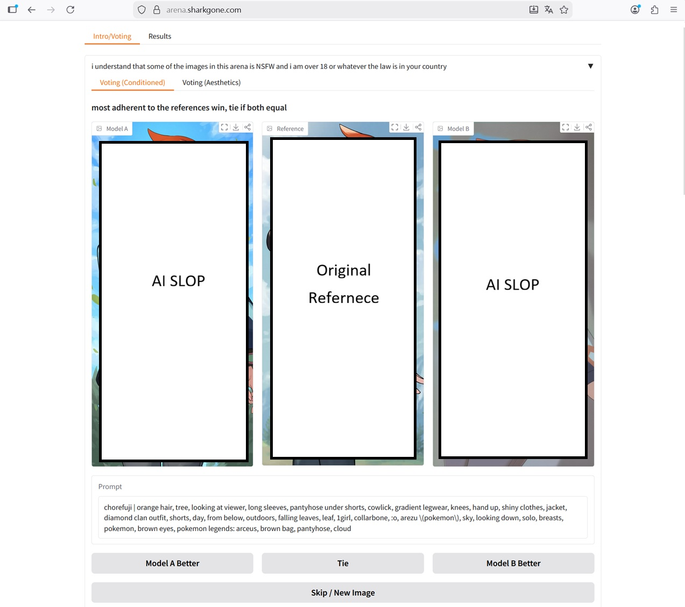
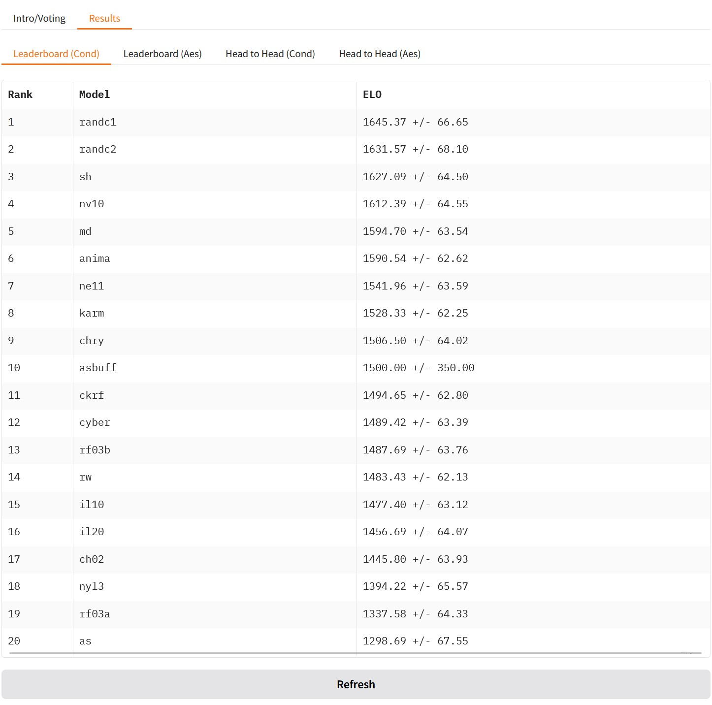

## Weeb Arena: Public Evaluation on my models ##

### Season 0,1 ###

- My application model was [AK-Evo 2EP](./gallery_2511.md#findings-after-train).

- The prompts was poorly aligned therefore my model hit top 3.

- The application and score board are similar with s2.

### Season 2 ###

- Scoreboard of [NoobAI based "weeb-arena"](https://huggingface.co/spaces/yoinked/weeb-arena-results), created by [yoinked](https://huggingface.co/yoinked). Many thanks for the kindness to include my model (and Karmix in s2).

- Despite quite a naive approach of the arena design, which community use highly customized (ComfyUI) workflows, or extended (reForge) WebUI with extensions most of the time, it is very rare to have enough dedication and resources to organize such a open public evaluation. It is very valuable to record this event.

- Since my approach is taking most varity with least bias, I expect for neutral result (or being middle / mediocre / ["golden mean"](https://en.wikipedia.org/wiki/Golden_mean_(philosophy)) ~~中庸~~), which is [ELO 1500 or 50% rate](https://en.wikipedia.org/wiki/Elo_rating_system), and s2 is quite towards that point.

- *The meta bias towards "merged model (usually in multiple iterlations) > trained model (just once or twice)", "nice bias > no bias > wrong bias", which may change when rules / prompts / "cherrypicking images" are changed.*

- The arena is not hosted for long time, so the links are not quite meaningful. Meanwhile they are just published Gradio App with random URLs.

- My application model is the [AK-Evo 2EP](./gallery_2511.md#findings-after-train).

### Weeb Arena S3 ###

- For s3, I use the "quite a trolling model" [AC-Evo 2.5EP](./gallery_2602.md#the-interleaved-past) intead. ~~It leads to the next model with no troll.~~

- For the s3, instead of providing generated images only, it provides original image as reference to provide visual aid. However since the models are still following prompts, the promtps itself may not describe the referenced image well.

- Despite my bottom score, the `randc` as "Random CivitAI model" are showing dominance, which is highly suprising. Meanwhile my "less troll" model has been added as `asbuff` with neutral score `1500+-350`. It also shows W/L Matrix besides the ELO score.

