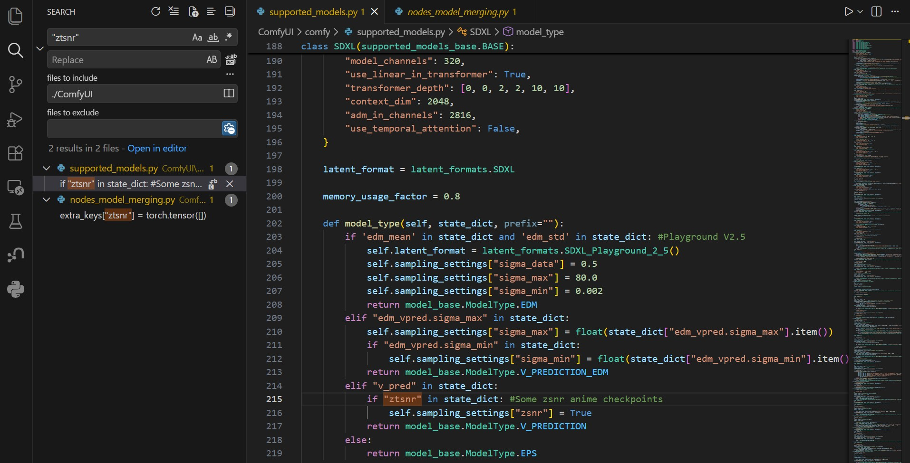
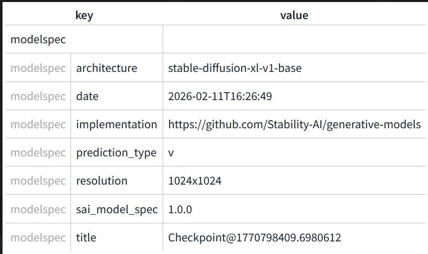

## ComfyUI Workflow ##

- `Basic VPred.json`: A workflow for ComfyUI to support my model. Considered the [special case](../ch06/gallery_2602.md#hitting-the-math-corner) which eventually derives 2 models. However, [I won't edit my model for that placeholder layer.](https://github.com/Comfy-Org/ComfyUI/blame/master/comfy/supported_models.py#L214). Fired my [Git Issue](https://github.com/Comfy-Org/ComfyUI/issues/12579) toward this issue. 

