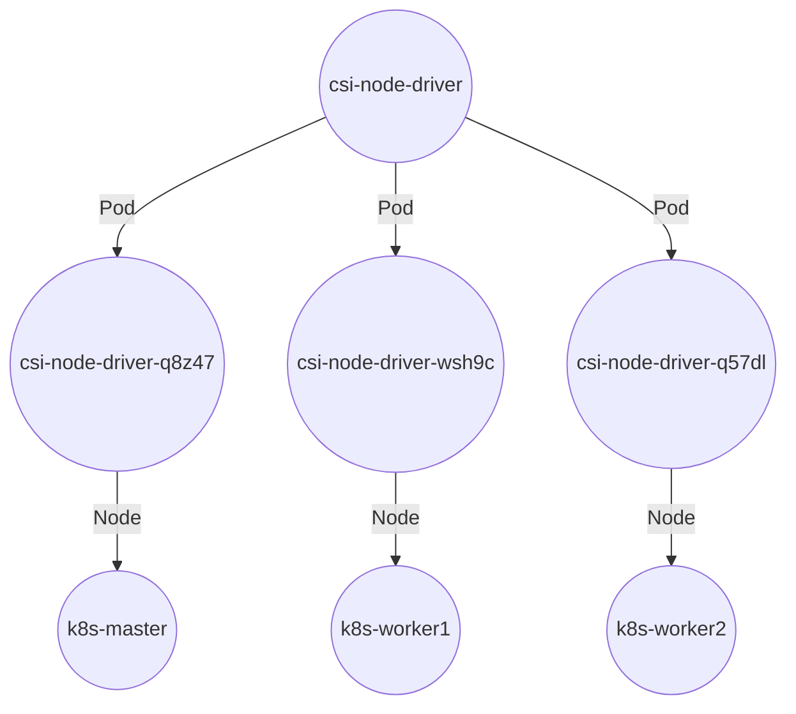
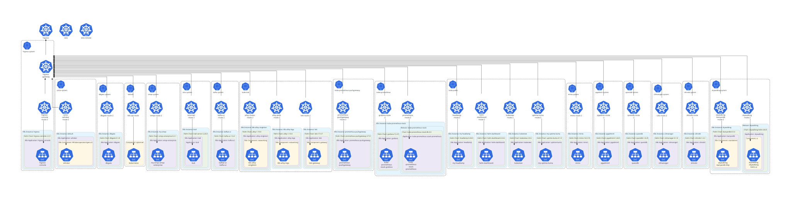
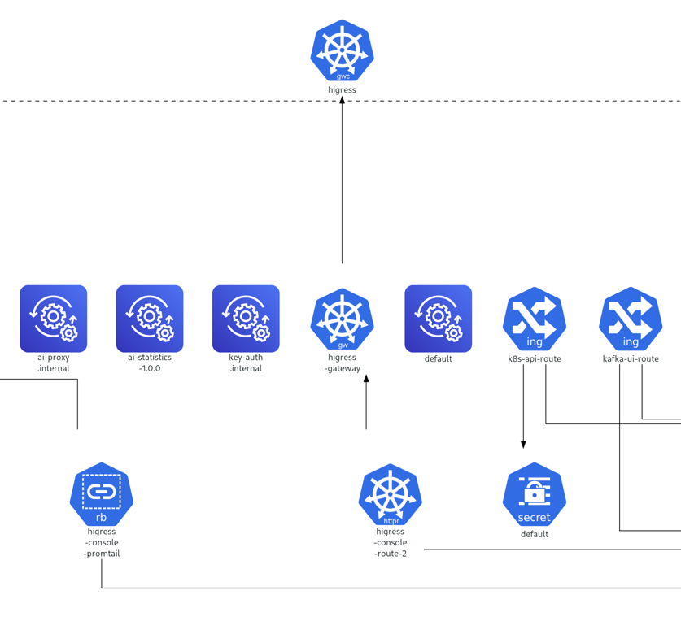

# Making KubeDiagram actually showing deployed systems #

*The intention remains hidden. BTW I think it counts for "AI art".*

The codes here are obviously vibe-coded. I know piping YAML contents is a solid idea, but I can't handle the $O(N^2)$ of content mapping, especially I'm not proficient in k8s.

Also, [it requires you use k8s namespaces to manage resources](https://www.vcluster.com/blog/kubernetes-namespace-the-what-why-and-how), and at least know the basic input / output across k8s CLI. ~~Google it and look for AI summary. It does a good job in this topic.~~

```sh
kubectl krew install get-all
docker pull philippemerle/kubediagrams

# Run "kubctl get-all" except "kubctl get all" for namespace "kube-system" which crash the kube-diagrams.
sh ./make-svg-per-ns.sh
```

Since it is easy to turn it generating Mermaid files, I omit the script. See [dbgate-system.mermaid](./dbgate-system.mermaid) for result. *Github can preview it directly.*

Here is a minimal version generated from [steveteuber/kubectl-graph](https://github.com/steveteuber/kubectl-graph) and trimmed manually.



## Extra: Migrate Ingress into HTTPRoutes ##

The codes here are obviously vibe-coded too. I do admire that [higress](https://higress.ai/en/blog/higress-gvr7dx_awbbpb_vbzalyy37xxuoswm/) glue things quite well, even the terminology is a mess. ~~"MCP Bridge" is a riddle to solve.~~

```sh
kubectl get ingress -A -o yaml > ingress.yaml
python3 ingress-httproute.py ingress.yaml -o httproute.yaml

# All Gateway API related resources, across namespace. Ignore warnings (out scope).
./get-all-gateway-apis.sh | ./fill-references-stubonly.sh | docker run -v "$(pwd)":/work -i philippemerle/kubediagrams kube-diagrams -f svg --embed-all-icons -o all-gateway-apis.svg -
```



Imagine how `higress-system.svg` looks like.


