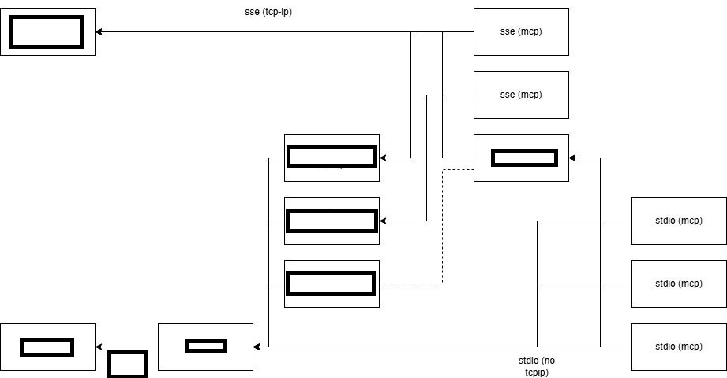

# "Enterprise MCP infrastructure" diagram #

- I think the blocked texts are easy to guess.

- The major standpoint is *it can be run in a contained private network*, which sensitive data are guarded under compilance.

- Make sure the described MCP are not related to any application. The funcitonal scope is always open.

- If you are making (agentic AI) application, **carefully fill in the context with functional requirement**.

- The LLM has its infrastructure. The dimension is different. Therefore it is not included in this diagram.

