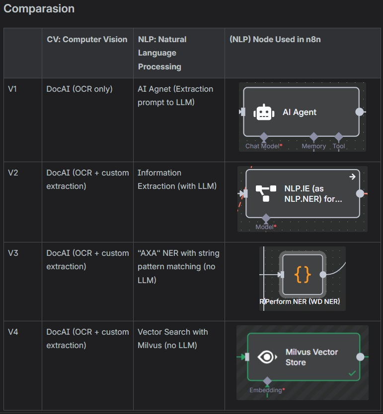
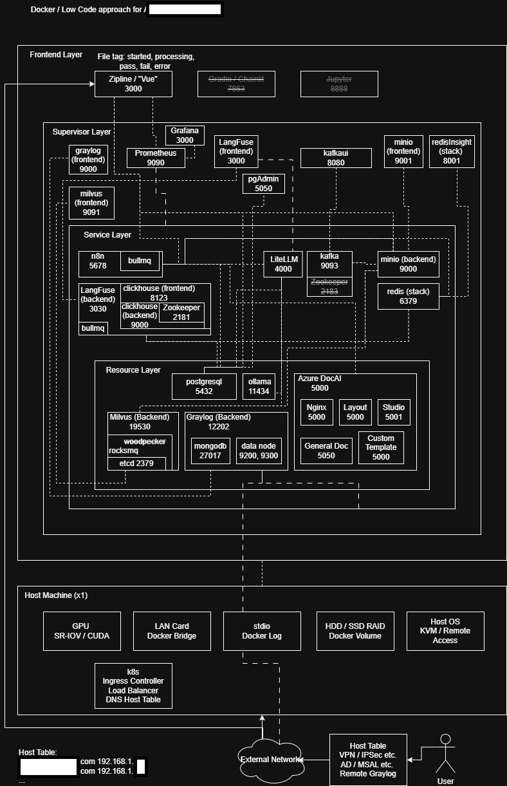

# "Enterprise n8n infrastructure" diagram #

- It was designed for a standalone physical machine ~~client want to go offline!~~ without multiple OS (e.g. VMWare) or nasty DevOps code based approach ~~client don't want to disturb IT department~~.

- n8n is visually and philosophical appealing, since you can code in [Code Node](https://docs.n8n.io/integrations/builtin/core-nodes/n8n-nodes-base.code/) with minimal service interruption ~~npm install requires docker restart bruh~~, and easy to migrate from existing NodeJS project ~~[ComfyUI Custom Node from existing Python project? bruh](https://docs.comfy.org/custom-nodes/overview)~~.

- In a *suboptimal working environment filled with legacy management and reasonable budget* ~~a few vCPUs, boomers who micromanages with C++ mindset and poor at drawing flowchart, voluntary vibe coders who lies with LLM, and a prior Vue Expert who also thinks Prompt Engineering can solve Engineering Problems, and clients who build physical stuffs with excessive bureaucracy~~ n8n as a [workflow engine](https://en.wikipedia.org/wiki/Workflow_engine) is an innovative tool to develop AI enabled solutions in ["production ready"](https://docs.cloud.gov/platform/deployment/production-ready/) basis ~~this is a buzz word~~, or "delivers under [SLA](https://aws.amazon.com/what-is/service-level-agreement/?nc1=h_ls)".

- Migrating from [SOMF](https://en.wikipedia.org/wiki/Service-oriented_modeling) and [DDD](https://en.wikipedia.org/wiki/Domain-driven_design) to such workflow based design (e.g. 30x NodeJS process, a broken Kafka Messaging Hub) to workflows in a single n8n portal is a bold move. The [HA](https://en.wikipedia.org/wiki/High_availability) consideration is not as well considered as in previous decade. ~~I should revise this sentence later.~~

- But at least the attempt has been made (deployed) and waiting for evaluation.

