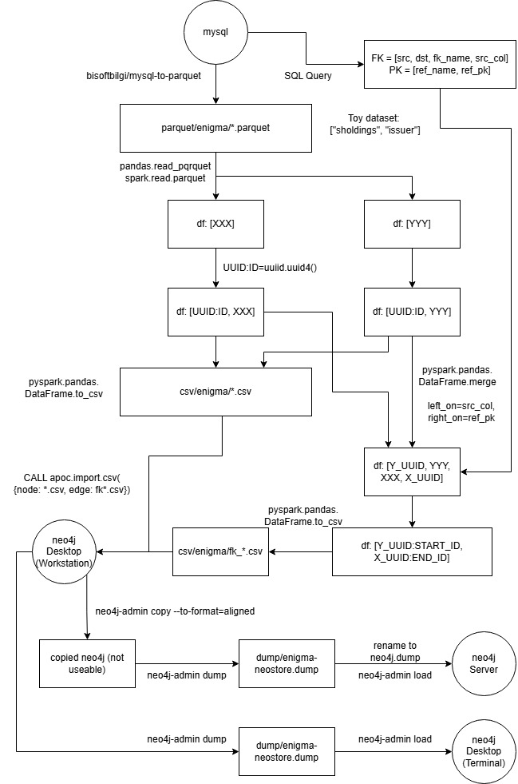

# Transforming MySQL to neo4j #

- Prerequisite: Well indexed / linked with [Foreign Key](https://en.wikipedia.org/wiki/Foreign_key), otherwise the "relationship" cannot be extracted without fully know the data (relationships).

## Core concept ##

- [Graph (G) is Vertex (V) with Edges (E)](https://en.wikipedia.org/wiki/Graph_(discrete_mathematics)). If you can *define* V and E, you have the G in auto. However the difficult part is estimate the size, and the resource requirement for conversion. It will be an engineering problem when the size is [big](https://en.wikipedia.org/wiki/Big_data).

- For *schemaless approach*, [Foreign Key](https://en.wikipedia.org/wiki/Foreign_key) can be treated as Edges. [UUID](https://en.wikipedia.org/wiki/Universally_unique_identifier) can be added for all table rows, and convert them into Vertex, or data Node. Table name will be the Node label, and the FK name will be the Edge label.

- If the RDBS schema is clearly known and implemented, some tables can be merged as shortcuts. However user story may denies. Generally use the *schemaless approach* regardless the "performance", until things are certain with confidence.

- *Until all SQL statements are obtained, and convert into specific language like GraphML and Cypher*, only data tables should be convert into graph. View tables becomes "query template with cache" instad. Triggers / Functions requires specific [translator](https://neo4j.com/docs/jdbc-manual/current/sql2cypher/) or [plugins](https://neo4j.com/docs/apoc/current/introduction/).

## Useful links as discussion ##

- [Geldata Blog.](https://stackoverflow.com/questions/15527334/has-anyone-used-neo4j-node-ids-as-foreign-keys-to-other-databases-for-large-prop)

- [Stackoverlow.](https://www.geldata.com/blog/the-graph-relational-database-defined#the-future-is-graph-relational)

- [Neo4j article.](https://neo4j.com/docs/getting-started/data-modeling/relational-to-graph-modeling/#model-transformation)

## Difficulties ##

- The concept is so abstract (you need to know some graph theory, for example, tree / cycle / forest etc.). You cannot "learn graph" from looking to the database, especially DB schema. **They are differnt concepts.** ER diagram helps, but the key concept is not directly shown ([Foreign Key](https://en.wikipedia.org/wiki/Foreign_key) and [UUID](https://en.wikipedia.org/wiki/Universally_unique_identifier) are common concept, but why combine them?).

- Somehow there are full of *scientific articles*, but lack of *engineering tools and guides*. Maybe the public interest is too low? I use [pandas](https://pandas.pydata.org/) throughout the process. Obviously Apache tools / platforms / frameworks etc. ["things around Apache"](https://neo4j.com/docs/spark/current/) works well also. ~~But their document is stange, meanwhile the community version is not so community focused.~~ 

- It is usally [big](https://en.wikipedia.org/wiki/Big_data) with sort of realistic feature ~~bug inside data~~. The knowledge around data is not so related to AI / ML, learning how to handle is hard nowdays. **They are differnt concepts.**

- [DDDM](https://www.ibm.com/think/topics/data-driven-decision-making) is a hot topic in... ~~oh wait, management.~~ Keeping focus in project execution in such abstract approach is extra hard. It breaks many assumptions and thinking skills. **They are differnt concepts.**

## Diagram ##

