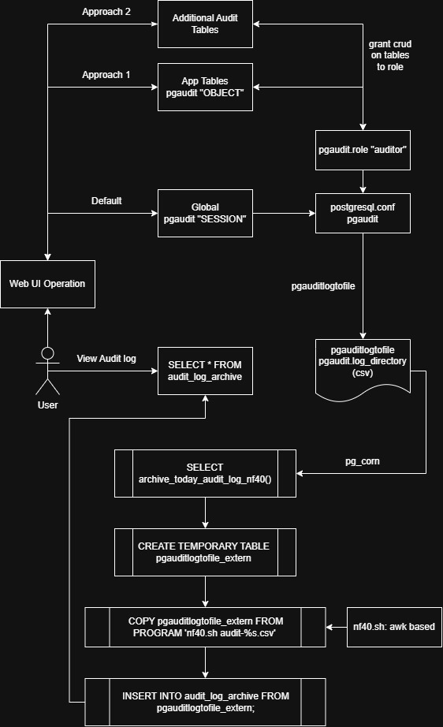

# pgAudit and the CSV loopback mechanism #

- Like [the audit log in Minio](https://docs.min.io/aistor/operations/monitoring/audit-logging/), **it is intentionally designed to not following any data contents.**

- So far **no article leads to correct result**: [Ref](https://neon.com/blog/postgres-logging-vs-pgaudit), [Ref](https://oneuptime.com/blog/post/2026-01-25-postgresql-pgaudit-track-data-changes/view), [Ref](https://www.crunchydata.com/blog/pgaudit-auditing-database-operations-part-2)

- Used postgres plugins:
  - [pgaudit/pgaudit](https://github.com/pgaudit/pgaudit)
  - [fmbiete/pgauditlogtofile](https://github.com/fmbiete/pgauditlogtofile)
  - [citusdata/pg_cron](https://github.com/citusdata/pg_cron)
  - (Optional, `SESSION` only) [pgaudit/pgaudit_analyze](https://github.com/pgaudit/pgaudit_analyze).

```sh
sudo apt install postgresql-18-pgaudit
sudo apt install postgresql-18-pgauditlogtofile
sudo apt install postgresql-18-cron
```

- pgAudit has 2 modes: [SESSION](https://github.com/pgaudit/pgaudit#session-audit-logging) and [OBJECT](https://github.com/pgaudit/pgaudit#object-audit-logging). We use `OBJECT` only, for targeted audit logging. `OBJECT` mode is configured by **role**.

- We may log parameters because **application user are not the DB user**.

## Key Differences at a Glance ##

*AI summary. From [github page](https://github.com/pgaudit/pgaudit).*

|Feature|Session Auditing|Object Auditing|
|---|---|---|
|Primary Scope|Broad classes of statements across the session.|Specific database relations (tables, views, columns).|
|Configuration Via|pgaudit.log parameter.|pgaudit.role parameter + database GRANTs.|
|Supported Commands|All (READ, WRITE, DDL, ROLE, FUNCTION, MISC).|Only SELECT, INSERT, UPDATE, and DELETE.|
|Log Volume|High (potentially noisy).|Low (highly targeted).|

## Diagram on the interactions ##



## Setup guide ##

**May not in sequence. Make sure double check the DB setting for at least 2 days.**

### Config pgaudit via SQL query ###

- *Go to next session for config file, when DB can restart for multiple times.*

- Run query line by line.

```sql
-- Enable extension for DB instance.
CREATE EXTENSION pgaudit;

-- View setting ("log") if required.
SHOW pgaudit.log_level;

-- Check current settings
SELECT name, setting FROM pg_settings WHERE name LIKE 'pgaudit%';

-- Log all DDL (CREATE DATABASE / ALTER DATABASE etc.) and DML (INSERT INTO ... VALUES ...)
-- ALTER SYSTEM SET pgaudit.log = 'ddl, write, read';
-- ALTER SYSTEM SET pgaudit.log = 'all';
-- ALTER SYSTEM SET pgaudit.log = 'ddl, write';
ALTER SYSTEM SET pgaudit.log = 'ddl';
-- ALTER SYSTEM SET pgaudit.log = 'none';

-- Log statement parameters like INSERT INTO ... VALUES (on_or_off)
ALTER SYSTEM SET pgaudit.log_parameter = on;

-- Reduce catalog-query noise (pg_catalog)
ALTER SYSTEM SET pgaudit.log_catalog = off;

-- Send audit messages to clients (e.g. psql), somehow not found in psql
ALTER SYSTEM SET pgaudit.log_client = on;

-- Log level (only enabled when pgaudit.log_client=='on')
ALTER SYSTEM SET pgaudit.log_level = 'log';

-- Log specific roles only
ALTER SYSTEM SET pgaudit.role = 'auditor';

SELECT pg_reload_conf();
```

- Now it will generate tons of logs in `/var/log/postgresql/*.log`.
  - Assume `pgauditlogtofile` is not activated yet.
  - Assume `OBJECT` mode (RBAC) is also not activated yet.
  - If we set `pgaudit.log=none`, we won't see the `SESSION` log at this moment.

- Login locally:

```sh
# Tons of AUDIT:
tail -f  /var/log/postgresql/postgresql-18-main.log
# 2026-08-10 07:29:52.097 UTC [1508205] user@n8n-v2 LOG:  AUDIT: SESSION,298,1,MISC,COMMIT,,,COMMIT,<none>
# 2026-08-10 07:29:53.050 UTC [1508205] user@n8n-v2 LOG:  AUDIT: SESSION,299,1,READ,SELECT,,,SELECT 1,<none>
# 2026-08-10 07:29:53.133 UTC [1506572] user@langfuse LOG:  AUDIT: SESSION,123,1,MISC,BEGIN,,,BEGIN,<none>

psql -U safeuser -d test_prismaview
# 2026-08-10 07:39:00.058 UTC [1513995] user@test_prismaview LOG:  AUDIT: SESSION,6,1,DDL,CREATE TABLE,,,"CREATE TABLE ""misc_form"" (
# 2026-08-10 07:39:02.476 UTC [1513995] user@test_prismaview LOG:  AUDIT: SESSION,7,1,DDL,DROP TABLE,,,"DROP TABLE ""misc_form""",<none>
```

### Config RBAC for pgaudit OBECT mode ###

Now add a new role to further scope the audit logging (line by line):

**RBAC ineffective on SQL query. Use config instead.**

```sql
-- Create a role to represent audit targets
CREATE ROLE auditor NOLOGIN;

-- Grant the auditor role access to tables you want to audit
-- GRANT ALL PRIVILEGES ON DATABASE test_prismaview TO auditor;
-- REVOKE ALL PRIVILEGES ON DATABASE "n8n-v2" FROM auditor;

GRANT INSERT, UPDATE, DELETE ON DATABASE test_prismaview TO auditor;

-- In specific database (e.g. app_db)
-- GRANT SELECT, INSERT, UPDATE, DELETE ON ALL TABLES IN SCHEMA public TO auditor;

-- app_db
GRANT INSERT, UPDATE, DELETE ON ALL TABLES IN SCHEMA public, web TO auditor;
-- dev_db
GRANT INSERT, UPDATE, DELETE ON ALL TABLES IN SCHEMA app TO auditor;

-- Remove access rights
REVOKE ALL PRIVILEGES ON ALL TABLES IN SCHEMA public FROM auditor;

-- View permission
SELECT rolname, rolsuper, rolinherit, rolcreaterole, rolcreatedb, rolcanlogin FROM pg_roles;
SELECT * FROM information_schema.role_table_grants WHERE grantee = 'auditor';
-- SELECT grantee, table_schema, table_name, privilege_type FROM information_schema.role_table_grants WHERE grantee = 'auditor';
```

By default pgaudit has no roles.

```sql
-- Set the audit role
ALTER SYSTEM SET pgaudit.role = 'auditor';

-- Unlock all actions
-- ALTER SYSTEM SET pgaudit.log = 'ddl';
ALTER SYSTEM SET pgaudit.log = 'none';

-- Apply change
SELECT pg_reload_conf();
```

### Config pgaudit via config file ###

- Refer to [postgresql.conf](https://www.postgresql.org/docs/current/config-setting.html) for details.

- Now the corrosponding `postgresql.conf` (hint: bottom session):
  - Our use case is **object audit exclusively**, which the default **session audit** should be turned off.

```conf
# Options: READ, WRITE, FUNCTION, ROLE, DDL, MISC, MISC_SET, ALL, NONE
# Log all DDL (CREATE DATABASE / ALTER DATABASE etc.) and DML (INSERT INTO ... VALUES ...)
# Specifies which classes of statements will be logged by session audit logging.
pgaudit.log = 'none'

# Log catalog (system table) access - usually disabled for noise reduction
# Reduce catalog-query noise (pg_catalog)
pgaudit.log_catalog = off

# Include the object name in the audit log
# This is a useful shortcut for exhaustive logging without using object audit logging.
pgaudit.log_relation = off

# Log statement text only once for each statement/substatement
pgaudit.log_statement_once = on

# Include parameter values in logs (careful with sensitive data)
# Log statement parameters like INSERT INTO ... VALUES (on_or_off)
pgaudit.log_parameter = on

# Log level for client-visible audit messages when pgaudit.log_client is on
# Log level (only enabled when pgaudit.log_client=='on')
pgaudit.log_level = 'log'

# Send audit messages to clients (e.g. psql), somehow not found in psql
pgaudit.log_client = on

# Log specific roles only
pgaudit.role = 'auditor'
```

### Config pgauditlogtofile via config file ###

Now we further config the `pgauditlogtofile`:

```conf
# Format used to write the audit records.
pgaudit.log_format = 'csv'

# Name of the directory where the audit file will be created.
pgaudit.log_directory = '/var/log/postgresql/auditlog'

# Name of the file where the audit will be written. Writing to an existing file will append the new entries.
pgaudit.log_filename = 'audit-%Y-%m-%d.csv'

# File permissions of the audit log files created.
pgaudit.log_file_mode = '0600'

# Number of minutes after which the audit file will be rotated. Count in minutes.
pgaudit.log_rotation_age = 1440
```

Apply config (DB restart):

```sh
# 192.168.1.101
cd ~/pg_dump
sudo cp /etc/postgresql/18/main/postgresql.conf .

cd /etc/postgresql/18/main
sudo cp ~/pg_dump/postgresql.conf .
sudo service postgresql restart
```

Now we should see CSV files in the new folder. Also they don't interfere with the original postgres log (log server status).

```sh
# Make it able to list files and move files.
sudo chmod 755 /var/log/postgresql/auditlog
ls /var/log/postgresql/auditlog/*

# /var/log/postgresql/auditlog/audit-YYYY-MM-DD.csv
```

### Import CSV back to DB with pg_corn ###

Create table schema for Audit log. Schema from [oneuptime](https://oneuptime.com/blog/post/2026-01-25-postgresql-pgaudit-track-data-changes/view): [create-audit-log-table.sql](./create-audit-log-table.sql)

```sql
-- CREATE TABLE audit_log_archive (...):
```

- A **SQL function with hacky shell script** is requried to make the CSV accepted by postgres. **Columns count must match for all kind of logs.** Ref: [archive-today-audit-log-nf40.sql](./archive-today-audit-log-nf40.sql)

1. Shell script to "normalize CSV into 40 columns via Linux native [awk](https://www.geeksforgeeks.org/linux-unix/awk-command-unixlinux-examples/)": [nf40.sh](./vibe-contents/nf40.sh), [verify-nf40.sh](./vibe-contents/verify-nf40.sh).
2. Create [temporary table](https://neon.com/postgresql/tutorial/temporary-table) `pgauditlogtofile_extern` dedicated for the CSV, and then load the CSV **by [injected shell script](https://dev.to/zrbecker/querying-csv-files-using-postgres-4idg)**: [redirect-audit-csv-to-table](./vibe-contents/redirect-audit-csv-to-table.sql). Schema from [pgauditlogtofile](https://github.com/fmbiete/pgauditlogtofile#pgaudit-log-to-file---record-format).
3. Insert to the assigned table `audit_log_archive`.
4. **Wrap entire thing back to a SQL function.** Notice that there are many syntax adaptation like [format()](https://neon.com/postgresql/string-functions/format) and `CURRENT_DATE`: [archive_today_audit_log.sql](./vibe-contents/archive_today_audit_log.sql).

```sql
-- CREATE OR REPLACE FUNCTION archive_today_audit_log_nf40(p_run_date date DEFAULT (CURRENT_DATE - 1))
-- RETURNS text
-- LANGUAGE plpgsql

-- 200+ lines with nf40.sh embedded inside
```

*It may not need offset `CURRENT_DATE`. Look for E2E results.*

- (Extra) If we are OK to view tables 1-to-1 with CSV: `CREATE FOREIGN TABLE` with `postgres_fdw`.
  - The SQL function should be changed as well.

- To register the cronjob via `pg_corn`:
  - Assume `cron.database_name = 'postgres'`

```sql
-- In DB 'postgres', run as superuser:
CREATE EXTENSION pg_cron;

-- optionally, grant usage to regular users:
GRANT USAGE ON SCHEMA cron TO safeuser;

-- 1 minute grace period, default value = yesterday
SELECT cron.schedule_in_database(
  'daily-pgaudit-csv-loopback', 
  '1 0 * * *', 
  'SELECT public.archive_today_audit_log_nf40()',
  'auditlog'
);

-- At least 1 record.
select * from cron.job;

-- Shows execution result. (1 row)
select * from cron.job_run_details order by start_time desc limit 5;

-- View settings.
SELECT * FROM pg_settings WHERE name LIKE 'cron.%';

-- e.g. Change timezone
ALTER SYSTEM SET cron.timezone = 'Asia/Hong_Kong';
```
