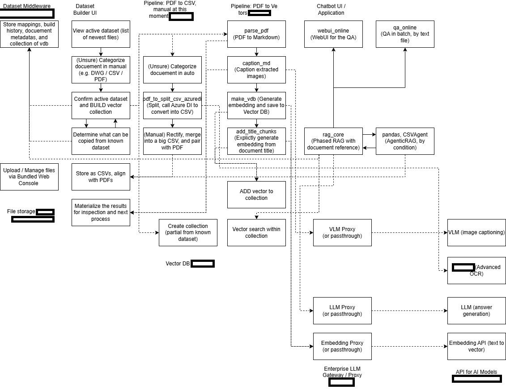

# A block diagram about "RAG with Docuement versioning control" #

- *This may cause impact to my career, instead of posting to LinkedIn, may be I can leave here as a hint.*

- [Vector DB](https://en.wikipedia.org/wiki/Vector_database), [TSDB](https://en.wikipedia.org/wiki/Time_series_database) [Docuement DB](https://en.wikipedia.org/wiki/Document-oriented_database), and [RDBS](https://en.wikipedia.org/wiki/Relational_database) are distint systems having their own functionality. You may forcefully solve it via a single solution like [MLOps](https://en.wikipedia.org/wiki/MLOps), but you will lost focus on the technical details (especially it is quite new in the field).

- Meanwhile, *Docuement*, *Vectors*, and *LLM* are not directly related to a [Task](https://learn.microsoft.com/en-us/dotnet/machine-learning/resources/tasks) (where RAG can be a AIML task, or just a buzzword as an chatbot, *thanks ChatGPT*)

- Therefore, the "missing piece" is obvious and easily being ignored in communication: The [dataset](https://en.wikipedia.org/wiki/Data_set) is undefined.

- With a statement (obviously suitable for engineering instead of science) like "Assign a dataset based from **a set of selected docuements**, the convert it to **a collection of vectors**", such [1:1 relationship](https://en.wikipedia.org/wiki/One-to-one_(data_model)) will be sufficient to implement the solution, then deploy with [current IT standard](https://en.wikipedia.org/wiki/High_availability_software).

- "Some product name has been masked", but I think they are obvious when it comes to enterprise / commercial use.

- The "RAG pipeline" is highly customized to the particular task, **which all docuements are provided as PDF scans**, you don't have to apply such an advanced approach if the data is a bit more structured.

