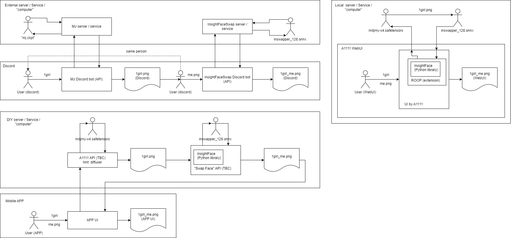

# A flowchart about current "APP" making use of "AI art" #

- Edit: Looks like there is some related APPs: [https://github.com/aigc-apps/sd-webui-EasyPhoto](https://github.com/aigc-apps/sd-webui-EasyPhoto), [article available in zh only.](https://cloud.tencent.com/developer/article/2326461) [Eeeyep.](https://developer.aliyun.com/article/1326043)

- Also, there is a [SadTalker](https://github.com/OpenTalker/SadTalker), [zh article also](https://www.cnblogs.com/bossma/p/17571028.html).

Self explained. [Draw IO file.](img/23071701.drawio) It is more like to show "why need software developement" instead of "what to develop".

