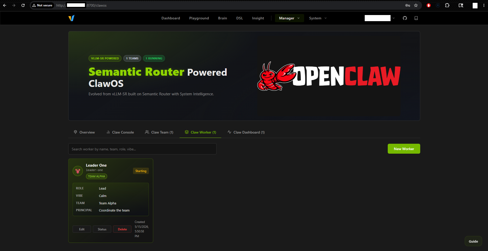
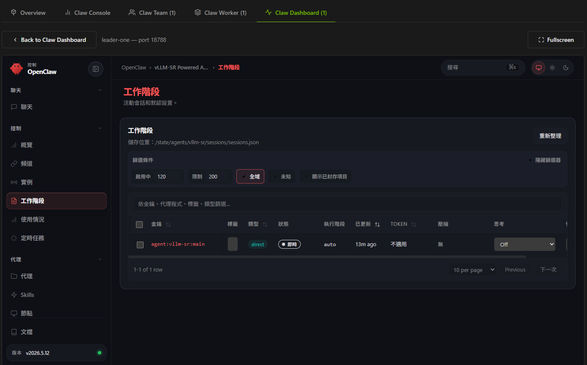

# Docker compose deployment files for vllm-sr #

- As in [#1845](https://github.com/vllm-project/semantic-router/issues/1845):

> As a new comer in the vLLM eco-system, I see huge potential on such rule based / ML based smart routing, instead of relying on agentic systems which force us to use public services.
> ...
> We don't use the docker compose anymore, for local docker we directly use vllm-sr cli

*Skipped the ranting and days of investigating.* I did started from looking at the VM for the `install.sh` approach. **Just clone it, checkout to the commit hash, then keep searching the codes.**

Also the envoy / extproc part requires external knowledge to set - I learnt from v0.1 docs. v0.1 has different dashboard also.

```sh
# Hmmm
hf download abdallah1008/semantic-router-ml-models --local-dir models/model-selection
# In case you can't get the official gated Gemma
hf download vectorranger/embeddinggemma-300m-medical-300k --local-dir models/mom-embedding-flash

sudo cp ./*.yaml ./vllm-sr

# I forgot how much more CLI to go, especially the leader-one. 
# Should be manual create in clawOS > docker rm > uncomment > docker compose up leader-one
docker compose up -d
```

To not exposing too much on my LAN setup, I have made up the IP address and tokens.

*In short, obviously we won't stuff RDBS / cache / vector DBs / o11y / PLG stacks all into a single VM isn't it?*

|URL|Docker image|
|---|---|
|`192.168.1.111:8080`|`ghcr.io/vllm-project/semantic-router/vllm-sr:v0.3.0`|
|`192.168.1.111:8700`|`ghcr.io/vllm-project/semantic-router/dashboard:v0.3.0`|
|`192.168.1.111:8000`|`ghcr.io/vllm-project/semantic-router/vllm-sr-sim:7c8c9e2e1231631e7149f723b47790d9f479a53f-linux-amd64`|
|`192.168.1.111:8899`|`envoyproxy/envoy:v1.37-latest`|
|`192.168.1.111:18788`|`ghcr.io/openclaw/openclaw:latest`|
|`192.168.1.112:8010`|`vllm/vllm-openai:v0.14.1-cu130`|
|`192.168.1.113:8002`|`vllm/vllm-openai:latest-cu130`|
|`192.168.1.114:4000`|`litellm/litellm:1.94.0`|
|`192.168.1.114:18788`|`ghcr.io/openclaw/openclaw:latest`|
|`192.168.1.115:9090`|`prom/prometheus:latest`|
|`192.168.1.115:3000`|`grafana/grafana-enterprise`|
|`192.168.1.115:4317`|`cr.jaegertracing.io/jaegertracing/jaeger:2.17.0`|
|`192.168.1.115:16686`|`cr.jaegertracing.io/jaegertracing/jaeger:2.17.0`|
|`192.168.1.116:6379`|`redis/redis-stack:latest`|
|`192.168.1.117:5432`|`pgvector/pgvector:pg18-trixie`|
|`192.168.1.118:19530`|`milvusdb/milvus:v2.6.3`|

However the GPU is hard to hide:

|Machine|GPU|LLM|
|---|---|---|
|[192.168.1.112](./vllm-112)|GTX 1650 4G LP|`Qwen/Qwen3-0.6B`|
|[192.168.1.113](./vllm-113)|Blackwell 4000 PRO 24G|`NVFP4/Qwen3-Coder-30B-A3B-Instruct-FP4`|

Finally the sqlites which should be connected to a proper RDBS already:

|Location|Usage|
|---|---|
|`/tmp/data/auth.db`|**The RBAC.**|
|`/tmp/data/evaluations.db`|ML Evaluations|
|`/tmp/data/workflow.sqlite`|Unknown|
|Unknown|ClawOS Team member infos|

## vllm-sr console and "ClawOS" Screenshots ##

- Hey, the frontend design is actually dope. Don't waste it OK?



- I prefer [Kohaku-Lab/KohakuTerrarium](https://github.com/Kohaku-Lab/KohakuTerrarium).


- Comparing to the OG Open Claw, it just screams for every 10 minutes and maxing out the content window of my poor 0.6B LLM...


