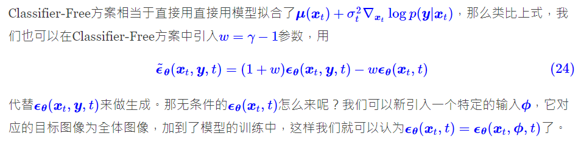
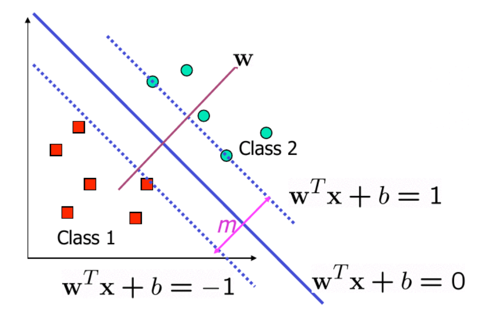

# CFG 機制分享 (偽科學) #

> 我也经常这样 或许负面里加个black会有用...

邏輯謬誤來的:

"或者失敗" 遠比 "或者成功" 有價值很多. 

> 加上 masterpiece 和 best quality 的话人体会变，而且不确定变好

雖然我那課頗爛 (但比數好學), 原因如下

要有大量失敗才顯得成功的價值 ([統計的價值](https://mropengate.blogspot.com/2015/06/ch12-5-resolution-refutation-proofs.html))

> 加上 masterpiece 和 best quality 的话人体会变，而且不确定变好变坏

[空 prompt 時間來囉](https://www.pixiv.net/en/artworks/102829322)
那 (咒語, 由 TI 開始愈多數字愈接近 AI) 是 "沒價值的不确定"

> (被問慘) 不要问我什么叫“人体还算能看”

"要是 yolov7 能認的" ~~不難答, 就當沒人 ~~

...

自從我確定了 K 佬口中的 "玄學" 就是 "CFG 機制" (CLIP 不考慮, 只有  "CFG 系數" 是最易比較) 後, 整個魔法 / 修仙的世界 (自身以外) 就開始崩塌了 (我自己就... 沒錯就是由 masterpiece of xxxx 開始就已經在懷疑)

"CFG 機制" 是 "愈低愈 free", 即使我對那些數學零理解
[好像有人看過, 但應該沒那種感覺](https://kexue.fm/archives/9257/comment-page-1)

[跟 SVM / 其他帶 "超參數" 的 ML 很像](https://blog.csdn.net/xlinsist/article/details/51311755)

手感上 就是這樣. 剩下的就只是不斷地刷數值.

但那個數值遠比 "魔法修仙" 有用 (咦

泛化能力, 模型偏差一口氣解決

~~然後繼續專心番工上堂清功課 ~~

PS: 沒提及 TI / DB / DA 那些. 效率可以低下, 但方向可是容易掌握.

一些研究連某解決的問題 (別指望 AI 業者了, FID / CLIP score 代表的 "還原能力" 跟 "美觀程度" 是相差很遠): 

- [DA 評價平平, 大眾仍然偏好 TI: DreamArtist](https://github.com/7eu7d7/DreamArtist-stable-diffusion)
- [SD 模型有很多限制, 而且 SFW, 2.0 都一樣](https://github.com/CCRcmcpe/scal-sdt/wiki)
- [CFG 玄學 (大量抽圖仍然是王道)](https://github.com/6DammK9/nai-anime-pure-negative-prompt/blob/main/925997e9.md)
