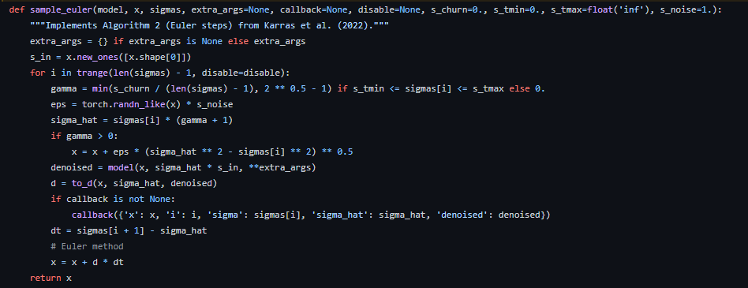
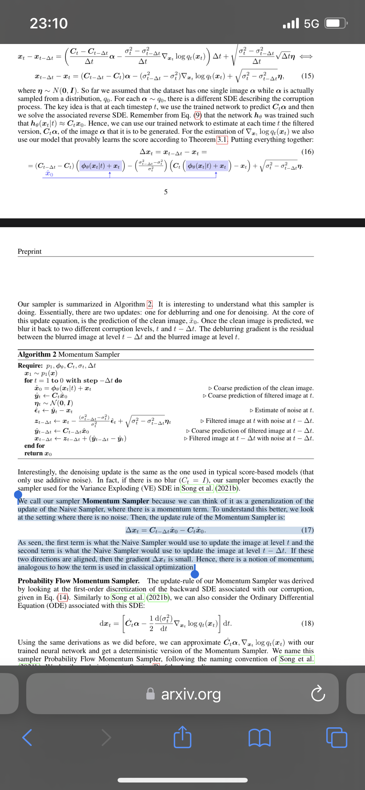
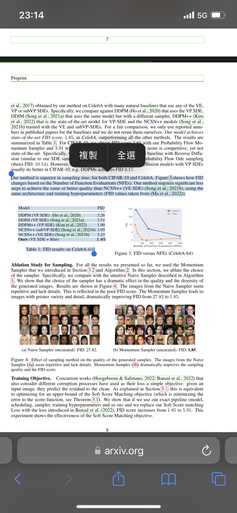

# Momentum Sampler (Algorithm 2) #

## 現象探討 ##

**注意: 大量數學**

問: 
- k_euler 那個 euler method (Euler-Maruyama?) 如何跟 Difusion model 去連結? 
- k_euler 可以在 U-NET 仔細取樣 (已知 DDIM 上限 1000 步)?
- 那個 3D / RTX effect 成立嗎 (局部 FID 爆低) ?  
- euler "還原圖像內容" 的話比起 DDIM / DDPM 會怎樣?  
- 以上比較 / 機制應該是跟 CFG 獨立? 搜系數時可以分開處理?

https://zhuanlan.zhihu.com/p/563661713
https://zhuanlan.zhihu.com/p/565698027

https://twitter.com/iScienceLuvr/status/1564847749073276928/photo/1

當年的 EM
https://arxiv.org/pdf/1511.06251.pdf

... 不懂
https://arxiv.org/pdf/2110.15739.pdf
..."SGMs"?
https://openreview.net/pdf/73d0f0136e580fe58d9e2ceb5a0317ad7aeb3d24.pdf
https://nv-tlabs.github.io/CLD-SGM/

噪點分 DDIM / EULER.
會發現 EULER 8 步都能出圖, CFG 要求低一點
k_diffuser 的 implementation 很謎, 期末後再看代碼 (今次沒 paper 解釋)

- DDIM

- Euler

- 對比: 2~500 步
- DDIM: `500,200,143,100,67,33,17,13,7,4,3,2`

## 查找驗証後 ##

~~在坐車，回家要搞 cheat cheet~~
多謝 A1111 再次改壞名
人家是 “momentum sampler” 再加個 euler (sgd 相關）

momentum (euler) 那至少不會被污名（還在看 momentum 在哪）
直少 adam 帶 momentum 成份，間接證明這個 euler 為何不比 ddim 慢一整個數量級

是咁的，k diffuser 不管是 euler 還是 heun, 因為是 **momentum sampler**, 那就是可以跟 ddim 一比，而不會有數量級的差距

[webui](https://github.com/AUTOMATIC1111/stable-diffusion-webui/blob/master/modules/sd_samplers.py)

[k_diffusion](https://github.com/crowsonkb/k-diffusion/blob/master/k_diffusion/sampling.py)

[arxiv]https://arxiv.org/pdf/2209.05442.pdf

